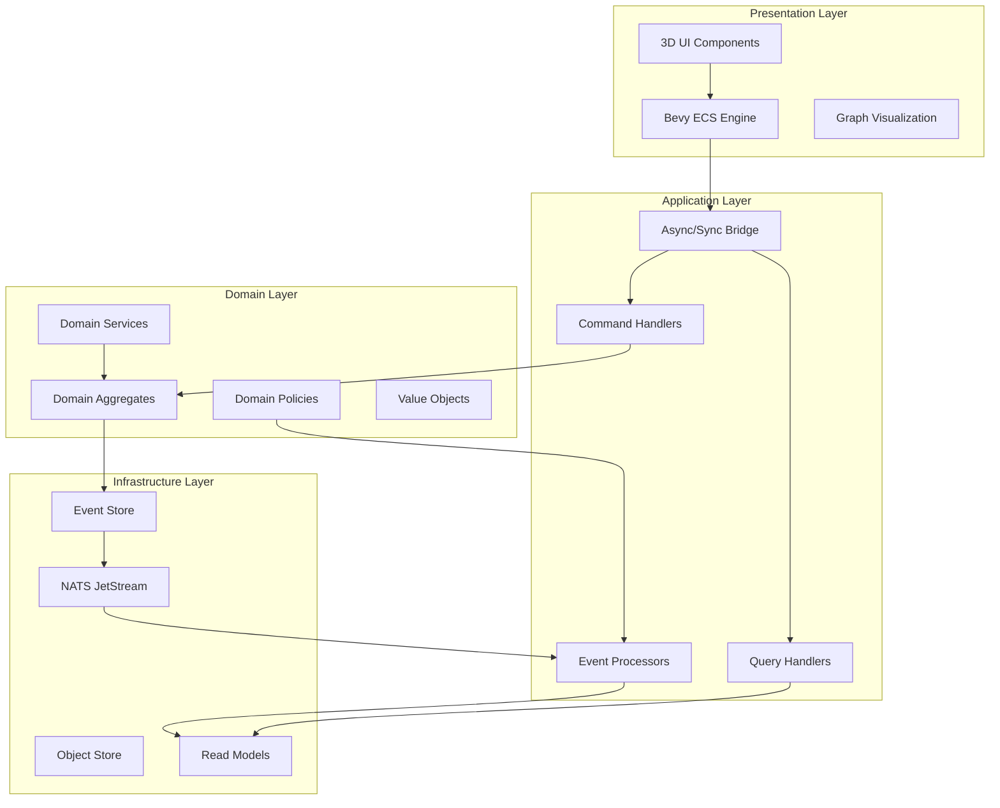

# CIM Architecture Overview

## System Architecture

The Composable Information Machine (CIM) is built on a foundation of proven architectural patterns combined in innovative ways to create a truly composable, event-driven system.

## Core Architectural Patterns

### 1. Event-Driven Architecture (EDA)
All state changes in CIM flow through events:
- Commands express intent to change state
- Aggregates validate and generate events
- Events are immutable facts about what happened
- Event processors update read models and trigger policies

### 2. Domain-Driven Design (DDD)
The system is organized into bounded contexts:
- Each domain module represents a bounded context
- Clear boundaries between contexts
- Communication only through events
- Ubiquitous language within each context

### 3. Entity Component System (ECS)
The presentation layer uses Bevy ECS for:
- High-performance rendering
- Flexible entity composition
- Parallel system execution
- Real-time interaction

### 4. CQRS (Command Query Responsibility Segregation)
Separate paths for writes and reads:
- Commands go through domain aggregates
- Queries read from optimized projections
- Eventually consistent read models
- No direct database access

### 5. Event Sourcing
Selected aggregates use event sourcing:
- Events as the source of truth
- Rebuild state by replaying events
- Complete audit trail
- Time travel debugging

## Layer Responsibilities

### Presentation Layer (Bevy ECS)
- 3D visualization of graphs and workflows
- User interaction handling
- Real-time updates from domain events
- Visual feedback and animations

### Application Layer
- Command and query routing
- Cross-cutting concerns (auth, logging)
- Async/sync bridge between Bevy and NATS
- Transaction coordination

### Domain Layer
- Business logic and rules
- Aggregate invariant enforcement
- Domain event generation
- Policy execution

### Infrastructure Layer
- Event persistence and streaming
- Message routing via NATS
- Object storage for large data
- Read model management

## Key Design Decisions

### 1. Dual ECS Systems
- **Bevy ECS**: For presentation and real-time interaction
- **Domain Model**: Traditional DDD aggregates for business logic
- Bridge translates between the two paradigms

### 2. Content-Addressed Storage
- Events linked via CID chains
- Cryptographic integrity verification
- Distributed storage capability
- IPLD for structured data

### 3. Graph as Primary Abstraction
- Workflows are graphs
- Knowledge is a graph
- Events form a graph
- System architecture is a graph

### 4. Conceptual Spaces Integration
- Every entity has both visual and conceptual position
- Semantic similarity drives layout
- AI-friendly knowledge representation
- Natural category formation

## Scalability Considerations

### Horizontal Scaling
- Stateless command/query handlers
- Event stream partitioning
- Read model replication
- NATS clustering

### Performance Optimization
- ECS for cache-friendly data layout
- Parallel system execution
- Lazy loading of graph sections
- Progressive rendering

### Resilience
- Event replay for recovery
- Circuit breakers for external calls
- Graceful degradation
- Automatic retries with backoff

## Security Architecture

### Authentication & Authorization
- JWT tokens for API access
- Subject-based NATS permissions
- Domain-level access control
- Audit event generation

### Data Protection
- Encryption at rest (object store)
- TLS for all network communication
- Field-level encryption for PII
- Secure key management

## Integration Points

### External Systems
- GitHub via MCP for code repositories
- NixOS for reproducible deployments
- External databases via adapters
- REST/GraphQL API gateways

### Extension Mechanisms
- Plugin system for custom domains
- Event handler registration
- Custom visualization components
- Policy rule engines

## Future Architecture Evolution

### Planned Enhancements
- WebAssembly for portable components
- Multi-region event replication
- Advanced ML/AI integration
- Blockchain event anchoring

### Research Areas
- Quantum-resistant cryptography
- Neuromorphic computing integration
- Biological system modeling
- Emergent behavior analysis 