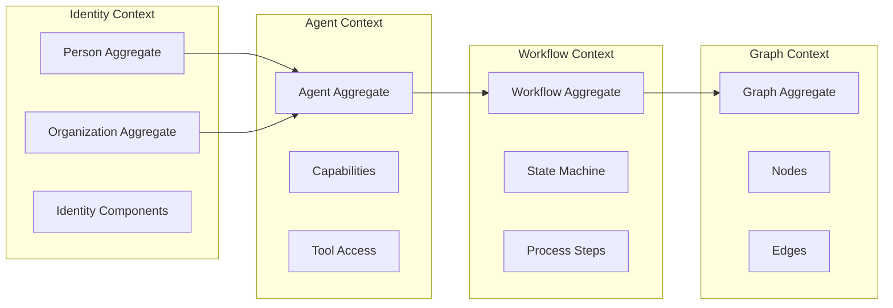
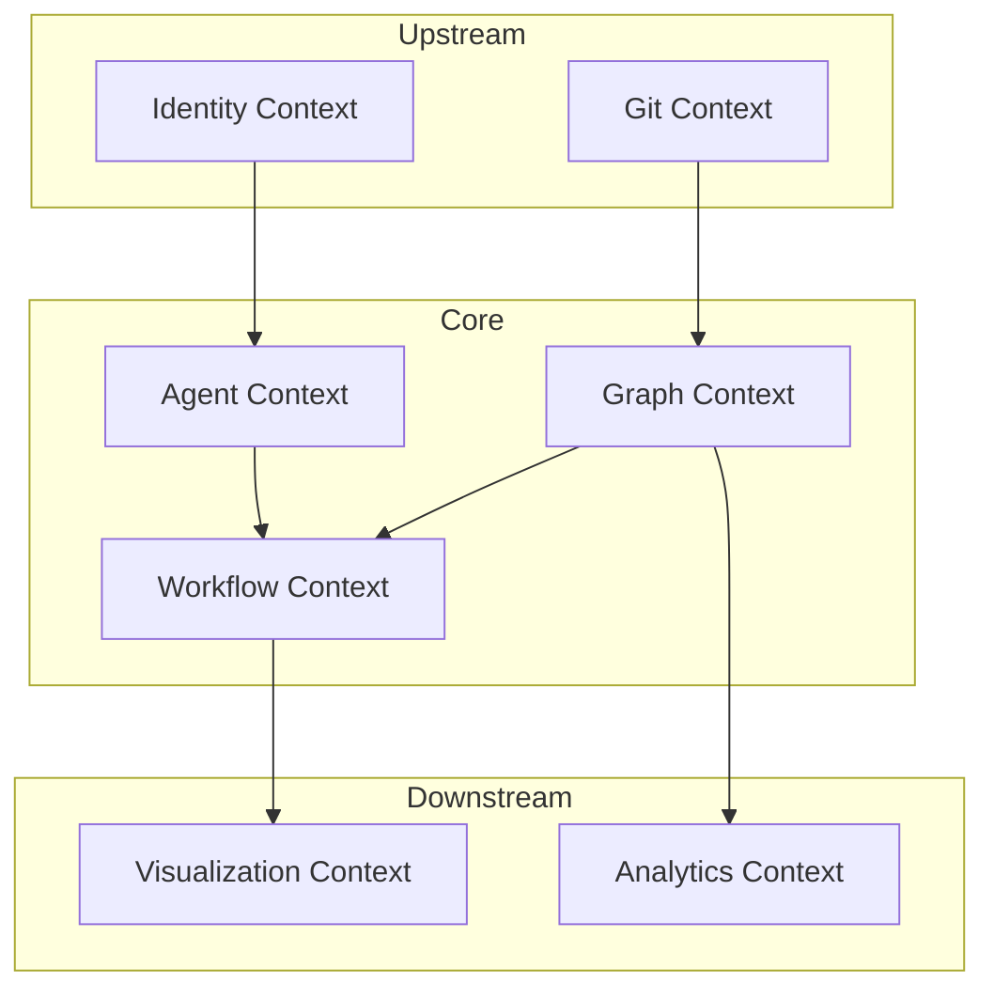

# Domain-Driven Design in CIM

## Overview

CIM implements Domain-Driven Design (DDD) principles to manage complexity through clear boundaries, ubiquitous language, and focused domain models. Each domain module represents a bounded context with its own language, models, and rules.

## Bounded Contexts

### Core Domain Contexts



### Infrastructure Contexts

- **Git Domain**: Repository analysis and version control
- **Nix Domain**: Package management and system configuration
- **Document Domain**: Content processing and knowledge extraction

### Visualization Contexts

- **Bevy Domain**: 3D rendering and interaction
- **Conceptual Spaces**: Semantic positioning and similarity

## DDD Building Blocks

### Entities

Entities have identity that persists through time:

```rust
pub trait Entity: Send + Sync {
    type Id: EntityId;
    
    fn id(&self) -> Self::Id;
    fn version(&self) -> u64;
}

// Example: Person Entity
pub struct Person {
    id: EntityId<PersonMarker>,
    version: u64,
    components: HashMap<TypeId, Box<dyn Component>>,
}
```

### Value Objects

Value objects are immutable and compared by value:

```rust
#[derive(Debug, Clone, PartialEq)]
pub struct Email {
    value: String,
}

#[derive(Debug, Clone, PartialEq)]
pub struct Position3D {
    x: f32,
    y: f32,
    z: f32,
}
```

### Aggregates

Aggregates enforce consistency boundaries:

```rust
pub trait AggregateRoot: Entity {
    type Command;
    type Event: DomainEvent;
    type Error;

    fn handle_command(&mut self, cmd: Self::Command) -> Result<Vec<Self::Event>, Self::Error>;
    fn apply_event(&mut self, event: &Self::Event) -> Result<(), Self::Error>;
}
```

### Domain Events

Events record what happened in the domain:

```rust
pub trait DomainEvent: Send + Sync {
    fn event_type(&self) -> &'static str;
    fn aggregate_id(&self) -> String;
    fn sequence(&self) -> u64;
    fn timestamp(&self) -> SystemTime;
}

// Example: PersonCreated Event
#[derive(Debug, Clone, Serialize, Deserialize)]
pub struct PersonCreated {
    pub person_id: EntityId<PersonMarker>,
    pub legal_name: PersonName,
    pub timestamp: SystemTime,
}
```

### Domain Services

Services encapsulate domain logic that doesn't belong to a single entity:

```rust
pub trait ConceptualSpaceService {
    fn calculate_similarity(&self, a: &ConceptualPoint, b: &ConceptualPoint) -> f32;
    fn find_nearest_neighbors(&self, point: &ConceptualPoint, k: usize) -> Vec<ConceptualPoint>;
}
```

### Repositories

Repositories provide persistence abstraction:

```rust
pub trait Repository<T: AggregateRoot> {
    type Error;

    async fn load(&self, id: T::Id) -> Result<T, Self::Error>;
    async fn save(&self, aggregate: &T) -> Result<(), Self::Error>;
    async fn delete(&self, id: T::Id) -> Result<(), Self::Error>;
}
```

## Context Mapping

### Integration Patterns

1. **Shared Kernel**: Core types shared between contexts
   - EntityId types
   - Basic value objects
   - Common traits

2. **Anti-Corruption Layer**: Protect domain from external systems
   - Git repository adapters
   - External API translators
   - Legacy system wrappers

3. **Open Host Service**: Well-defined APIs for integration
   - NATS event subjects
   - GraphQL endpoints
   - REST APIs

4. **Published Language**: Common event schemas
   - Domain event definitions
   - Command schemas
   - Query result formats

### Context Relationships



## Ubiquitous Language

### Person/Identity Context
- **Person**: An individual with identity and attributes
- **Organization**: A collective entity with members
- **Identity**: Unique identification information
- **Contact**: Ways to reach a person
- **Employment**: Relationship between person and organization

### Agent Context
- **Agent**: An autonomous actor with capabilities
- **Capability**: What an agent can do
- **Tool**: External functionality an agent can access
- **Deployment**: Making an agent available for use
- **Activation**: Bringing an agent online

### Graph Context
- **Graph**: A collection of nodes and edges
- **Node**: A vertex in the graph
- **Edge**: A connection between nodes
- **Subgraph**: A subset of a graph
- **Traversal**: Navigation through the graph

### Workflow Context
- **Workflow**: A sequence of steps to achieve a goal
- **State**: Current position in the workflow
- **Transition**: Movement between states
- **Process**: The execution of a workflow
- **Policy**: Rules governing workflow behavior

## Implementation Patterns

### Command Handling

```rust
impl GraphAggregate {
    pub fn handle_command(&mut self, cmd: GraphCommand) -> Result<Vec<DomainEvent>> {
        match cmd {
            GraphCommand::AddNode { node_type, position } => {
                // Validate business rules
                if self.nodes.len() >= self.max_nodes {
                    return Err(DomainError::GraphFull);
                }

                // Generate event
                let node_id = NodeId::new();
                let event = NodeAdded {
                    graph_id: self.id,
                    node_id,
                    node_type,
                    position,
                };

                // Apply to self
                self.apply_event(&DomainEvent::NodeAdded(event.clone()))?;

                Ok(vec![DomainEvent::NodeAdded(event)])
            }
            // ... other commands
        }
    }
}
```

### Event Application

```rust
impl GraphAggregate {
    pub fn apply_event(&mut self, event: &DomainEvent) -> Result<()> {
        match event {
            DomainEvent::NodeAdded(e) => {
                self.nodes.insert(e.node_id, Node {
                    id: e.node_id,
                    node_type: e.node_type.clone(),
                    position: e.position.clone(),
                });
                self.version += 1;
            }
            // ... other events
        }
        Ok(())
    }
}
```

### Cross-Context Communication

```rust
// Agent context publishes event
let event = AgentDeployed {
    agent_id: agent.id(),
    capabilities: agent.capabilities().to_vec(),
};
event_publisher.publish("agent.deployed", event).await?;

// Workflow context subscribes and reacts
async fn handle_agent_deployed(event: AgentDeployed) {
    // Update available agents for workflows
    workflow_service.register_agent(event.agent_id, event.capabilities).await?;
}
```

## Best Practices

### 1. Keep Aggregates Small
- Focus on true invariants
- Prefer eventual consistency
- Use domain events for coordination

### 2. Model True Business Concepts
- Use ubiquitous language from domain experts
- Avoid technical terms in domain model
- Express business rules explicitly

### 3. Protect Domain Purity
- No infrastructure concerns in domain
- No UI concerns in domain
- Use ports and adapters pattern

### 4. Design for Change
- Make implicit concepts explicit
- Refactor toward deeper insight
- Evolve the model with understanding

### 5. Test Domain Logic Thoroughly
- Unit test aggregates and entities
- Test invariant enforcement
- Verify event generation

## Anti-Patterns to Avoid

### ❌ Anemic Domain Model
```rust
// Bad: Just data with no behavior
struct Person {
    name: String,
    email: String,
}
```

### ✅ Rich Domain Model
```rust
// Good: Encapsulates behavior and rules
impl Person {
    pub fn change_email(&mut self, new_email: Email) -> Result<EmailChanged> {
        self.validate_email_change(&new_email)?;
        // ... business logic
    }
}
```

### ❌ Domain Logic in Services
```rust
// Bad: Business logic outside aggregate
fn activate_agent(agent: &mut Agent, service: &ActivationService) {
    if service.can_activate(agent) {
        agent.status = Status::Active;
    }
}
```

### ✅ Domain Logic in Aggregates
```rust
// Good: Business logic inside aggregate
impl Agent {
    pub fn activate(&mut self) -> Result<Vec<DomainEvent>> {
        if !self.can_activate() {
            return Err(DomainError::InvalidState);
        }
        // ... generate events
    }
}
``` 