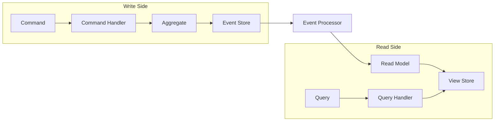

# Event Sourcing & CQRS in CIM

## Overview

CIM implements Event Sourcing and CQRS (Command Query Responsibility Segregation) to achieve:
- Complete audit trails
- Time travel debugging
- Event-driven integration
- Optimized read models
- Eventual consistency

## CQRS Architecture



## Command Side

### Commands

Commands express intent to change state:

```rust
pub trait Command: Send + Sync {
    type Aggregate: AggregateRoot;
    
    fn aggregate_id(&self) -> EntityId<Self::Aggregate>;
    fn validate(&self) -> Result<(), ValidationError>;
}

// Example: CreatePerson Command
#[derive(Debug, Clone)]
pub struct CreatePerson {
    pub person_id: EntityId<PersonMarker>,
    pub legal_name: PersonName,
    pub date_of_birth: Option<NaiveDate>,
}

impl Command for CreatePerson {
    type Aggregate = Person;
    
    fn aggregate_id(&self) -> EntityId<Person> {
        self.person_id
    }
    
    fn validate(&self) -> Result<(), ValidationError> {
        self.legal_name.validate()?;
        // Additional validation...
        Ok(())
    }
}
```

### Command Handlers

Command handlers process commands and generate events:

```rust
pub trait CommandHandler<C: Command> {
    type Error;
    
    async fn handle(&self, command: C) -> Result<CommandAcknowledgment, Self::Error>;
}

pub struct PersonCommandHandler {
    repository: Arc<dyn Repository<Person>>,
    event_publisher: Arc<dyn EventPublisher>,
}

impl CommandHandler<CreatePerson> for PersonCommandHandler {
    type Error = DomainError;
    
    async fn handle(&self, cmd: CreatePerson) -> Result<CommandAcknowledgment, Self::Error> {
        // Validate command
        cmd.validate()?;
        
        // Create new aggregate
        let mut person = Person::new(cmd.person_id);
        
        // Execute command
        let events = person.create(cmd.legal_name, cmd.date_of_birth)?;
        
        // Save aggregate
        self.repository.save(&person).await?;
        
        // Publish events
        for event in events {
            self.event_publisher.publish(event).await?;
        }
        
        Ok(CommandAcknowledgment::accepted(cmd.person_id))
    }
}
```

### Command Acknowledgment

Commands return acknowledgments, not data:

```rust
pub struct CommandAcknowledgment {
    pub status: CommandStatus,
    pub aggregate_id: String,
    pub version: u64,
    pub timestamp: SystemTime,
}

pub enum CommandStatus {
    Accepted,
    Rejected(String),
    Pending,
}
```

## Query Side

### Queries

Queries request data without side effects:

```rust
pub trait Query: Send + Sync {
    type Result: Send + Sync;
    
    fn validate(&self) -> Result<(), ValidationError>;
}

// Example: GetPersonById Query
#[derive(Debug, Clone)]
pub struct GetPersonById {
    pub person_id: EntityId<PersonMarker>,
}

impl Query for GetPersonById {
    type Result = Option<PersonView>;
    
    fn validate(&self) -> Result<(), ValidationError> {
        Ok(())
    }
}
```

### Query Handlers

Query handlers read from optimized projections:

```rust
pub trait QueryHandler<Q: Query> {
    type Error;
    
    async fn handle(&self, query: Q) -> Result<Q::Result, Self::Error>;
}

pub struct PersonQueryHandler {
    read_model: Arc<PersonReadModel>,
}

impl QueryHandler<GetPersonById> for PersonQueryHandler {
    type Error = QueryError;
    
    async fn handle(&self, query: GetPersonById) -> Result<Option<PersonView>, Self::Error> {
        self.read_model.find_by_id(query.person_id).await
    }
}
```

### Read Models

Read models are optimized for queries:

```rust
pub struct PersonView {
    pub person_id: EntityId<PersonMarker>,
    pub name: String,
    pub email: Option<String>,
    pub organization: Option<String>,
    pub last_updated: SystemTime,
}

pub trait PersonReadModel: Send + Sync {
    async fn find_by_id(&self, id: EntityId<PersonMarker>) -> Result<Option<PersonView>>;
    async fn find_by_email(&self, email: &str) -> Result<Vec<PersonView>>;
    async fn find_by_organization(&self, org_id: EntityId<OrganizationMarker>) -> Result<Vec<PersonView>>;
}
```

## Event Sourcing

### Event Store

The event store persists all domain events:

```rust
pub trait EventStore: Send + Sync {
    async fn append_events(
        &self,
        aggregate_id: String,
        events: Vec<DomainEventEnvelope>,
        expected_version: Option<u64>,
    ) -> Result<()>;
    
    async fn load_events(
        &self,
        aggregate_id: String,
        from_version: Option<u64>,
    ) -> Result<Vec<DomainEventEnvelope>>;
    
    async fn subscribe(
        &self,
        subject_pattern: &str,
    ) -> Result<Box<dyn Stream<Item = DomainEventEnvelope>>>;
}
```

### Event Envelope

Events are wrapped with metadata:

```rust
pub struct DomainEventEnvelope {
    pub event_id: Uuid,
    pub aggregate_id: String,
    pub sequence: u64,
    pub event_type: String,
    pub event_data: Vec<u8>,
    pub metadata: EventMetadata,
    pub timestamp: SystemTime,
}

pub struct EventMetadata {
    pub correlation_id: Option<Uuid>,
    pub causation_id: Option<Uuid>,
    pub user_id: Option<String>,
    pub session_id: Option<String>,
}
```

### Event Replay

Aggregates can be rebuilt from events:

```rust
pub async fn load_aggregate<A: AggregateRoot>(
    event_store: &dyn EventStore,
    aggregate_id: A::Id,
) -> Result<A> {
    let events = event_store
        .load_events(aggregate_id.to_string(), None)
        .await?;
    
    let mut aggregate = A::default();
    
    for envelope in events {
        let event = deserialize_event::<A::Event>(&envelope)?;
        aggregate.apply_event(&event)?;
    }
    
    Ok(aggregate)
}
```

## Event Processing

### Event Processors

Event processors update read models:

```rust
pub trait EventProcessor: Send + Sync {
    async fn process(&mut self, event: DomainEventEnvelope) -> Result<()>;
    async fn get_checkpoint(&self) -> Option<u64>;
    async fn save_checkpoint(&mut self, position: u64) -> Result<()>;
}

pub struct PersonProjectionProcessor {
    projection: Arc<Mutex<PersonProjection>>,
}

impl EventProcessor for PersonProjectionProcessor {
    async fn process(&mut self, envelope: DomainEventEnvelope) -> Result<()> {
        match envelope.event_type.as_str() {
            "PersonCreated" => {
                let event: PersonCreated = deserialize(&envelope.event_data)?;
                self.projection.lock().await.handle_person_created(event)?;
            }
            "EmailChanged" => {
                let event: EmailChanged = deserialize(&envelope.event_data)?;
                self.projection.lock().await.handle_email_changed(event)?;
            }
            _ => {} // Ignore unknown events
        }
        Ok(())
    }
}
```

### Projection Updates

Projections maintain denormalized views:

```rust
impl PersonProjection {
    pub fn handle_person_created(&mut self, event: PersonCreated) -> Result<()> {
        let view = PersonView {
            person_id: event.person_id,
            name: event.legal_name.display_name(),
            email: None,
            organization: None,
            last_updated: event.timestamp,
        };
        
        self.persons.insert(event.person_id, view);
        Ok(())
    }
    
    pub fn handle_email_changed(&mut self, event: EmailChanged) -> Result<()> {
        if let Some(view) = self.persons.get_mut(&event.person_id) {
            view.email = Some(event.new_email);
            view.last_updated = event.timestamp;
        }
        Ok(())
    }
}
```

## NATS Integration

### Event Publishing

Events are published to NATS subjects:

```rust
impl EventPublisher for NatsEventPublisher {
    async fn publish(&self, event: DomainEventEnvelope) -> Result<()> {
        let subject = format!("events.{}.{}", 
            event.aggregate_type(), 
            event.event_type
        );
        
        let payload = serde_json::to_vec(&event)?;
        
        self.client
            .publish(subject, payload.into())
            .await?;
        
        Ok(())
    }
}
```

### Event Subscription

Processors subscribe to event streams:

```rust
pub async fn start_projection_processor(
    nats: &NatsClient,
    processor: Arc<Mutex<dyn EventProcessor>>,
) -> Result<()> {
    let subscription = nats
        .subscribe("events.>")
        .await?;
    
    while let Some(message) = subscription.next().await {
        let envelope: DomainEventEnvelope = serde_json::from_slice(&message.payload)?;
        
        processor.lock().await.process(envelope).await?;
        
        message.ack().await?;
    }
    
    Ok(())
}
```

## Consistency Patterns

### Eventual Consistency

Read models are eventually consistent:

```rust
// Command side - immediate consistency
let events = person.change_email(new_email)?;
repository.save(&person).await?;

// Query side - eventual consistency
// May take milliseconds for projection to update
let view = query_handler.get_person(person_id).await?;
// view.email might still show old value briefly
```

### Saga Pattern

Long-running processes coordinate across aggregates:

```rust
pub struct HiringProcessSaga {
    state: HiringState,
    person_id: EntityId<PersonMarker>,
    organization_id: EntityId<OrganizationMarker>,
}

impl Saga for HiringProcessSaga {
    async fn handle_event(&mut self, event: DomainEvent) -> Result<Vec<Command>> {
        match (&self.state, event) {
            (HiringState::Started, PersonCreated { .. }) => {
                self.state = HiringState::PersonCreated;
                Ok(vec![Command::CreateEmployment { .. }])
            }
            (HiringState::PersonCreated, EmploymentCreated { .. }) => {
                self.state = HiringState::Completed;
                Ok(vec![Command::NotifyHR { .. }])
            }
            _ => Ok(vec![])
        }
    }
}
```

## Best Practices

### 1. Command Design
- Commands should be task-oriented, not CRUD
- Include all data needed for the operation
- Validate commands before processing

### 2. Event Design
- Events are immutable facts
- Use past tense naming
- Include relevant data, not entire aggregates

### 3. Projection Design
- Design projections for specific query needs
- Denormalize for query performance
- Handle out-of-order events gracefully

### 4. Error Handling
- Commands can fail, handle errors gracefully
- Events should not fail during replay
- Use dead letter queues for failed projections

### 5. Testing
- Test aggregates with event scenarios
- Test projections with event sequences
- Test eventual consistency handling

## Performance Considerations

### Event Store Optimization
- Partition by aggregate ID
- Index by aggregate type and timestamp
- Consider snapshotting for long event streams

### Projection Optimization
- Use appropriate data structures
- Batch updates when possible
- Consider caching for frequently accessed data

### Message Flow Optimization
- Use NATS JetStream for guaranteed delivery
- Implement backpressure handling
- Monitor queue depths and processing rates 