# IPLD in CIM: Visual Guide

## The Evolution of Information Management

```mermaid
graph LR
    subgraph "Past: File Cabinets"
        FC["📁 Physical Files<br/>Location-based"]
    end

    subgraph "Present: Digital Folders"
        DF["💾 Digital Files<br/>Path-based"]
    end

    subgraph "Future: CIM with IPLD"
        CIM["🌐 Content Network<br/>Content-addressed"]
    end

    FC -->|"Digitization"| DF
    DF -->|"Intelligence"| CIM

    style FC fill:#f9f9f9
    style DF fill:#e3f2fd
    style CIM fill:#c8e6c9
```



## How Content Gets Its Superpower

```mermaid
graph TB
    subgraph "Traditional File"
        FILE["📄 report.pdf<br/>Just bytes"]
    end

    subgraph "IPLD-Enhanced Content"
        CONTENT["📄 report.pdf"]
        CID["🔐 CID: bafyrei...]
        TYPE["📑 Type: Document/PDF"]
        META["📊 Metadata: Author, Date, Tags"]
        TEXT["📝 Extracted Text: Searchable"]
        REL["🔗 Relationships: Links to sources"]
        HIST["📚 History: All versions"]
    end

    FILE -->|"Transform with IPLD"| CONTENT
    CONTENT --> CID
    CONTENT --> TYPE
    CONTENT --> META
    CONTENT --> TEXT
    CONTENT --> REL
    CONTENT --> HIST

    style FILE fill:#ffcccc
    style CONTENT fill:#c8e6c9
```

## The Knowledge Graph in Action


## Content Transformation Pipeline

```mermaid
graph LR
    subgraph "Input"
        VIDEO["🎥 Video File"]
    end

    subgraph "Automatic Transformations"
        TRANS["📝 Transcript"]
        TRANSLATE["🌐 Translation"]
        SUMMARY["📋 Summary"]
        TASKS["✅ Action Items"]
        SEARCH["🔍 Searchable"]
    end

    subgraph "Output"
        KNOW["🧠 Knowledge"]
    end

    VIDEO --> TRANS
    TRANS --> TRANSLATE
    TRANS --> SUMMARY
    TRANS --> TASKS
    TRANS --> SEARCH

    TRANSLATE --> KNOW
    SUMMARY --> KNOW
    TASKS --> KNOW
    SEARCH --> KNOW

    style VIDEO fill:#e3f2fd
    style KNOW fill:#c8e6c9
```



## Time Travel Through Your Work

```mermaid
graph TB
    subgraph "Document Timeline"
        V1["📄 Version 1<br/>Jan 1"]
        V2["📄 Version 2<br/>Jan 15"]
        V3["📄 Version 3<br/>Feb 1"]
        V4["📄 Version 4<br/>Feb 20"]
        CURRENT["📄 Current<br/>Today"]
    end

    V1 -->|"Added intro"| V2
    V2 -->|"Updated data"| V3
    V3 -->|"Peer review"| V4
    V4 -->|"Final edits"| CURRENT

    V1 -.->|"Branch"| ALT["📄 Alternative<br/>Approach"]
    ALT -.->|"Merge ideas"| V4

    style CURRENT fill:#c8e6c9
    style ALT fill:#fff3e0
```



## The Intelligence Amplification Effect

```mermaid
graph TB
    subgraph "Individual Knowledge"
        YOU["👤 Your Knowledge"]
    end

    subgraph "Team Knowledge"
        TEAM["👥 Team Knowledge"]
    end

    subgraph "Organizational Intelligence"
        ORG["🏢 Organizational Memory"]
        PATTERNS["📊 Discovered Patterns"]
        INSIGHTS["💡 AI Insights"]
        PREDICT["🔮 Predictions"]
    end

    YOU -->|"Contributes to"| TEAM
    TEAM -->|"Builds"| ORG
    ORG --> PATTERNS
    ORG --> INSIGHTS
    ORG --> PREDICT

    PATTERNS -->|"Enhances"| YOU
    INSIGHTS -->|"Enhances"| YOU
    PREDICT -->|"Guides"| YOU

    style YOU fill:#e3f2fd
    style ORG fill:#c8e6c9
    style PREDICT fill:#fff3e0
```



## Security and Trust Model


## ROI of Intelligent Information

```mermaid
graph LR
    subgraph "Investment"
        TIME["⏱️ Time to Tag/Link"]
        STORAGE["💾 Storage Space"]
    end

    subgraph "Returns"
        FIND["🔍 80% Faster Discovery"]
        REUSE["♻️ 60% More Reuse"]
        QUALITY["📈 Better Decisions"]
        INNOVATION["💡 New Insights"]
        RISK["🛡️ Reduced Risk"]
    end

    TIME -->|"Yields"| FIND
    TIME -->|"Yields"| REUSE
    STORAGE -->|"Enables"| QUALITY
    STORAGE -->|"Enables"| INNOVATION
    STORAGE -->|"Enables"| RISK

    style TIME fill:#fff3e0
    style STORAGE fill:#fff3e0
    style FIND fill:#c8e6c9
    style REUSE fill:#c8e6c9
    style QUALITY fill:#c8e6c9
    style INNOVATION fill:#c8e6c9
    style RISK fill:#c8e6c9
```



## Your Journey with CIM

```mermaid
graph TB
    START["🚀 Start Using CIM"]

    subgraph "Week 1"
        W1["📁 Store Documents<br/>🔍 Basic Search<br/>🔗 See Connections"]
    end

    subgraph "Month 1"
        M1["📊 Knowledge Graphs<br/>🤖 AI Suggestions<br/>⚡ Workflows"]
    end

    subgraph "Year 1"
        Y1["🧠 Organizational Intelligence<br/>🔮 Predictive Insights<br/>🏆 Competitive Advantage"]
    end

    START --> W1
    W1 --> M1
    M1 --> Y1

    style START fill:#e3f2fd
    style W1 fill:#e8f5e9
    style M1 fill:#fff3e0
    style Y1 fill:#c8e6c9
```



---

## Quick Reference Card

### 🔑 Key Concepts
- **CID**: Content Identifier - Your content's permanent address
- **IPLD**: InterPlanetary Linked Data - The smart connection system
- **Knowledge Graph**: Your interconnected information network
- **Semantic Search**: Find by meaning, not just keywords

### 🎯 Quick Wins
1. **Never lose a file**: Everything has a permanent address
2. **Find anything**: Search by content, not location
3. **See connections**: Discover relationships automatically
4. **Track changes**: Complete history of everything
5. **Prove authenticity**: Cryptographic verification built-in

### 🚀 Power Features
- **Auto-extraction**: PDFs become searchable text
- **Smart linking**: Related content connects itself
- **Time travel**: Go back to any version
- **AI insights**: Discover patterns you missed
- **Team intelligence**: Learn from collective knowledge

---

*Transform your information from a filing cabinet into an intelligence amplifier with CIM and IPLD.*
