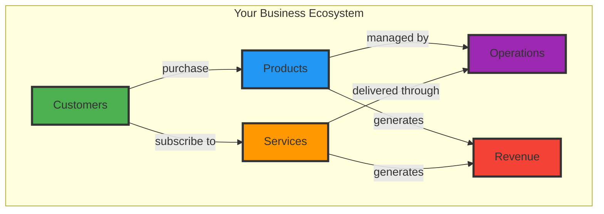
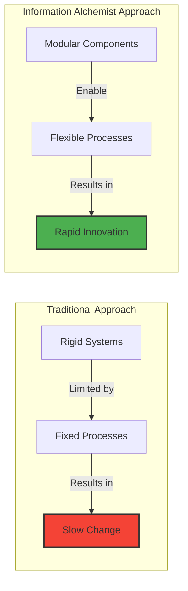

# Information Alchemist: Your Visual Gateway to Business Intelligence

## Transform Your Business with the Power of Visual Information Management

Information Alchemist is the intuitive visual interface for the Composable Information Machine (CIM) - a revolutionary platform that transforms how businesses understand, organize, and leverage their information assets.

## What is Information Alchemist?

Information Alchemist is a powerful graph visualization tool that makes complex business relationships visible and manageable. Think of it as a "Google Maps" for your business information - where you can see how customers, products, processes, and outcomes connect and influence each other.

## The Business Challenge

In today's data-driven world, businesses face several critical challenges:

- **Information Silos**: Critical business data is scattered across multiple systems
- **Hidden Relationships**: Important connections between data points remain invisible
- **Slow Decision Making**: Lack of real-time insights delays critical business decisions
- **Complex Analysis**: Understanding multi-dimensional business relationships requires technical expertise

## The Information Alchemist Solution

Information Alchemist transforms these challenges into competitive advantages:

### 1. **Visual Intelligence**
See your entire business ecosystem in interactive 3D or 2D views. Zoom from high-level overviews down to specific details with a click.

### 2. **Real-Time Insights**
Watch as business events update your information landscape in real-time, revealing trends and patterns as they emerge.

### 3. **Modular Business Building Blocks**
Compose complex business processes from simple, reusable components - like building with digital Lego blocks.

### 4. **Intelligent Recommendations**
AI-powered agents analyze your business patterns and suggest optimizations, opportunities, and risk mitigations.

## Key Benefits for Your Business

### 📈 **Accelerate Decision Making**
- Visualize complex scenarios instantly
- Identify opportunities and risks at a glance
- Make data-driven decisions with confidence

### 🔄 **Optimize Operations**
- Discover inefficiencies in your processes
- Identify bottlenecks and dependencies
- Streamline workflows based on actual data patterns

### 🎯 **Enhance Customer Understanding**
- Map complete customer journeys
- Identify high-value customer segments
- Predict customer behavior and needs

### 💡 **Drive Innovation**
- Explore "what-if" scenarios visually
- Test new business models safely
- Identify new revenue opportunities

## Proven Value Across Industries

Information Alchemist delivers measurable value across diverse sectors:

- **Document Management**: Streamline approval workflows and enhance compliance tracking
- **Customer Relations**: Optimize relationship networks and improve account management
- **Financial Services**: Enhance risk assessment and portfolio optimization
- **Healthcare**: Improve patient outcomes through journey visualization
- **Manufacturing**: Increase production efficiency and reduce operational costs
- **Private Lending**: Enhance risk assessment and compliance management

## Getting Started is Simple

1. **Connect Your Data**: Information Alchemist integrates with your existing systems
2. **Visualize Instantly**: See your business relationships come to life
3. **Discover Insights**: Let AI help you find patterns and opportunities
4. **Take Action**: Make informed decisions based on clear visual evidence

## The Power of Composable Business

Information Alchemist is built on CIM's composable architecture, meaning:

- **Start Small**: Begin with one department or process
- **Scale Naturally**: Expand as you see value
- **Stay Flexible**: Adapt quickly to market changes
- **Maintain Control**: Your business logic remains yours

## Next Steps

Ready to transform how you see and manage your business information?

1. **Schedule a Demo**: See Information Alchemist in action with your business scenarios
2. **Start a Pilot**: Begin with a focused project to prove value
3. **Scale Success**: Expand across your organization as you see results

---

*Information Alchemist: Where Business Insight Meets Visual Intelligence*
