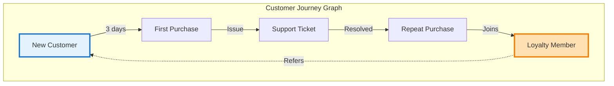
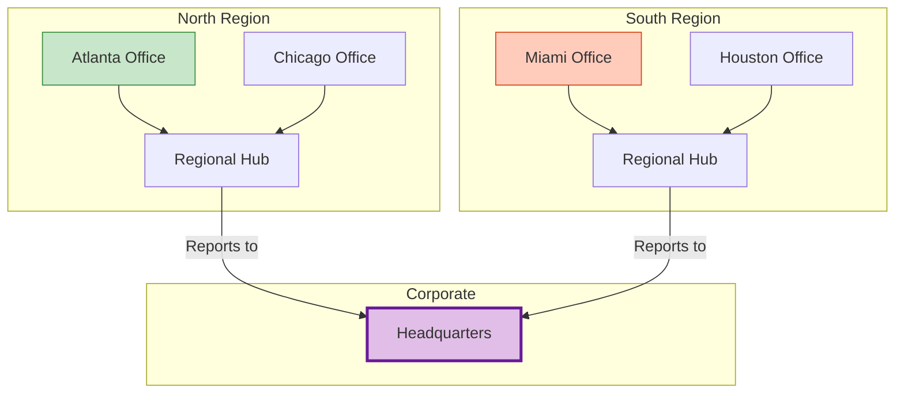
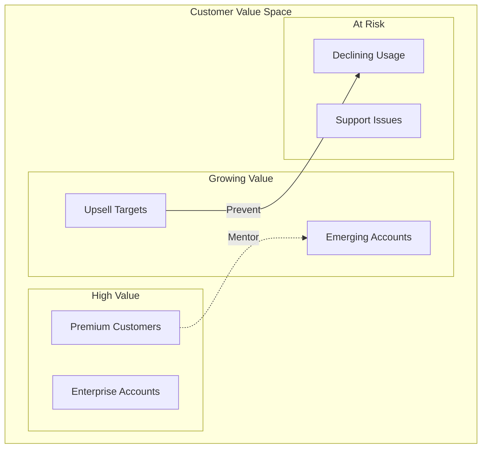
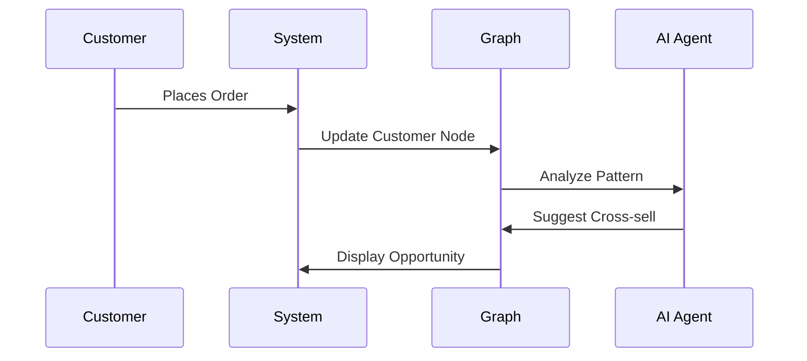
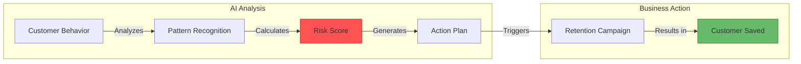
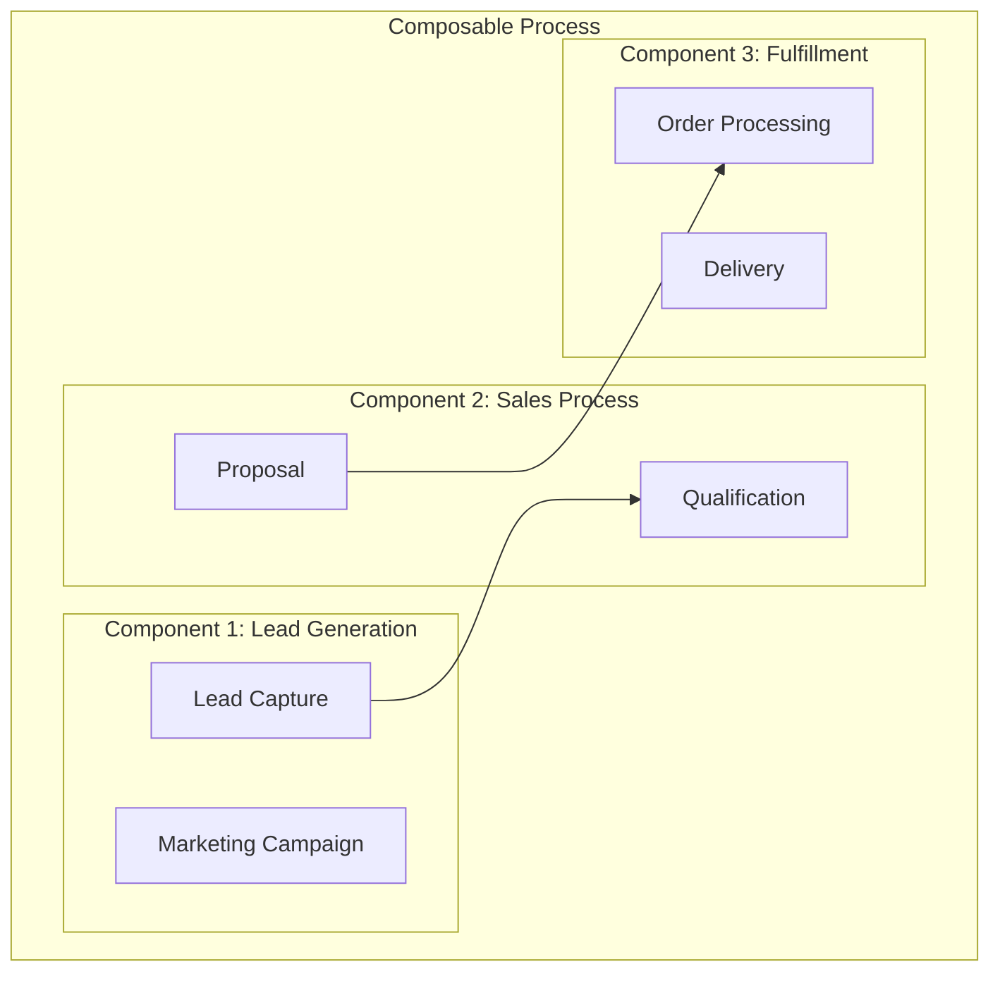
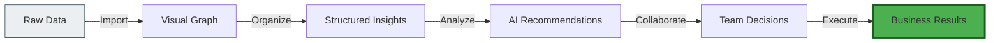

# Core Concepts: Understanding Information Alchemist

## Visual Building Blocks for Your Business

Information Alchemist transforms complex business data into visual, interactive elements that anyone can understand and manipulate. Let's explore the core concepts that make this possible.

## 1. The Graph: Your Business Map

Think of a graph as a living map of your business where:
- **Nodes** represent business entities (customers, products, locations)
- **Edges** show relationships (purchases, deliveries, communications)
- **Properties** capture details (revenue, dates, quantities)

## 2. Subgraphs: Organize Complexity

Subgraphs are self-contained sections of your business that maintain their own identity while connecting to the larger picture.

### Real-World Example: Regional Operations

### Benefits of Subgraphs:
- **Modular Management**: Load and manage different business units independently
- **Clear Boundaries**: See where one department ends and another begins
- **Flexible Composition**: Combine multiple business models into unified views
- **Maintain Context**: Each subgraph remembers its origin and structure

## 3. Conceptual Spaces: Smart Organization

Information Alchemist uses "conceptual spaces" to intelligently organize your information. Imagine a 3D space where similar things naturally cluster together:

## 4. Event-Driven Intelligence

Your business doesn't stand still, and neither does Information Alchemist. Every change in your business triggers an event that updates your visual landscape in real-time:

### Event Flow Example

## 5. AI-Powered Insights

Intelligent agents continuously analyze your business graph to:

- **Predict Trends**: Spot patterns before they become obvious
- **Suggest Actions**: Recommend optimal next steps
- **Identify Risks**: Alert you to potential problems
- **Find Opportunities**: Discover hidden connections

### Example: Customer Churn Prevention

## 6. Collaborative Workspaces

Multiple team members can work with the same business graph simultaneously:

- **See Others' Focus**: Colored cursors show where teammates are working
- **Share Insights**: Highlight important discoveries for others
- **Prevent Conflicts**: Smart locking prevents accidental overwrites
- **Track Changes**: Complete audit trail of who changed what and when

## 7. The Power of Composition

Build complex business processes by combining simple components:

### Why Composition Matters:
- **Reusability**: Use the same components across different processes
- **Flexibility**: Swap components without rebuilding everything
- **Speed**: Assemble new processes in hours, not months
- **Testing**: Try new approaches without risk

## 8. Visual Analytics

Transform data into understanding through visual analysis:

### Layout Algorithms
Information Alchemist automatically organizes your data for clarity:

- **Force-Directed**: Related items naturally cluster together
- **Hierarchical**: See organizational structures clearly
- **Geographic**: Map data to real-world locations
- **Timeline**: Understand sequences and processes

### Interactive Exploration
- **3D Navigation**: Fly through your data landscape
- **2D Overview**: Get the big picture at a glance
- **Focus + Context**: Zoom into details while keeping perspective
- **Filter and Search**: Find exactly what you need instantly

## Putting It All Together

Information Alchemist combines these concepts to create a powerful business intelligence platform:

1. **Import** your business data from multiple sources
2. **Visualize** relationships automatically
3. **Organize** with subgraphs and conceptual spaces
4. **Analyze** with AI-powered insights
5. **Collaborate** with your team in real-time
6. **Act** on clear, visual intelligence

## Summary

Information Alchemist makes the invisible visible. By transforming abstract business data into interactive visual landscapes, it empowers everyone in your organization to:

- **See** the complete picture
- **Understand** complex relationships
- **Discover** hidden opportunities
- **Make** better decisions
- **Drive** business growth

The future of business intelligence is visual, intuitive, and intelligent. Welcome to Information Alchemist.

---

*Next: Learn about specific use cases and how Information Alchemist transforms different industries →*
