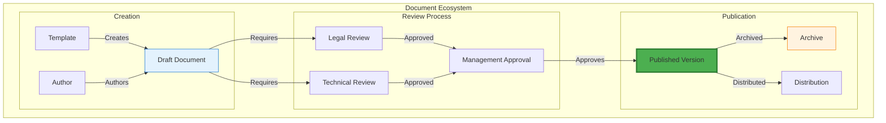
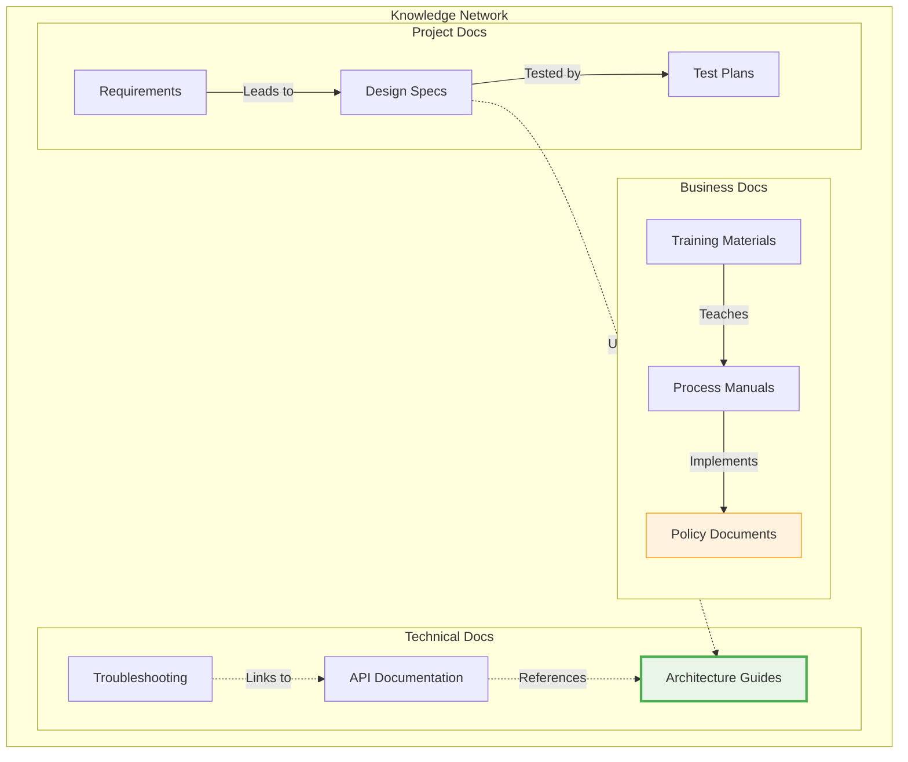
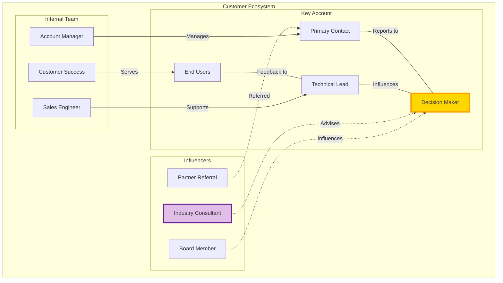
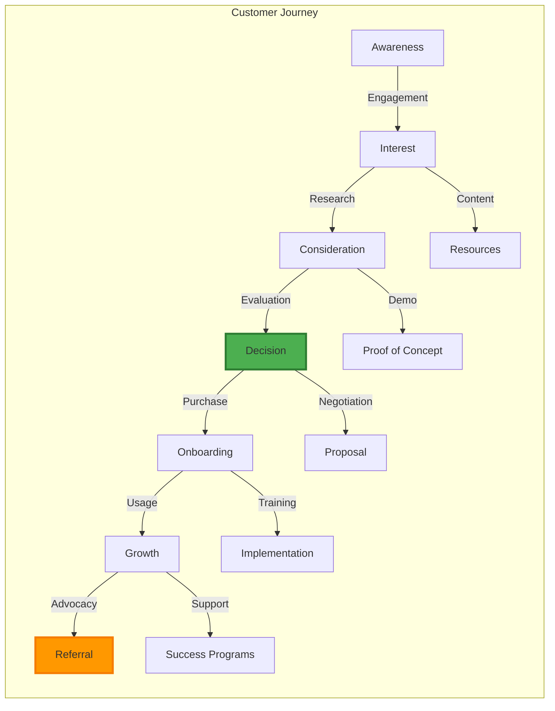
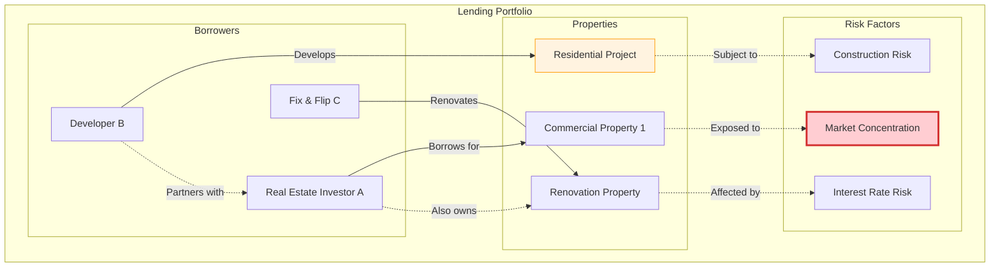
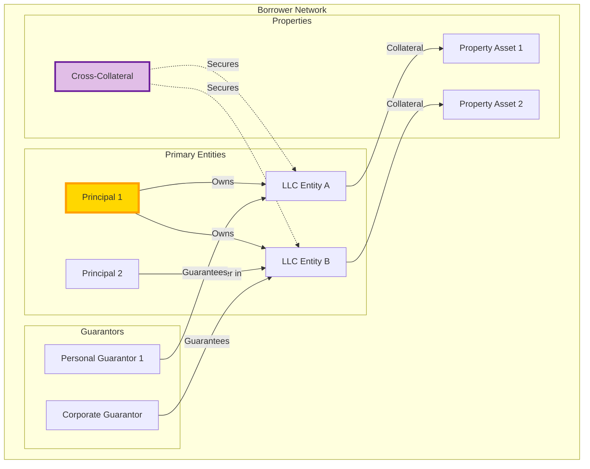
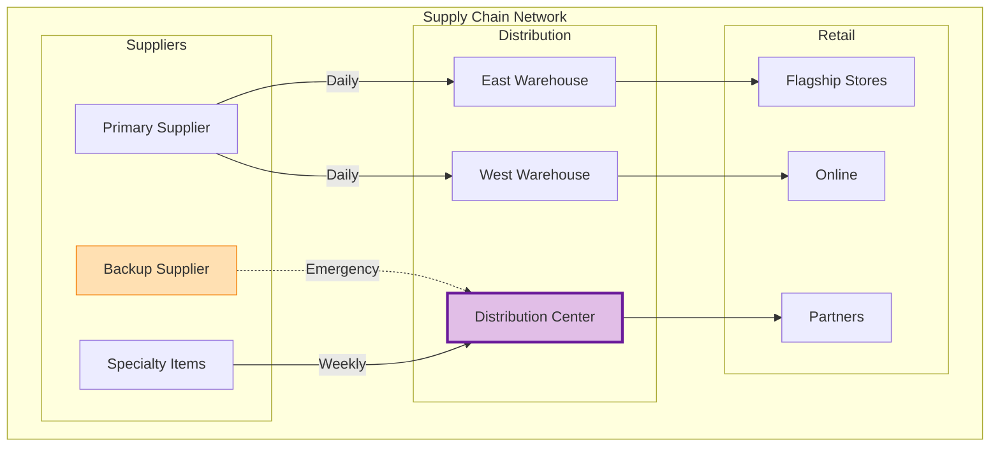
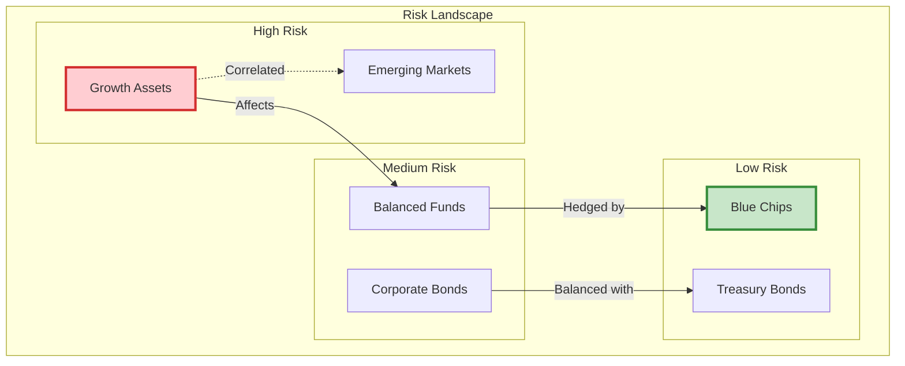
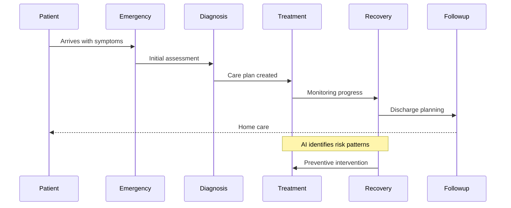
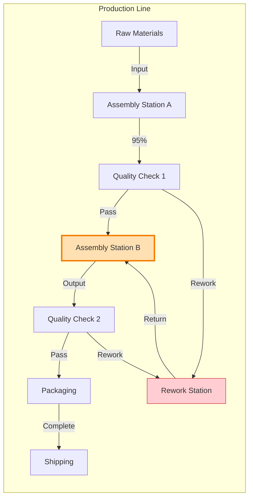

# Use Cases: Information Alchemist in Action

## Real-World Applications Across Industries

Information Alchemist transforms how businesses visualize and understand their operations. Here are practical examples of how different industries leverage this powerful platform.

## 1. Document Management

### Enterprise Document Lifecycle Visualization

**Challenge**: Organizations struggle to track document relationships, approval workflows, and compliance across departments.

**Solution**: Information Alchemist creates a visual map of document ecosystems, revealing:

**Business Impact**:
- Streamlined approval processes through visual bottleneck identification
- Enhanced compliance tracking with clear audit trails
- Improved collaboration through document relationship mapping
- Reduced document duplication and version confusion

### Knowledge Base Optimization

**Challenge**: Finding relevant documents and understanding knowledge relationships across large repositories.

**Solution**: Visualize knowledge connections and content relationships:

**Business Impact**:
- Faster information discovery through visual knowledge maps
- Improved onboarding with clear learning paths
- Enhanced decision-making through context awareness
- Reduced knowledge silos across departments

## 2. Customer Relations Management

### Customer Relationship Network Analysis

**Challenge**: Understanding complex customer relationships, influence patterns, and account dependencies in B2B environments.

**Solution**: Map comprehensive customer ecosystems and stakeholder networks:

**Business Impact**:
- Enhanced account planning through relationship visibility
- Improved sales strategies based on influence mapping
- Better resource allocation across customer touchpoints
- Increased customer retention through proactive relationship management

### Customer Journey Optimization

**Challenge**: Understanding customer behavior patterns and optimizing touchpoints across complex sales cycles.

**Solution**: Visualize complete customer journeys and interaction patterns:

**Business Impact**:
- Optimized conversion rates through journey analysis
- Improved customer experience design
- Enhanced sales and marketing alignment
- Increased customer lifetime value through engagement optimization

## 3. Private Mortgage Lending

### Loan Portfolio Risk Visualization

**Challenge**: Managing complex relationships between borrowers, properties, and risk factors in private lending portfolios.

**Solution**: Create comprehensive views of lending networks and risk concentrations:

**Business Impact**:
- Enhanced risk assessment through relationship analysis
- Improved portfolio diversification strategies
- Better due diligence through network visualization
- Proactive risk management through pattern recognition

### Borrower Relationship Networks

**Challenge**: Understanding borrower connections, guarantor relationships, and potential conflicts of interest.

**Solution**: Map borrower ecosystems and financial relationships:

**Business Impact**:
- Improved credit risk assessment through entity analysis
- Enhanced compliance with concentration limits
- Better understanding of borrower capacity
- Streamlined due diligence processes

## 4. Retail & E-Commerce

### Supply Chain Visibility

**Challenge**: Managing complex supplier relationships and inventory flows.

**Solution**: Create a living map of your entire supply chain:

**Business Impact**:
- Enhanced supply chain resilience through visibility
- Improved inventory optimization
- Better supplier relationship management
- Proactive risk mitigation

## 5. Financial Services

### Risk Network Analysis

**Challenge**: Understanding interconnected financial risks across portfolios.

**Solution**: Visualize risk relationships and correlation patterns:

**Business Impact**:
- Enhanced portfolio risk management
- Improved correlation analysis
- Better regulatory compliance
- Proactive risk identification

## 6. Healthcare

### Patient Journey Mapping

**Challenge**: Optimizing patient care pathways and reducing readmissions.

**Solution**: Visualize complete patient journeys through the healthcare system:

**Business Impact**:
- Improved patient outcomes through pathway optimization
- Enhanced care coordination across departments
- Better resource utilization
- Reduced readmission rates

## 7. Manufacturing

### Production Flow Optimization

**Challenge**: Identifying bottlenecks in complex manufacturing processes.

**Solution**: Visualize entire production networks with performance data:

**Business Impact**:
- Enhanced production efficiency through bottleneck identification
- Improved quality control processes
- Better resource allocation
- Reduced operational costs

## Key Benefits Across All Use Cases

### Common Value Propositions:

1. **Enhanced Visibility**: See complex relationships that traditional tools miss
2. **Pattern Recognition**: AI identifies trends and anomalies automatically
3. **Improved Decision Making**: Visual insights support better choices
4. **Team Collaboration**: Shared understanding across departments
5. **Operational Efficiency**: Streamlined processes through visualization

### Implementation Approach:

- **Scalable Solutions**: Start small and expand based on value
- **Integration Friendly**: Works with existing systems and data
- **User-Centric Design**: Intuitive interfaces for all skill levels
- **Continuous Learning**: AI improves insights over time

## Getting Started with Your Use Case

1. **Identify Your Challenge**: What relationships matter most to your business?
2. **Start Small**: Pick one process or department for your pilot
3. **Connect Your Data**: Integrate existing systems with Information Alchemist
4. **Visualize and Explore**: Let the platform reveal hidden patterns
5. **Act on Insights**: Transform visualization into business value

---

*Ready to see how Information Alchemist can transform your specific business challenges? Contact us for a personalized demonstration.*
