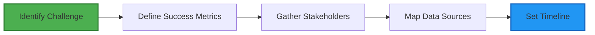
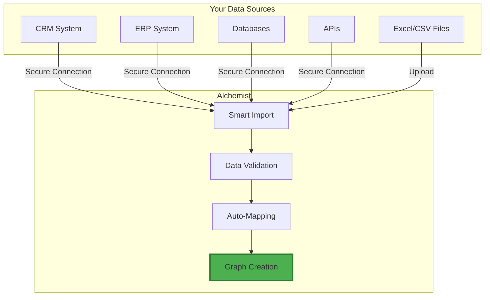
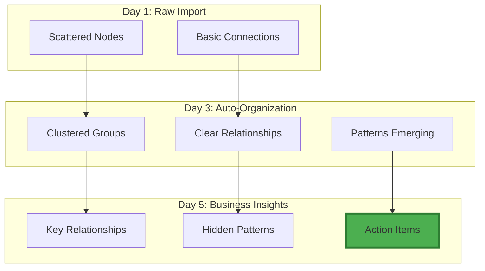
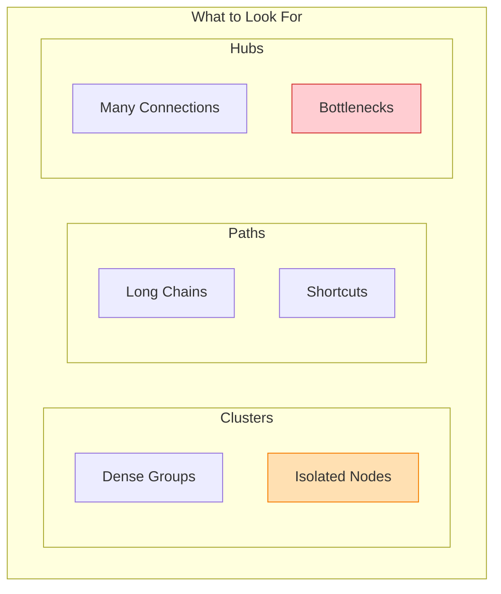
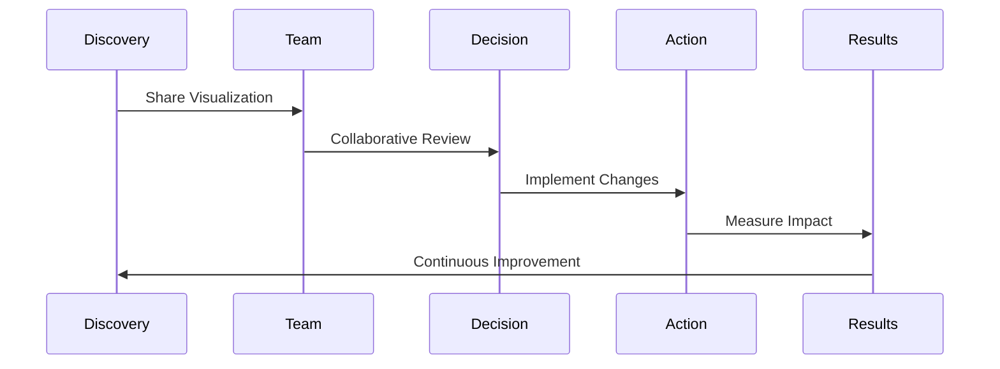
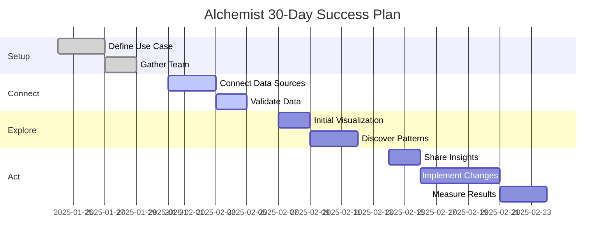

# Getting Started with Alchemist

## Your Journey from Data to Insight

Getting started with Alchemist is straightforward. This guide walks you through the process from initial setup to delivering your first business insights.

## Phase 1: Preparation (Week 1)

### Define Your First Use Case

Start with a focused business challenge that has clear value:

**Good First Projects:**
- Customer journey mapping for a single product line
- Supply chain visualization for your top SKUs
- Sales team performance and relationship networks
- Single department process optimization

### Success Criteria Checklist

Before starting, ensure you have:
- [ ] Clear business problem to solve
- [ ] Executive sponsor committed to the project
- [ ] Access to relevant data sources
- [ ] Team members identified (3-5 people ideal)
- [ ] 30-60 day timeline for initial results

## Phase 2: Connection (Week 2)

### Connect Your Data Sources

Alchemist integrates with your existing systems without disruption:

### Data Integration Options

1. **Direct Database Connection**
   - Real-time data synchronization
   - Secure read-only access
   - Automatic updates

2. **API Integration**
   - Connect to cloud services
   - REST/GraphQL support
   - Scheduled refreshes

3. **File Import**
   - Excel, CSV, JSON formats
   - Drag-and-drop interface
   - Data validation on import

4. **Manual Entry**
   - Quick prototyping
   - Small data sets
   - Proof of concepts

## Phase 3: Visualization (Week 3)

### Your First Graph

Once data is connected, Alchemist automatically creates your initial visualization:

### Exploration Tools

**Navigation Controls:**
- **Mouse**: Click and drag to rotate view
- **Scroll**: Zoom in and out
- **Double-click**: Focus on element
- **Right-click**: Context menu

**View Options:**
- **3D Mode**: Full spatial exploration
- **2D Mode**: Traditional diagram view
- **Split Screen**: Compare different views
- **Minimap**: Navigate large graphs

## Phase 4: Discovery (Week 4)

### Finding Insights

Alchemist helps you discover patterns through:

### 1. Visual Patterns
Look for natural clusters and outliers:

### 2. AI Assistance
Let AI agents highlight important discoveries:

- **Anomaly Detection**: Unusual patterns flagged automatically
- **Trend Analysis**: Changes over time highlighted
- **Recommendations**: Suggested actions based on patterns
- **Predictive Insights**: Future state projections

### 3. Interactive Analysis
- Filter by properties to focus investigation
- Color-code by metrics to reveal performance
- Animate time sequences to see evolution
- Compare scenarios side-by-side

## Phase 5: Action (Week 5-6)

### From Insight to Impact

Transform discoveries into business value:

### Sharing and Collaboration

**Export Options:**
- **Interactive Reports**: Share live visualizations
- **Static Images**: For presentations
- **Data Exports**: For further analysis
- **Video Walkthroughs**: For training

**Collaboration Features:**
- Real-time multi-user sessions
- Annotation and comments
- Version control
- Access permissions

## Common First-Time User Scenarios

### Scenario 1: Sales Manager
**Goal**: Understand customer relationships and improve targeting

**Week 1**: Import CRM data
**Week 2**: Visualize customer networks
**Week 3**: Identify influencer customers
**Week 4**: Launch referral program
**Result**: Improved referral program effectiveness

### Scenario 2: Operations Director
**Goal**: Optimize supply chain efficiency

**Week 1**: Connect ERP and logistics data
**Week 2**: Map supplier networks
**Week 3**: Identify bottlenecks
**Week 4**: Restructure routing
**Result**: Enhanced delivery performance

### Scenario 3: Marketing VP
**Goal**: Improve campaign effectiveness

**Week 1**: Import campaign and customer data
**Week 2**: Visualize customer journey
**Week 3**: Find drop-off points
**Week 4**: Redesign touchpoints
**Result**: Improved conversion rates

## Best Practices for Success

### Do's:
✅ Start with a specific, bounded problem
✅ Involve end users early and often
✅ Celebrate small wins along the way
✅ Document insights as you discover them
✅ Share visualizations widely

### Don'ts:
❌ Try to boil the ocean on day one
❌ Skip the planning phase
❌ Work in isolation
❌ Ignore the AI recommendations
❌ Forget to measure results

## Support Resources

### Training Options
1. **Quick Start Videos**: Overview sessions
2. **Interactive Tutorials**: Hands-on learning
3. **Weekly Webinars**: Tips and tricks
4. **User Community**: Share experiences

### Getting Help
- **In-App Assistant**: Context-sensitive help
- **Support Chat**: Real-time assistance
- **Knowledge Base**: Searchable articles
- **Success Manager**: Dedicated resource

## Your 30-Day Success Plan

## Ready to Begin?

You now have everything you need to start your Alchemist journey:

1. **Choose your first project** - Start specific and valuable
2. **Assemble your team** - 3-5 committed people
3. **Connect your data** - We'll help with integration
4. **Explore and discover** - Let the insights emerge
5. **Take action** - Transform insight into impact

Remember: The goal isn't to create perfect visualizations—it's to uncover insights that drive better business decisions.

---

*Start your journey today and see your business in a whole new light.*
