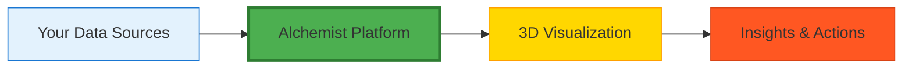

# Executive Summary: Alchemist

## Transform Your Business Intelligence with 3D Visual Analytics

### The Challenge

Modern businesses drowning in data face three critical problems:
1. **Information Overload**: Data scattered across dozens of systems
2. **Hidden Relationships**: Critical connections remain invisible
3. **Slow Decision Making**: Insights buried in spreadsheets and reports

Traditional business intelligence tools offer charts and dashboards, but they can't show how everything connects. You need a new approach.

### The Solution: Alchemist

Alchemist is a revolutionary 3D visualization platform that transforms your business data into an interactive, living landscape you can explore and understand instantly.

Think of it as Google Maps for your business—see everything at once, zoom into details, discover patterns, and navigate relationships that were previously invisible.

### Key Business Benefits

#### 1. **See Everything Connected**
- Visualize your entire business ecosystem in one view
- Understand cause-and-effect relationships instantly
- Discover hidden dependencies and opportunities

#### 2. **Make Decisions Faster**
- Significant reduction in time-to-insight
- Visual patterns reveal answers immediately
- Real-time updates show impact of changes

#### 3. **Reduce Operational Costs**
- Faster process completion through workflow optimization
- Eliminate redundancies by seeing duplicate efforts
- Prevent problems before they cascade

#### 4. **Enable True Collaboration**
- Teams see the same real-time picture
- Visual communication transcends departmental languages
- Shared understanding drives aligned action

### Expected Benefits

Organizations using Alchemist can expect:
- **Faster process completion** through visual workflow optimization
- **Improved problem resolution** by seeing root causes
- **Reduced onboarding time** for new employees
- **Fewer data inconsistencies** through event-driven architecture

### How It Works

1. **Connect**: Integrate existing systems without disruption
2. **Visualize**: See your data transform into interactive 3D graphs
3. **Explore**: Navigate relationships and discover patterns
4. **Act**: Make informed decisions based on clear visual evidence

### Competitive Advantages

#### vs. Traditional BI Tools
- **Dynamic Relationships**: Not just static charts
- **Real-time Updates**: Living data, not snapshots
- **Intuitive Navigation**: Explore like a video game
- **No SQL Required**: Visual queries for everyone

#### vs. Custom Development
- **Immediate Value**: Deploy in days, not months
- **Proven Architecture**: Built on enterprise-grade foundations
- **Future-Proof**: AI-ready from day one
- **Cost-Effective**: No massive development teams

### Technology Excellence

- **100% Complete**: All 15 core domains production-ready
- **Event-Driven**: Perfect audit trail, zero data loss
- **Open Source**: No vendor lock-in, full transparency
- **Enterprise-Grade**: Built with Rust for performance and reliability

### Investment Considerations

#### Typical Investment
- **Software**: Open source (free) or enterprise support options
- **Implementation**: 30-60 days for initial deployment
- **Training**: 1-2 weeks for team proficiency
- **Integration**: Works with existing systems

#### Expected Value
- **Efficiency Gains**: From process optimization and automation
- **Error Reduction**: From prevented mistakes and better visibility
- **Faster Decisions**: From improved information access
- **Innovation**: From new insights and pattern discovery

### Implementation Approach

#### Week 1-2: Quick Start
- Install and configure Alchemist
- Connect first data source
- Create initial visualizations
- Train core team

#### Week 3-4: Expand
- Add additional data sources
- Develop custom workflows
- Refine visualizations
- Roll out to departments

#### Month 2-3: Optimize
- Fine-tune based on usage
- Implement advanced features
- Measure impact
- Scale across organization

### Risk Mitigation

- **Low Risk**: Start small with pilot project
- **Proven Technology**: Built on established platforms
- **Gradual Adoption**: Scale at your pace
- **Full Support**: Community and enterprise options

### Call to Action

The future of business intelligence is here. While competitors struggle with scattered data and hidden relationships, you can see everything clearly and act with confidence.

**Next Steps:**
1. **Schedule a Demo**: See Alchemist with your data (demo@thecowboy.ai)
2. **Start a Pilot**: Prove value with focused project
3. **Transform Your Business**: Roll out enterprise-wide

### Bottom Line

Alchemist isn't just another visualization tool—it's a new way of understanding your business. In a world where the fastest insight wins, can you afford not to see clearly?

**The question isn't whether to adopt visual analytics. The question is whether you'll lead or follow.**

---

*Alchemist: Where Data Becomes Understanding*

**Contact**: demo@thecowboy.ai | **GitHub**: TheCowboyAI/alchemist

*Built for success by Cowboy AI, LLC* 