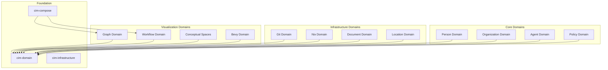
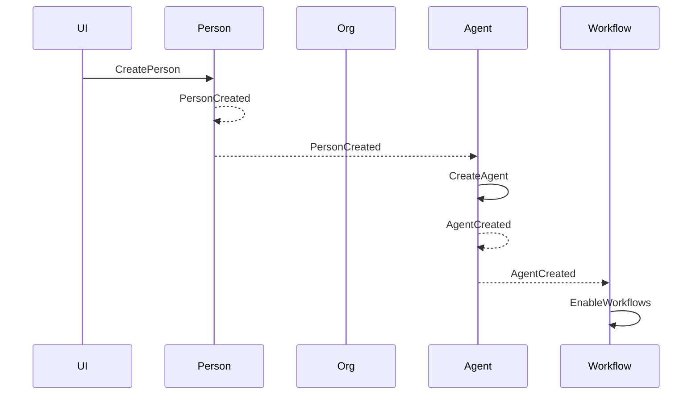

# Domain Modules Overview

## Architecture

CIM is organized into domain modules, each representing a bounded context with clear responsibilities and boundaries. All domains follow Domain-Driven Design principles and communicate exclusively through events.



## Domain Categories

### Core Business Domains

These domains represent the core business concepts:

1. **Person Domain** (`cim-domain-person`)
   - Identity management
   - Contact information
   - Skills and capabilities
   - Employment relationships

2. **Organization Domain** (`cim-domain-organization`)
   - Organizational structures
   - Hierarchies and departments
   - Member management
   - Roles and responsibilities

3. **Agent Domain** (`cim-domain-agent`)
   - Autonomous actors
   - Capability management
   - Tool access control
   - Deployment and activation

4. **Policy Domain** (`cim-domain-policy`)
   - Business rules
   - Security policies
   - Compliance requirements
   - Access control

### Infrastructure Domains

These domains provide technical capabilities:

1. **Git Domain** (`cim-domain-git`)
   - Repository analysis
   - Commit graph extraction
   - Branch management
   - GitHub integration via MCP

2. **Nix Domain** (`cim-domain-nix`)
   - Flake management
   - Package building
   - System configuration
   - Development environments

3. **Document Domain** (`cim-domain-document`)
   - Content processing
   - Knowledge extraction
   - Version tracking
   - Format conversion

4. **Location Domain** (`cim-domain-location`)
   - Geospatial data
   - Address management
   - Region definitions
   - Distance calculations

### Visualization Domains

These domains handle presentation and interaction:

1. **Graph Domain** (`cim-domain-graph`)
   - Graph structures
   - Node and edge management
   - Subgraph operations
   - Layout algorithms

2. **Workflow Domain** (`cim-domain-workflow`)
   - Process definitions
   - State machines
   - Task orchestration
   - Execution tracking

3. **Conceptual Spaces** (`cim-domain-conceptualspaces`)
   - Semantic positioning
   - Similarity calculations
   - Category formation
   - Knowledge representation

4. **Bevy Domain** (`cim-domain-bevy`)
   - 3D rendering
   - User interaction
   - Real-time updates
   - Visual effects

## Domain Communication

### Event-Based Integration

Domains communicate exclusively through events published on NATS:

```rust
// Person domain publishes
PersonCreated {
    person_id: EntityId<PersonMarker>,
    legal_name: PersonName,
    timestamp: SystemTime,
}

// Agent domain subscribes and reacts
async fn handle_person_created(event: PersonCreated) {
    // Create default agent for new person
    let agent = Agent::for_person(event.person_id);
    // ...
}
```

### Subject Naming Convention

Events follow a hierarchical subject pattern:

```
events.<domain>.<aggregate>.<event_type>

Examples:
- events.person.person.created
- events.graph.node.added
- events.workflow.process.started
```

### Cross-Domain Workflows

Complex operations span multiple domains through event choreography:



## Domain Structure

Each domain module follows a consistent structure:

```
cim-domain-<name>/
├── src/
│   ├── lib.rs              # Module exports
│   ├── aggregate/          # Aggregate roots
│   │   └── mod.rs
│   ├── commands/           # Command definitions
│   │   └── mod.rs
│   ├── events/             # Domain events
│   │   └── mod.rs
│   ├── handlers/           # Command/Query handlers
│   │   ├── command_handlers.rs
│   │   └── query_handlers.rs
│   ├── projections/        # Read models
│   │   └── mod.rs
│   ├── queries/            # Query definitions
│   │   └── mod.rs
│   └── value_objects/      # Value objects
│       └── mod.rs
├── tests/                  # Domain tests
├── examples/               # Usage examples
├── Cargo.toml             # Dependencies
└── README.md              # Documentation
```

## Domain Dependencies

### Allowed Dependencies

- `cim-domain` - Core DDD infrastructure
- `cim-infrastructure` - NATS and persistence
- Standard Rust libraries
- Domain-specific libraries (e.g., geo for location)

### Prohibited Dependencies

- Direct dependencies between domain modules
- UI/presentation libraries in domain code
- Concrete infrastructure implementations

## Testing Strategy

### Unit Tests

Each domain includes comprehensive unit tests:

```rust
#[test]
fn test_person_creation() {
    let person = Person::new(EntityId::new());
    let events = person.create(
        PersonName::new("John", "Doe").unwrap(),
        None,
    ).unwrap();
    
    assert_eq!(events.len(), 1);
    match &events[0] {
        DomainEvent::PersonCreated(e) => {
            assert_eq!(e.legal_name.given_name, "John");
        }
        _ => panic!("Wrong event type"),
    }
}
```

### Integration Tests

Test cross-domain workflows:

```rust
#[tokio::test]
async fn test_person_agent_workflow() {
    let person_handler = PersonCommandHandler::new();
    let agent_handler = AgentCommandHandler::new();
    
    // Create person
    let create_person = CreatePerson { /* ... */ };
    person_handler.handle(create_person).await.unwrap();
    
    // Verify agent was created
    let agent = agent_handler
        .find_by_person(person_id)
        .await
        .unwrap();
    
    assert!(agent.is_some());
}
```

## Best Practices

### 1. Domain Isolation
- Keep domains focused on their bounded context
- Don't leak domain concepts across boundaries
- Use events for all cross-domain communication

### 2. Ubiquitous Language
- Use terms from the business domain
- Maintain consistency within each context
- Document domain-specific terminology

### 3. Event Design
- Events should be business-meaningful
- Include necessary data for consumers
- Version events for evolution

### 4. Testing
- Test domain logic thoroughly
- Mock external dependencies
- Verify event generation

### 5. Documentation
- Document the domain's purpose
- Provide usage examples
- Maintain glossary of terms 