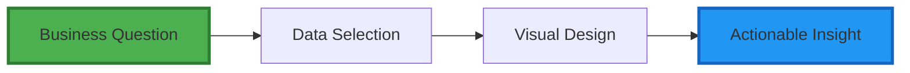
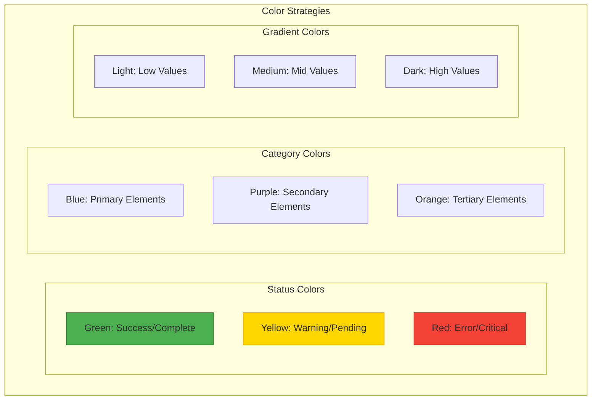
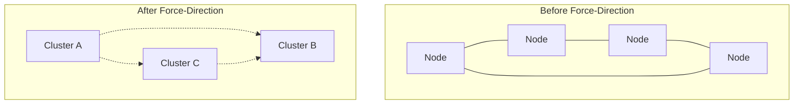
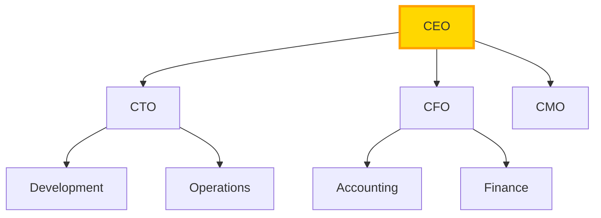
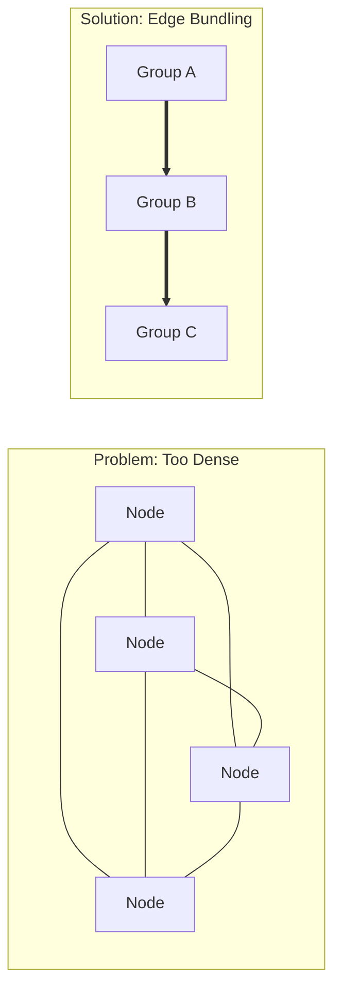
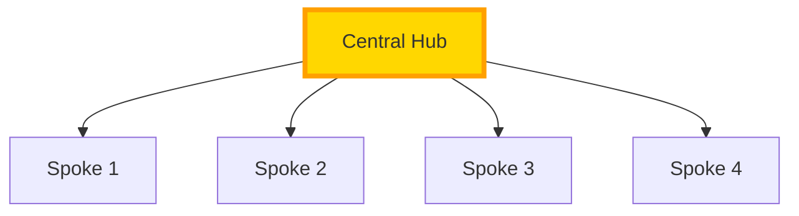
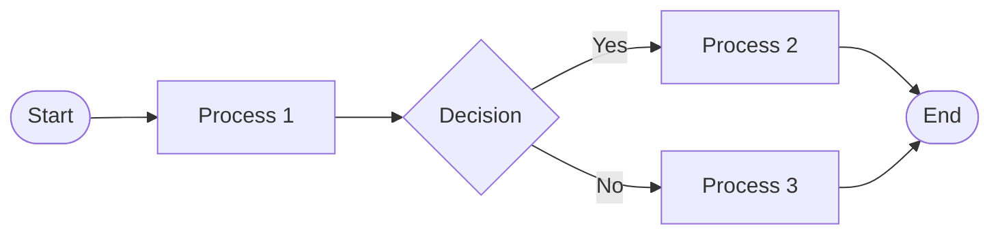
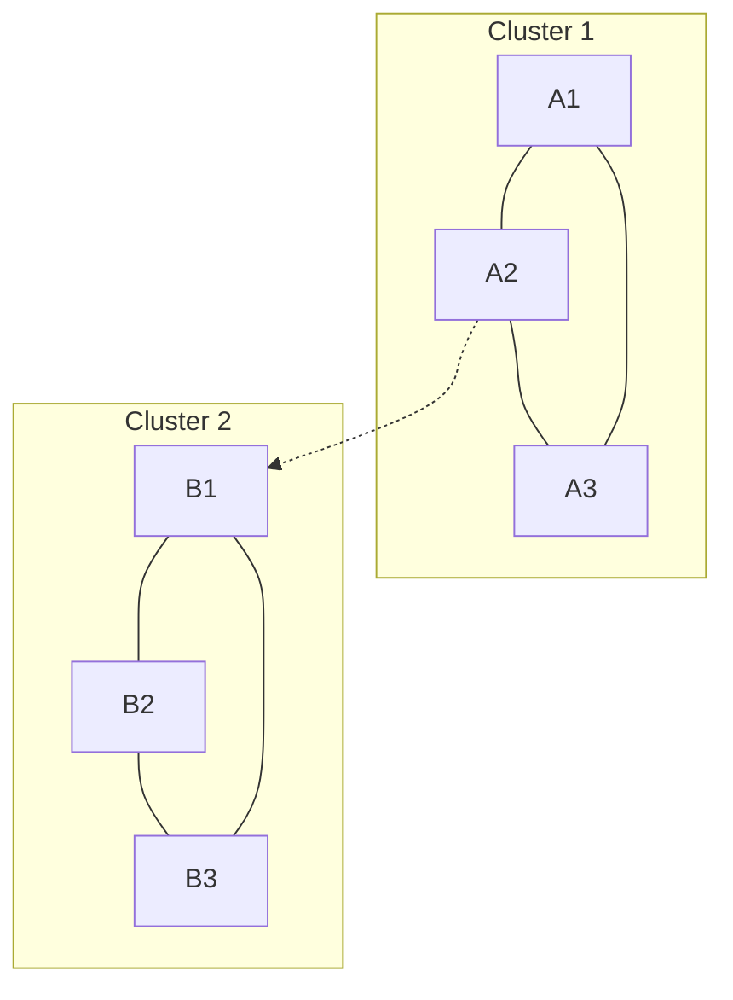

# Visualization Best Practices for Alchemist

## Transform Data into Understanding Through Effective Visual Design

This guide provides best practices for creating clear, meaningful, and actionable visualizations in Alchemist. Whether you're mapping business processes, exploring data relationships, or designing workflows, these principles will help you maximize the value of your visual representations.

## Core Visualization Principles

### 1. Start with Purpose

Every visualization should answer a specific question or solve a particular problem:

**Key Questions to Ask:**
- What decision will this visualization support?
- Who is the primary audience?
- What action should viewers take?
- What's the core message?

### 2. Choose the Right View

Alchemist offers multiple visualization modes. Select based on your needs:

#### 3D View - Best For:
- **Exploring complex relationships**: When you need to see multi-dimensional connections
- **Discovery mode**: When you don't know what patterns might emerge
- **Large datasets**: When 2D becomes too cluttered
- **Presentations**: When you need to impress and engage

#### 2D View - Best For:
- **Documentation**: Creating clear diagrams for reports
- **Process flows**: Linear or hierarchical workflows
- **Comparisons**: Side-by-side analysis
- **Printing**: When you need static output

#### Split View - Best For:
- **Before/after comparisons**: Showing transformation
- **Multiple perspectives**: Different views of same data
- **Collaboration**: When team members need different views
- **Analysis**: Detailed examination with overview

## Visual Design Guidelines

### Color Usage

Use color purposefully to convey meaning:

**Color Best Practices:**
- **Limit palette**: Use 5-7 colors maximum
- **Consistency**: Same color = same meaning throughout
- **Accessibility**: Ensure sufficient contrast
- **Cultural awareness**: Red doesn't mean "stop" everywhere

### Node Design

Effective node design communicates information at a glance:

#### Size Strategies:
- **Importance**: Larger nodes for critical elements
- **Volume**: Size represents quantity or frequency
- **Hierarchy**: Parent nodes larger than children
- **Fixed**: Uniform size for equal importance

#### Shape Meanings:
- **Circles**: General entities, equal relationships
- **Squares**: Processes, systems, containers
- **Diamonds**: Decisions, gateways, choices
- **Triangles**: Directional flow, warnings

### Edge Design

Edges (connections) convey relationship types:

#### Line Styles:
- **Solid lines**: Direct, strong relationships
- **Dashed lines**: Indirect, weak relationships
- **Dotted lines**: Potential or planned connections
- **Thick lines**: High volume or importance

#### Arrow Styles:
- **Single arrow**: One-way relationship
- **Double arrow**: Bidirectional relationship
- **No arrow**: Undirected relationship
- **Multiple arrows**: Multi-step process

## Layout Strategies

### Force-Directed Layout

Best for discovering natural clusters:

**When to Use:**
- Unknown relationship patterns
- Organic data structures
- Social networks
- Conceptual relationships

### Hierarchical Layout

Best for organizational structures:

**When to Use:**
- Reporting structures
- Process flows
- Decision trees
- Category hierarchies

### Geographic Layout

Best for location-based data:

**When to Use:**
- Supply chain visualization
- Store locations
- Regional performance
- Logistics planning

## Performance Optimization

### For Large Graphs (1000+ nodes)

1. **Progressive Disclosure**
   - Start with high-level view
   - Expand details on demand
   - Use clustering for node groups
   - Implement level-of-detail rendering

2. **Filtering Strategies**
   - Time-based filtering
   - Category filtering
   - Importance thresholds
   - Search-based focus

3. **Performance Tips**
   - Limit initial render to top 100 nodes
   - Use node aggregation for similar items
   - Enable GPU acceleration
   - Implement viewport culling

### For Dense Relationships

## Interactive Features

### Effective Interaction Design

1. **Hover Information**
   - Show details on demand
   - Keep tooltips concise
   - Include actionable data
   - Provide context

2. **Click Actions**
   - Single click: Select and highlight
   - Double click: Focus and zoom
   - Right click: Context menu
   - Drag: Reposition or pan

3. **Keyboard Shortcuts**
   - Space: Reset view
   - +/-: Zoom in/out
   - Arrow keys: Pan view
   - F: Fit to screen

## Common Visualization Patterns

### 1. Hub and Spoke

For centralized relationships:

### 2. Flow Visualization

For process representation:

### 3. Network Clusters

For community detection:

## Avoiding Common Pitfalls

### ❌ Don't Do This:
- **Overload with color**: Rainbow graphs confuse
- **Ignore hierarchy**: Flat views hide structure
- **Forget labels**: Unlabeled nodes are useless
- **Mix metaphors**: Inconsistent design confuses

### ✅ Do This Instead:
- **Use color sparingly**: Highlight what matters
- **Show structure**: Make relationships clear
- **Label thoughtfully**: Balance detail and clarity
- **Stay consistent**: Same rules throughout

## Accessibility Considerations

### Visual Accessibility:
- **Color blindness**: Don't rely on color alone
- **Contrast**: Ensure readable text
- **Size**: Make important elements larger
- **Animation**: Provide option to disable

### Interaction Accessibility:
- **Keyboard navigation**: Full keyboard support
- **Screen readers**: Meaningful descriptions
- **Touch targets**: Adequate size for touch
- **Zoom support**: Allow magnification

## Sharing and Export

### For Presentations:
1. **Simplify**: Remove unnecessary detail
2. **Annotate**: Add explanatory text
3. **Highlight**: Focus on key insights
4. **Animate**: Show progression

### For Documentation:
1. **Static views**: Capture key states
2. **Legends**: Explain symbols
3. **Context**: Provide background
4. **Multiple views**: Show different angles

## Measuring Success

Your visualization is successful when:
- ✅ Viewers understand the message immediately
- ✅ Decisions are made faster
- ✅ Hidden patterns become visible
- ✅ Complex data becomes simple
- ✅ Actions taken improve outcomes

## Quick Reference Checklist

Before finalizing any visualization:

- [ ] **Purpose Clear**: Does it answer the intended question?
- [ ] **Audience Appropriate**: Will viewers understand?
- [ ] **Visually Clean**: Is it free of clutter?
- [ ] **Interactive**: Can users explore?
- [ ] **Accessible**: Can everyone use it?
- [ ] **Actionable**: Does it drive decisions?
- [ ] **Documented**: Are symbols explained?
- [ ] **Performant**: Does it load quickly?

## Next Steps

1. **Practice**: Start with simple visualizations
2. **Iterate**: Refine based on feedback
3. **Share**: Learn from others' approaches
4. **Experiment**: Try different layouts
5. **Measure**: Track visualization impact

---

*Remember: The best visualization is the one that leads to understanding and action. Keep it simple, make it meaningful, and let the data tell its story.* 