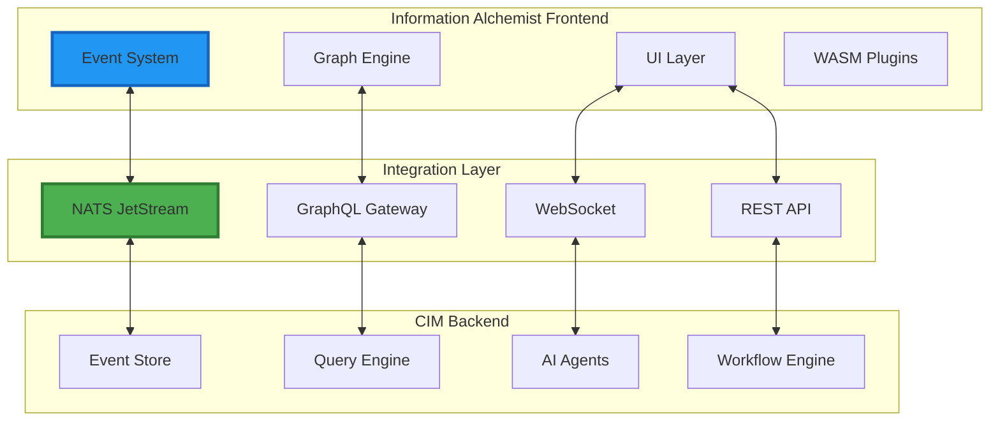

# Integration Guide

## Connecting Information Alchemist with CIM Backend

This guide provides comprehensive instructions for integrating Information Alchemist with the Composable Information Machine (CIM) backend, enabling seamless data flow and real-time synchronization.

## Integration Architecture



## 1. NATS JetStream Integration

### Configuration

```rust
use async_nats::jetstream;

pub struct NATSConfig {
    pub servers: Vec<String>,
    pub credentials_path: Option<PathBuf>,
    pub tls_config: Option<TlsConfig>,
    pub connection_name: String,
    pub max_reconnects: Option<usize>,
}

impl Default for NATSConfig {
    fn default() -> Self {
        Self {
            servers: vec!["nats://localhost:4222".to_string()],
            credentials_path: None,
            tls_config: None,
            connection_name: "information-alchemist".to_string(),
            max_reconnects: Some(10),
        }
    }
}
```

### Connection Setup

```rust
pub struct CIMConnector {
    client: async_nats::Client,
    jetstream: jetstream::Context,
    subscriptions: HashMap<String, jetstream::consumer::Consumer<jetstream::consumer::pull::Config>>,
}

impl CIMConnector {
    pub async fn connect(config: NATSConfig) -> Result<Self> {
        // Build connection options
        let mut options = async_nats::ConnectOptions::new()
            .name(&config.connection_name)
            .reconnect_buffer_size(256);

        if let Some(creds_path) = config.credentials_path {
            options = options.credentials_path(creds_path).await?;
        }

        if let Some(tls) = config.tls_config {
            options = options.tls_client_config(tls);
        }

        // Connect to NATS
        let client = options
            .connect(&config.servers.join(","))
            .await?;

        // Create JetStream context
        let jetstream = jetstream::new(client.clone());

        // Ensure required streams exist
        Self::ensure_streams(&jetstream).await?;

        Ok(Self {
            client,
            jetstream,
            subscriptions: HashMap::new(),
        })
    }

    async fn ensure_streams(js: &jetstream::Context) -> Result<()> {
        // Graph events stream
        js.create_stream(jetstream::stream::Config {
            name: "GRAPH_EVENTS".to_string(),
            subjects: vec!["graph.>".to_string()],
            retention: jetstream::stream::RetentionPolicy::Limits,
            storage: jetstream::stream::StorageType::File,
            max_age: Duration::from_days(30),
            ..Default::default()
        }).await?;

        // AI insights stream
        js.create_stream(jetstream::stream::Config {
            name: "AI_INSIGHTS".to_string(),
            subjects: vec!["ai.insights.>".to_string()],
            retention: jetstream::stream::RetentionPolicy::WorkQueue,
            ..Default::default()
        }).await?;

        Ok(())
    }
}
```

### Event Publishing

```rust
impl CIMConnector {
    pub async fn publish_graph_event(&self, event: &GraphEvent) -> Result<()> {
        let subject = format!("graph.{}.{}",
            event.aggregate_type(),
            event.event_type()
        );

        let payload = serde_json::to_vec(event)?;

        let ack = self.jetstream
            .publish(subject, payload.into())
            .await?
            .await?;

        debug!("Published event {} with seq {}", event.id, ack.sequence);
        Ok(())
    }

    pub async fn publish_batch(&self, events: Vec<GraphEvent>) -> Result<()> {
        let mut futures = Vec::new();

        for event in events {
            let future = self.publish_graph_event(&event);
            futures.push(future);
        }

        futures::future::try_join_all(futures).await?;
        Ok(())
    }
}
```

### Event Subscription

```rust
impl CIMConnector {
    pub async fn subscribe_to_ai_insights<F>(&mut self, handler: F) -> Result<()>
    where
        F: Fn(AIInsight) -> BoxFuture<'static, Result<()>> + Send + Sync + 'static,
    {
        let consumer = self.jetstream
            .create_consumer(
                "AI_INSIGHTS",
                jetstream::consumer::pull::Config {
                    durable_name: Some("information-alchemist".to_string()),
                    filter_subject: "ai.insights.graph".to_string(),
                    ..Default::default()
                },
            )
            .await?;

        let handler = Arc::new(handler);

        tokio::spawn(async move {
            loop {
                match consumer.fetch()
                    .max_messages(10)
                    .expires(Duration::from_secs(30))
                    .messages()
                    .await
                {
                    Ok(messages) => {
                        while let Some(Ok(message)) = messages.next().await {
                            if let Ok(insight) = serde_json::from_slice::<AIInsight>(&message.payload) {
                                if let Err(e) = handler(insight).await {
                                    error!("Failed to handle AI insight: {}", e);
                                    message.ack_with(AckKind::Nak(None)).await?;
                                } else {
                                    message.ack().await?;
                                }
                            }
                        }
                    }
                    Err(e) => {
                        error!("Failed to fetch messages: {}", e);
                        tokio::time::sleep(Duration::from_secs(5)).await;
                    }
                }
            }
        });

        Ok(())
    }
}
```

## 2. GraphQL Integration

### Schema Definition

```graphql
type Query {
  # Graph queries
  graph(id: ID!): Graph
  graphs(filter: GraphFilter, pagination: PaginationInput): GraphConnection!

  # Node queries
  node(id: ID!): Node
  nodes(graphId: ID!, filter: NodeFilter): [Node!]!

  # Search queries
  searchNodes(query: String!, limit: Int = 20): [Node!]!
  findPath(from: ID!, to: ID!, maxDepth: Int = 10): Path

  # Analytics queries
  graphStatistics(id: ID!): GraphStatistics!
  clusterAnalysis(graphId: ID!, algorithm: ClusterAlgorithm!): [Cluster!]!
}

type Mutation {
  # Graph mutations
  createGraph(input: CreateGraphInput!): Graph!
  importGraph(source: GraphSource!): ImportResult!

  # Node mutations
  addNode(graphId: ID!, input: AddNodeInput!): Node!
  updateNode(id: ID!, input: UpdateNodeInput!): Node!
  removeNode(id: ID!): Boolean!

  # Edge mutations
  createEdge(input: CreateEdgeInput!): Edge!
  removeEdge(id: ID!): Boolean!

  # Layout mutations
  applyLayout(graphId: ID!, algorithm: LayoutAlgorithm!): LayoutJob!
}

type Subscription {
  # Real-time graph updates
  graphUpdates(graphId: ID!): GraphUpdate!

  # AI insights
  aiInsights(graphId: ID!): AIInsight!

  # Collaboration events
  collaboratorActivity(graphId: ID!): CollaboratorEvent!
}
```

### Client Implementation

```rust
use graphql_client::{GraphQLQuery, Response};

#[derive(GraphQLQuery)]
#[graphql(
    schema_path = "schema.graphql",
    query_path = "queries/load_graph.graphql",
    response_derives = "Debug, Clone, Serialize, Deserialize"
)]
pub struct LoadGraph;

pub struct GraphQLClient {
    client: reqwest::Client,
    endpoint: String,
    auth_token: Option<String>,
}

impl GraphQLClient {
    pub async fn load_graph(&self, id: &str) -> Result<Graph> {
        let variables = load_graph::Variables {
            id: id.to_string(),
        };

        let request_body = LoadGraph::build_query(variables);

        let response = self.client
            .post(&self.endpoint)
            .bearer_auth(self.auth_token.as_ref().unwrap_or(&String::new()))
            .json(&request_body)
            .send()
            .await?;

        let response_body: Response<load_graph::ResponseData> =
            response.json().await?;

        if let Some(errors) = response_body.errors {
            return Err(GraphQLError::QueryErrors(errors).into());
        }

        let data = response_body.data
            .ok_or(GraphQLError::NoData)?;

        Ok(data.graph.into())
    }
}
```

### Subscription Handling

```rust
use graphql_ws_client::{graphql::StreamingOperation, Client};

pub struct GraphQLSubscriptions {
    client: Client,
}

impl GraphQLSubscriptions {
    pub async fn subscribe_to_graph_updates(
        &self,
        graph_id: &str,
    ) -> Result<impl Stream<Item = Result<GraphUpdate>>> {
        #[derive(GraphQLQuery)]
        #[graphql(
            schema_path = "schema.graphql",
            query_path = "subscriptions/graph_updates.graphql"
        )]
        struct GraphUpdatesSubscription;

        let variables = graph_updates_subscription::Variables {
            graph_id: graph_id.to_string(),
        };

        let operation = StreamingOperation::<GraphUpdatesSubscription>::new(variables);

        let stream = self.client
            .streaming_operation(operation)
            .await?
            .map(|result| {
                result
                    .map_err(Into::into)
                    .and_then(|data| {
                        data.graph_updates
                            .ok_or_else(|| anyhow!("No update data"))
                    })
            });

        Ok(stream)
    }
}
```

## 3. REST API Integration

### API Client

```rust
#[derive(Clone)]
pub struct RestApiClient {
    client: reqwest::Client,
    base_url: String,
    api_key: Option<String>,
}

impl RestApiClient {
    pub fn new(base_url: String, api_key: Option<String>) -> Self {
        let client = reqwest::Client::builder()
            .timeout(Duration::from_secs(30))
            .build()
            .expect("Failed to create HTTP client");

        Self {
            client,
            base_url,
            api_key,
        }
    }

    pub async fn import_graph_file(&self, file_path: &Path) -> Result<ImportResult> {
        let file = tokio::fs::File::open(file_path).await?;
        let stream = tokio_util::io::ReaderStream::new(file);
        let body = reqwest::Body::wrap_stream(stream);

        let response = self.client
            .post(format!("{}/api/v1/graphs/import", self.base_url))
            .header("X-API-Key", self.api_key.as_ref().unwrap_or(&String::new()))
            .header("Content-Type", "application/octet-stream")
            .body(body)
            .send()
            .await?;

        if !response.status().is_success() {
            let error = response.text().await?;
            return Err(anyhow!("Import failed: {}", error));
        }

        Ok(response.json().await?)
    }

    pub async fn export_graph(&self, graph_id: &str, format: ExportFormat) -> Result<Vec<u8>> {
        let response = self.client
            .get(format!("{}/api/v1/graphs/{}/export", self.base_url, graph_id))
            .query(&[("format", format.as_str())])
            .header("X-API-Key", self.api_key.as_ref().unwrap_or(&String::new()))
            .send()
            .await?;

        if !response.status().is_success() {
            let error = response.text().await?;
            return Err(anyhow!("Export failed: {}", error));
        }

        Ok(response.bytes().await?.to_vec())
    }
}
```

## 4. WebSocket Integration

### Real-time Collaboration

```rust
use tokio_tungstenite::{connect_async, tungstenite::Message};

pub struct CollaborationClient {
    ws_stream: WebSocketStream<MaybeTlsStream<TcpStream>>,
    graph_id: String,
    user_id: String,
}

impl CollaborationClient {
    pub async fn connect(
        url: &str,
        graph_id: String,
        auth_token: &str,
    ) -> Result<Self> {
        let url = format!("{}/collaboration?token={}&graph={}",
            url, auth_token, graph_id);

        let (ws_stream, _) = connect_async(&url).await?;

        Ok(Self {
            ws_stream,
            graph_id,
            user_id: extract_user_id(auth_token)?,
        })
    }

    pub async fn broadcast_cursor_position(&mut self, position: Vec3) -> Result<()> {
        let event = CollaborationEvent::CursorMoved {
            user_id: self.user_id.clone(),
            position,
            timestamp: Utc::now(),
        };

        let message = Message::text(serde_json::to_string(&event)?);
        self.ws_stream.send(message).await?;
        Ok(())
    }

    pub async fn listen_for_events(&mut self) -> Result<impl Stream<Item = CollaborationEvent>> {
        let (_, read) = self.ws_stream.split();

        let stream = read
            .filter_map(|msg| async move {
                match msg {
                    Ok(Message::Text(text)) => {
                        serde_json::from_str(&text).ok()
                    }
                    _ => None,
                }
            });

        Ok(stream)
    }
}
```

## 5. AI Agent Integration

### AI Service Client

```rust
pub struct AIServiceClient {
    connector: Arc<CIMConnector>,
    request_timeout: Duration,
}

impl AIServiceClient {
    pub async fn analyze_graph_patterns(
        &self,
        graph_id: &str,
        analysis_type: PatternAnalysisType,
    ) -> Result<PatternAnalysisResult> {
        let request = AIRequest::AnalyzePatterns {
            graph_id: graph_id.to_string(),
            analysis_type,
            parameters: Default::default(),
        };

        let correlation_id = Uuid::new_v4().to_string();

        // Publish request
        self.connector
            .publish_ai_request(&request, &correlation_id)
            .await?;

        // Wait for response
        let response = self.wait_for_response(&correlation_id).await?;

        match response {
            AIResponse::PatternAnalysis(result) => Ok(result),
            _ => Err(anyhow!("Unexpected response type")),
        }
    }

    pub async fn get_layout_suggestions(
        &self,
        graph: &Graph,
    ) -> Result<Vec<LayoutSuggestion>> {
        let request = AIRequest::SuggestLayout {
            graph_snapshot: graph.to_snapshot(),
            constraints: vec![],
        };

        let correlation_id = Uuid::new_v4().to_string();

        self.connector
            .publish_ai_request(&request, &correlation_id)
            .await?;

        let response = self.wait_for_response(&correlation_id).await?;

        match response {
            AIResponse::LayoutSuggestions(suggestions) => Ok(suggestions),
            _ => Err(anyhow!("Unexpected response type")),
        }
    }

    async fn wait_for_response(
        &self,
        correlation_id: &str,
    ) -> Result<AIResponse> {
        let (tx, rx) = oneshot::channel();

        // Subscribe to response
        self.connector
            .subscribe_to_ai_response(correlation_id, move |response| {
                let _ = tx.send(response);
            })
            .await?;

        // Wait with timeout
        tokio::time::timeout(self.request_timeout, rx)
            .await?
            .map_err(|_| anyhow!("Response channel closed"))
    }
}
```

## 6. Data Synchronization

### Sync Manager

```rust
pub struct SyncManager {
    local_store: Arc<LocalEventStore>,
    remote_connector: Arc<CIMConnector>,
    sync_state: Arc<RwLock<SyncState>>,
}

#[derive(Default)]
struct SyncState {
    last_sync_version: u64,
    pending_events: Vec<DomainEvent>,
    sync_in_progress: bool,
}

impl SyncManager {
    pub async fn start_sync(&self) -> Result<()> {
        let sync_interval = Duration::from_secs(5);

        loop {
            if let Err(e) = self.sync_cycle().await {
                error!("Sync cycle failed: {}", e);
            }

            tokio::time::sleep(sync_interval).await;
        }
    }

    async fn sync_cycle(&self) -> Result<()> {
        // Mark sync in progress
        {
            let mut state = self.sync_state.write().await;
            if state.sync_in_progress {
                return Ok(());
            }
            state.sync_in_progress = true;
        }

        // Push local changes
        self.push_local_changes().await?;

        // Pull remote changes
        self.pull_remote_changes().await?;

        // Mark sync complete
        {
            let mut state = self.sync_state.write().await;
            state.sync_in_progress = false;
        }

        Ok(())
    }

    async fn push_local_changes(&self) -> Result<()> {
        let state = self.sync_state.read().await;
        let local_events = self.local_store
            .get_events_since(state.last_sync_version)
            .await?;

        if !local_events.is_empty() {
            self.remote_connector
                .publish_batch(local_events)
                .await?;
        }

        Ok(())
    }

    async fn pull_remote_changes(&self) -> Result<()> {
        let mut state = self.sync_state.write().await;

        let remote_events = self.remote_connector
            .fetch_events_since(state.last_sync_version)
            .await?;

        for event in remote_events {
            self.local_store.append(event.clone()).await?;
            state.last_sync_version = event.version;
        }

        Ok(())
    }
}
```

## 7. Error Handling and Resilience

### Retry Logic

```rust
pub struct RetryPolicy {
    max_attempts: u32,
    initial_delay: Duration,
    max_delay: Duration,
    exponential_base: f64,
}

impl RetryPolicy {
    pub async fn execute<F, Fut, T>(&self, operation: F) -> Result<T>
    where
        F: Fn() -> Fut,
        Fut: Future<Output = Result<T>>,
    {
        let mut attempt = 0;
        let mut delay = self.initial_delay;

        loop {
            match operation().await {
                Ok(result) => return Ok(result),
                Err(e) if attempt >= self.max_attempts => return Err(e),
                Err(e) => {
                    warn!("Operation failed (attempt {}): {}", attempt + 1, e);

                    tokio::time::sleep(delay).await;

                    attempt += 1;
                    delay = std::cmp::min(
                        self.max_delay,
                        Duration::from_secs_f64(
                            delay.as_secs_f64() * self.exponential_base
                        ),
                    );
                }
            }
        }
    }
}
```

### Circuit Breaker

```rust
pub struct CircuitBreaker {
    failure_threshold: u32,
    success_threshold: u32,
    timeout: Duration,
    state: Arc<RwLock<CircuitState>>,
}

#[derive(Debug)]
enum CircuitState {
    Closed { failure_count: u32 },
    Open { opened_at: Instant },
    HalfOpen { success_count: u32 },
}

impl CircuitBreaker {
    pub async fn call<F, Fut, T>(&self, operation: F) -> Result<T>
    where
        F: FnOnce() -> Fut,
        Fut: Future<Output = Result<T>>,
    {
        let state = self.state.read().await.clone();

        match state {
            CircuitState::Open { opened_at } => {
                if opened_at.elapsed() < self.timeout {
                    return Err(anyhow!("Circuit breaker is open"));
                }

                // Transition to half-open
                *self.state.write().await = CircuitState::HalfOpen { success_count: 0 };
            }
            _ => {}
        }

        match operation().await {
            Ok(result) => {
                self.record_success().await;
                Ok(result)
            }
            Err(e) => {
                self.record_failure().await;
                Err(e)
            }
        }
    }
}
```

## 8. Monitoring and Observability

### Metrics Collection

```rust
use prometheus::{Counter, Histogram, Registry};

pub struct IntegrationMetrics {
    pub events_published: Counter,
    pub events_received: Counter,
    pub sync_duration: Histogram,
    pub api_request_duration: Histogram,
    pub websocket_messages: Counter,
}

impl IntegrationMetrics {
    pub fn new(registry: &Registry) -> Result<Self> {
        let events_published = Counter::new(
            "integration_events_published_total",
            "Total number of events published to CIM"
        )?;
        registry.register(Box::new(events_published.clone()))?;

        let events_received = Counter::new(
            "integration_events_received_total",
            "Total number of events received from CIM"
        )?;
        registry.register(Box::new(events_received.clone()))?;

        let sync_duration = Histogram::with_opts(
            HistogramOpts::new(
                "integration_sync_duration_seconds",
                "Duration of sync operations"
            )
        )?;
        registry.register(Box::new(sync_duration.clone()))?;

        Ok(Self {
            events_published,
            events_received,
            sync_duration,
            api_request_duration,
            websocket_messages,
        })
    }
}
```

## Summary

This integration guide provides:

1. **NATS JetStream**: Event streaming and pub/sub messaging
2. **GraphQL**: Flexible queries and real-time subscriptions
3. **REST API**: File operations and batch processing
4. **WebSocket**: Real-time collaboration features
5. **AI Services**: Pattern analysis and intelligent suggestions
6. **Data Sync**: Offline support and conflict resolution
7. **Resilience**: Retry policies and circuit breakers
8. **Monitoring**: Comprehensive metrics and observability

The integration layer ensures Information Alchemist seamlessly connects with the CIM backend while maintaining performance, reliability, and real-time responsiveness.

---

*Continue to [Performance Guide](05-performance-guide.md) →*
