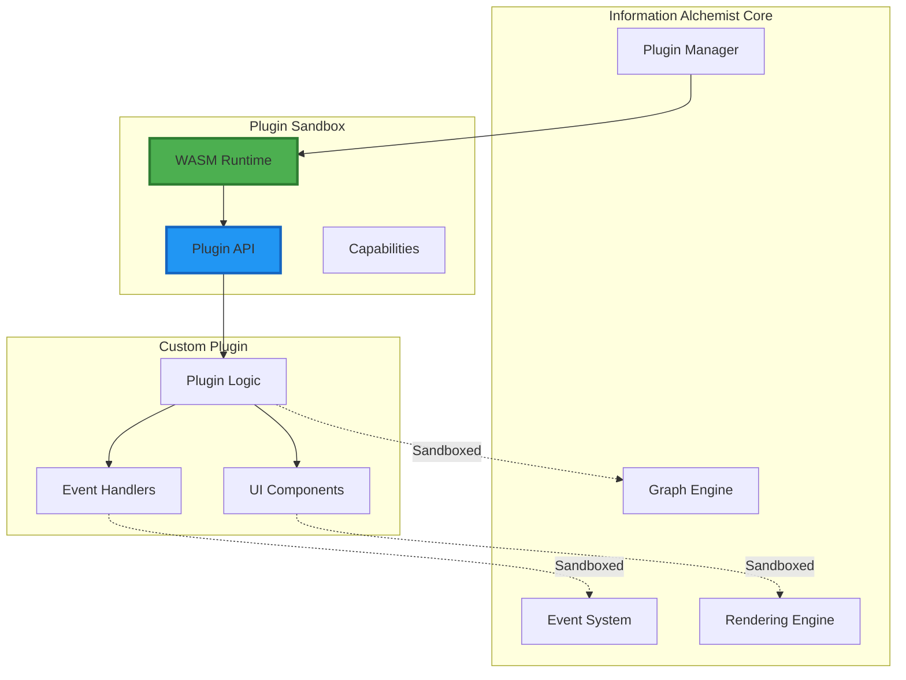

# Plugin Development Guide

## Extending Information Alchemist with Custom Functionality

This guide provides comprehensive instructions for developing plugins that extend Information Alchemist's capabilities through the WASM-based plugin system.

## Plugin Architecture Overview



## 1. Plugin Development Setup

### Project Structure

```
my-plugin/
├── Cargo.toml
├── src/
│   ├── lib.rs
│   ├── handlers.rs
│   ├── ui.rs
│   └── algorithms.rs
├── assets/
│   ├── icons/
│   └── shaders/
└── plugin.toml
```

### Cargo.toml Configuration

```toml
[package]
name = "my-graph-plugin"
version = "0.1.0"
edition = "2021"

[lib]
crate-type = ["cdylib"]

[dependencies]
information-alchemist-plugin = "0.1"
wasm-bindgen = "0.2"
serde = { version = "1.0", features = ["derive"] }
serde_json = "1.0"

[dependencies.web-sys]
version = "0.3"
features = [
    "console",
]

[profile.release]
opt-level = "z"
lto = true
```

### Plugin Manifest (plugin.toml)

```toml
[plugin]
name = "My Graph Plugin"
id = "com.example.my-graph-plugin"
version = "0.1.0"
author = "Your Name"
description = "Adds custom graph analysis capabilities"

[capabilities]
required = ["graph.read", "events.subscribe"]
optional = ["graph.write", "ui.menu"]

[compatibility]
min_version = "0.1.0"
max_version = "1.0.0"

[assets]
icons = "assets/icons"
shaders = "assets/shaders"
```

## 2. Plugin API

### Core Plugin Trait

```rust
use information_alchemist_plugin::prelude::*;

#[wasm_bindgen]
pub struct MyPlugin {
    context: PluginContext,
    state: PluginState,
}

#[wasm_bindgen]
impl MyPlugin {
    #[wasm_bindgen(constructor)]
    pub fn new() -> Result<MyPlugin, JsValue> {
        console_log!("Initializing My Graph Plugin");

        Ok(MyPlugin {
            context: PluginContext::new()?,
            state: PluginState::default(),
        })
    }

    pub fn on_load(&mut self, config: JsValue) -> Result<(), JsValue> {
        let config: PluginConfig = serde_wasm_bindgen::from_value(config)?;

        // Initialize plugin with configuration
        self.state.initialize(config);

        // Register event handlers
        self.register_handlers()?;

        // Register UI components
        self.register_ui()?;

        Ok(())
    }

    pub fn on_unload(&mut self) -> Result<(), JsValue> {
        console_log!("Unloading plugin");
        self.cleanup()?;
        Ok(())
    }
}
```

### Event Handling

```rust
impl MyPlugin {
    fn register_handlers(&mut self) -> Result<(), JsValue> {
        // Subscribe to node selection events
        self.context.events().subscribe(
            EventType::NodeSelected,
            Box::new(move |event| {
                self.on_node_selected(event)
            }),
        )?;

        // Subscribe to graph layout events
        self.context.events().subscribe(
            EventType::LayoutCompleted,
            Box::new(move |event| {
                self.on_layout_completed(event)
            }),
        )?;

        Ok(())
    }

    fn on_node_selected(&mut self, event: Event) -> Result<(), JsValue> {
        if let EventPayload::NodeSelected { node_id } = event.payload {
            // Perform custom analysis
            let analysis = self.analyze_node_importance(&node_id)?;

            // Emit custom event with results
            self.context.events().emit(Event {
                event_type: EventType::Custom("node.importance.calculated"),
                payload: EventPayload::Custom(serde_json::to_value(analysis)?),
                timestamp: Utc::now(),
            })?;
        }

        Ok(())
    }
}
```

## 3. Graph Manipulation

### Reading Graph Data

```rust
impl MyPlugin {
    pub fn analyze_graph_structure(&self) -> Result<AnalysisResult, JsValue> {
        let graph = self.context.graph();

        // Get all nodes
        let nodes = graph.nodes()?;
        let node_count = nodes.len();

        // Calculate degree distribution
        let mut degree_distribution = HashMap::new();

        for node in nodes {
            let degree = graph.node_degree(&node.id)?;
            *degree_distribution.entry(degree).or_insert(0) += 1;
        }

        // Find connected components
        let components = self.find_connected_components(&graph)?;

        // Calculate clustering coefficient
        let clustering_coefficient = self.calculate_clustering_coefficient(&graph)?;

        Ok(AnalysisResult {
            node_count,
            edge_count: graph.edge_count()?,
            degree_distribution,
            component_count: components.len(),
            largest_component_size: components.iter().map(|c| c.len()).max().unwrap_or(0),
            average_clustering_coefficient: clustering_coefficient,
        })
    }
}
```

### Modifying Graph Structure

```rust
impl MyPlugin {
    pub fn add_analysis_edges(&mut self) -> Result<(), JsValue> {
        let graph = self.context.graph_mut()?;

        // Find nodes with similar properties
        let similarity_threshold = 0.8;
        let nodes = graph.nodes()?;

        for i in 0..nodes.len() {
            for j in (i + 1)..nodes.len() {
                let similarity = self.calculate_similarity(&nodes[i], &nodes[j])?;

                if similarity > similarity_threshold {
                    // Create similarity edge
                    graph.add_edge(Edge {
                        id: EdgeId::new(),
                        source: nodes[i].id.clone(),
                        target: nodes[j].id.clone(),
                        edge_type: EdgeType::Custom("similarity"),
                        properties: hashmap! {
                            "similarity_score" => Value::Number(similarity),
                            "created_by" => Value::String("my-plugin".to_string()),
                        },
                    })?;
                }
            }
        }

        // Emit graph modified event
        self.context.events().emit(Event {
            event_type: EventType::GraphModified,
            payload: EventPayload::GraphModified {
                modification_type: ModificationType::EdgesAdded,
                affected_elements: edge_ids,
            },
            timestamp: Utc::now(),
        })?;

        Ok(())
    }
}
```

## 4. Custom UI Components

### Menu Integration

```rust
impl MyPlugin {
    fn register_ui(&mut self) -> Result<(), JsValue> {
        let ui = self.context.ui();

        // Add menu item
        ui.add_menu_item(MenuItem {
            id: "analyze-graph",
            label: "Analyze Graph Structure",
            icon: Some("graph-analysis"),
            shortcut: Some("Ctrl+Shift+A"),
            action: Box::new(|| {
                self.show_analysis_dialog()
            }),
        })?;

        // Add toolbar button
        ui.add_toolbar_button(ToolbarButton {
            id: "quick-analysis",
            tooltip: "Quick Graph Analysis",
            icon: "lightning",
            action: Box::new(|| {
                self.run_quick_analysis()
            }),
        })?;

        Ok(())
    }
}
```

### Custom Panels

```rust
impl MyPlugin {
    pub fn create_analysis_panel(&self) -> Result<PanelConfig, JsValue> {
        Ok(PanelConfig {
            id: "graph-analysis",
            title: "Graph Analysis",
            position: PanelPosition::Right,
            default_width: 300,
            resizable: true,
            content: self.render_analysis_content()?,
        })
    }

    fn render_analysis_content(&self) -> Result<VNode, JsValue> {
        let analysis = self.state.last_analysis.as_ref();

        html! {
            <div class="analysis-panel">
                <h3>{"Graph Metrics"}</h3>
                {if let Some(analysis) = analysis {
                    html! {
                        <div class="metrics">
                            <div class="metric">
                                <span class="label">{"Nodes:"}</span>
                                <span class="value">{analysis.node_count}</span>
                            </div>
                            <div class="metric">
                                <span class="label">{"Edges:"}</span>
                                <span class="value">{analysis.edge_count}</span>
                            </div>
                            <div class="metric">
                                <span class="label">{"Components:"}</span>
                                <span class="value">{analysis.component_count}</span>
                            </div>
                            <div class="metric">
                                <span class="label">{"Clustering:"}</span>
                                <span class="value">
                                    {format!("{:.3}", analysis.average_clustering_coefficient)}
                                </span>
                            </div>
                        </div>
                    }
                } else {
                    html! {
                        <p class="empty-state">{"Run analysis to see results"}</p>
                    }
                }}
                <button onclick={|_| self.run_analysis()}>
                    {"Run Analysis"}
                </button>
            </div>
        }
    }
}
```

## 5. Custom Algorithms

### Layout Algorithm

```rust
pub struct CustomLayoutAlgorithm {
    settings: LayoutSettings,
}

impl LayoutAlgorithm for CustomLayoutAlgorithm {
    fn name(&self) -> &str {
        "Custom Spring Layout"
    }

    fn apply(&mut self, graph: &mut Graph) -> Result<(), JsValue> {
        let nodes = graph.nodes()?;
        let edges = graph.edges()?;

        // Initialize node positions
        let mut positions = self.initialize_positions(&nodes);

        // Iterative force calculation
        for iteration in 0..self.settings.max_iterations {
            let mut forces = vec![Vec3::ZERO; nodes.len()];

            // Calculate repulsive forces
            for i in 0..nodes.len() {
                for j in (i + 1)..nodes.len() {
                    let delta = positions[j] - positions[i];
                    let distance = delta.length().max(self.settings.min_distance);

                    let force = self.settings.repulsion / (distance * distance);
                    let force_vec = delta.normalize() * force;

                    forces[i] -= force_vec;
                    forces[j] += force_vec;
                }
            }

            // Calculate attractive forces
            for edge in &edges {
                let source_idx = self.node_index(&edge.source);
                let target_idx = self.node_index(&edge.target);

                let delta = positions[target_idx] - positions[source_idx];
                let distance = delta.length();

                let force = self.settings.attraction * distance;
                let force_vec = delta.normalize() * force;

                forces[source_idx] += force_vec;
                forces[target_idx] -= force_vec;
            }

            // Update positions
            let mut max_displacement = 0.0;
            for i in 0..nodes.len() {
                let displacement = forces[i] * self.settings.time_step;
                positions[i] += displacement;
                max_displacement = max_displacement.max(displacement.length());
            }

            // Check convergence
            if max_displacement < self.settings.convergence_threshold {
                break;
            }

            // Emit progress event
            if iteration % 10 == 0 {
                self.emit_progress(iteration as f32 / self.settings.max_iterations as f32)?;
            }
        }

        // Apply positions to graph
        for (i, node) in nodes.iter().enumerate() {
            graph.set_node_position(&node.id, positions[i])?;
        }

        Ok(())
    }
}
```

### Graph Analysis Algorithm

```rust
pub struct CommunityDetection {
    resolution: f32,
}

impl CommunityDetection {
    pub fn detect_communities(&self, graph: &Graph) -> Result<Vec<Community>, JsValue> {
        // Implement Louvain algorithm
        let mut communities = self.initialize_communities(graph)?;
        let mut modularity = self.calculate_modularity(graph, &communities)?;

        loop {
            let mut improved = false;

            // Phase 1: Local optimization
            for node in graph.nodes()? {
                let current_community = communities.get(&node.id).copied().unwrap();
                let mut best_community = current_community;
                let mut best_gain = 0.0;

                // Try moving to neighboring communities
                for neighbor_id in graph.neighbors(&node.id)? {
                    let neighbor_community = communities.get(&neighbor_id).copied().unwrap();

                    if neighbor_community != current_community {
                        let gain = self.calculate_modularity_gain(
                            graph,
                            &node.id,
                            current_community,
                            neighbor_community,
                            &communities,
                        )?;

                        if gain > best_gain {
                            best_gain = gain;
                            best_community = neighbor_community;
                        }
                    }
                }

                if best_community != current_community {
                    communities.insert(node.id.clone(), best_community);
                    improved = true;
                }
            }

            if !improved {
                break;
            }

            // Phase 2: Community aggregation
            communities = self.aggregate_communities(graph, communities)?;
        }

        // Convert to community list
        let mut community_map: HashMap<CommunityId, Vec<NodeId>> = HashMap::new();
        for (node_id, community_id) in communities {
            community_map.entry(community_id)
                .or_insert_with(Vec::new)
                .push(node_id);
        }

        Ok(community_map.into_iter()
            .map(|(id, nodes)| Community { id, nodes })
            .collect())
    }
}
```

## 6. Plugin Communication

### Inter-Plugin Communication

```rust
impl MyPlugin {
    pub fn communicate_with_other_plugins(&self) -> Result<(), JsValue> {
        let plugin_manager = self.context.plugin_manager();

        // Check if another plugin is loaded
        if plugin_manager.is_plugin_loaded("com.example.other-plugin")? {
            // Send message to other plugin
            plugin_manager.send_message(
                "com.example.other-plugin",
                PluginMessage {
                    message_type: "analysis.request",
                    payload: serde_json::json!({
                        "graph_id": self.context.graph().id(),
                        "analysis_type": "centrality",
                    }),
                },
            )?;
        }

        Ok(())
    }

    pub fn handle_message(&mut self, message: PluginMessage) -> Result<(), JsValue> {
        match message.message_type.as_str() {
            "analysis.request" => {
                let result = self.perform_requested_analysis(message.payload)?;

                // Send response
                self.context.plugin_manager().send_response(
                    message.sender_id,
                    PluginMessage {
                        message_type: "analysis.response",
                        payload: serde_json::to_value(result)?,
                    },
                )?;
            }
            _ => {
                console_warn!("Unknown message type: {}", message.message_type);
            }
        }

        Ok(())
    }
}
```

## 7. Testing Plugins

### Unit Tests

```rust
#[cfg(test)]
mod tests {
    use super::*;
    use information_alchemist_plugin::testing::*;

    #[test]
    fn test_similarity_calculation() {
        let node1 = create_test_node("node1", hashmap! {
            "type" => "person",
            "age" => 30,
            "department" => "engineering",
        });

        let node2 = create_test_node("node2", hashmap! {
            "type" => "person",
            "age" => 32,
            "department" => "engineering",
        });

        let plugin = MyPlugin::new().unwrap();
        let similarity = plugin.calculate_similarity(&node1, &node2).unwrap();

        assert!(similarity > 0.8);
    }

    #[test]
    fn test_community_detection() {
        let graph = create_test_graph(vec![
            // Nodes
            ("A", hashmap!{}),
            ("B", hashmap!{}),
            ("C", hashmap!{}),
            ("D", hashmap!{}),
        ], vec![
            // Edges - two clear communities
            ("A", "B"),
            ("B", "C"),
            ("A", "C"),
            ("D", "E"),
            ("E", "F"),
            ("D", "F"),
            // Weak link between communities
            ("C", "D"),
        ]);

        let detector = CommunityDetection { resolution: 1.0 };
        let communities = detector.detect_communities(&graph).unwrap();

        assert_eq!(communities.len(), 2);
    }
}
```

### Integration Tests

```rust
#[wasm_bindgen_test]
async fn test_plugin_lifecycle() {
    let context = create_test_context().await;
    let mut plugin = MyPlugin::new().unwrap();

    // Test loading
    plugin.on_load(JsValue::from_str("{}")).unwrap();

    // Test event handling
    let event = Event {
        event_type: EventType::NodeSelected,
        payload: EventPayload::NodeSelected {
            node_id: NodeId::from("test-node"),
        },
        timestamp: Utc::now(),
    };

    context.emit_event(event).await.unwrap();

    // Wait for async processing
    sleep(Duration::from_millis(100)).await;

    // Verify plugin processed the event
    assert!(plugin.state.last_selected_node.is_some());

    // Test unloading
    plugin.on_unload().unwrap();
}
```

## 8. Plugin Distribution

### Building for Release

```bash
# Build optimized WASM
wasm-pack build --target web --release

# Optimize size
wasm-opt -Oz -o pkg/my_plugin_bg_opt.wasm pkg/my_plugin_bg.wasm

# Create plugin package
zip -r my-plugin-v0.1.0.zip pkg/ assets/ plugin.toml README.md
```

### Plugin Package Structure

```
my-plugin-v0.1.0.zip
├── pkg/
│   ├── my_plugin_bg.wasm
│   ├── my_plugin.js
│   └── my_plugin.d.ts
├── assets/
│   └── icons/
├── plugin.toml
├── README.md
└── LICENSE
```

## 9. Best Practices

### Performance

```rust
// Cache expensive calculations
pub struct MyPlugin {
    analysis_cache: LruCache<GraphHash, AnalysisResult>,
}

impl MyPlugin {
    fn get_or_compute_analysis(&mut self, graph: &Graph) -> Result<AnalysisResult, JsValue> {
        let hash = graph.compute_hash()?;

        if let Some(cached) = self.analysis_cache.get(&hash) {
            return Ok(cached.clone());
        }

        let result = self.compute_analysis(graph)?;
        self.analysis_cache.put(hash, result.clone());

        Ok(result)
    }
}
```

### Error Handling

```rust
// Use custom error types
#[derive(Debug, thiserror::Error)]
pub enum PluginError {
    #[error("Graph operation failed: {0}")]
    GraphError(String),

    #[error("Invalid configuration: {0}")]
    ConfigError(String),

    #[error("Analysis failed: {0}")]
    AnalysisError(String),
}

// Convert to JsValue for WASM boundary
impl From<PluginError> for JsValue {
    fn from(err: PluginError) -> Self {
        JsValue::from_str(&err.to_string())
    }
}
```

### Memory Management

```rust
// Clean up resources properly
impl Drop for MyPlugin {
    fn drop(&mut self) {
        // Cancel any pending operations
        if let Some(handle) = self.analysis_handle.take() {
            handle.abort();
        }

        // Clear caches
        self.analysis_cache.clear();

        // Unregister event handlers
        if let Err(e) = self.context.events().unsubscribe_all() {
            console_error!("Failed to unsubscribe events: {:?}", e);
        }
    }
}
```

## Summary

This guide covers:

1. **Setup**: Project structure and configuration
2. **API**: Core plugin interface and capabilities
3. **Graph Operations**: Reading and modifying graph data
4. **UI Integration**: Adding custom UI components
5. **Algorithms**: Implementing custom layout and analysis
6. **Communication**: Inter-plugin messaging
7. **Testing**: Unit and integration testing
8. **Distribution**: Building and packaging plugins
9. **Best Practices**: Performance, error handling, and memory management

Plugins enable Information Alchemist to be extended with domain-specific functionality while maintaining security through WASM sandboxing and capability-based permissions.

---

*Continue to [Technical README](README.md) →*
