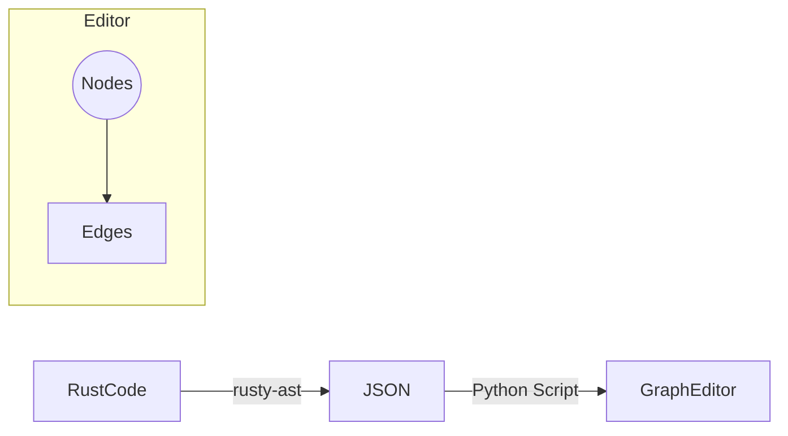

To visualize and work with Rust's Abstract Syntax Tree (AST) in a graph editor, you can use these approaches:

## Extraction Methods
1. **rust-analyzer Integration**
   - Use VS Code's "rust-analyzer: Show Syntax Tree" command (Ctrl+Shift+P)
   - Outputs `.rast` format showing node relationships:
     ```rast
     FN@363..735
       __ATTR@363..378
         ____POUND@363..364_"#"
         ____L_BRACK@364..365_"["...
     ```
   - Parse this structure into nodes/edges using pattern matching[1]

2. **rusty-ast CLI Tool**
   ```bash
   # Generate JSON AST
   rusty-ast -f your_file.rs -o json
   ```
   Sample output structure:
   ```json
   {
     "kind": "Function",
     "name": "main",
     "params": [],
     "body": {
       "kind": "Block",
       "stmts": [
         {"kind": "MacroCall", "name": "println!", "args": ["\"Hello, world!\""]}
       ]
     }
   }
   ```
   Map JSON fields to graph nodes/edges programmatically[2][6][7]

3. **syn Crate Integration** (Programmatic access)
   ```rust
   use syn::{parse_file, visit::Visit};
   
   struct GraphVisitor {
       nodes: Vec,
       edges: Vec
   }
   
   impl Visit for GraphVisitor {
       fn visit_item_fn(&mut self, i: &'ast syn::ItemFn) {
           let node_id = self.add_node(i.sig.ident.to_string());
           // Add edges to parameters/body
       }
   }
   ```
   Build graph structure during AST traversal[1][7]

## Visualization Pipeline


**Key Conversion Strategies**:
- Map AST node types to different graph node shapes
- Use edge labels for relationship types (parent/child, sibling)
- Store source spans as node metadata
- Handle macro expansions as subgraphs

For immediate visualization, consider these tools:
1. **DOT Generator** (Graphviz-compatible output)[5]
2. **rust-ast-explorer** (Web-based interactive viewer)[1]
3. **ROSE Compiler Framework** (Advanced AST visualization)[5]

Example graph editor integration using Python:
```python
import json
from graph_editor import Graph

def load_rust_ast(json_file):
    ast = json.load(json_file)
    g = Graph()
    
    for node in ast['nodes']:
        g.add_node(node['id'], label=node['type'])
    
    for edge in ast['edges']:
        g.add_edge(edge['from'], edge['to'], label=edge['rel'])
    
    return g
```

Citations:
[1] https://www.reddit.com/r/rust/comments/xmd5jg/rust_ast_explorer/
[2] https://github.com/e-bebe/rusty-ast
[3] https://users.rust-lang.org/t/visualizing-rust-ast-help-needed/30675
[4] https://ruslanspivak.com/lsbasi-part7/
[5] https://github.com/rose-compiler/rose/wiki/How-to-visualize-AST
[6] https://github.com/katsuhirohonda/rusty-ast
[7] https://docs.rs/rusty-ast
[8] https://createlang.rs/01_calculator/ast.html
[9] https://softwareengineering.stackexchange.com/questions/452584/how-do-i-solve-this-graphing-dependency-cycle-in-an-ast
[10] https://users.rust-lang.org/t/visualizing-an-existing-project-with-a-flowgraph-pipeline-graph-flowchart-graphviz/50992
[11] https://github.com/oxc-project/oxc/issues/2409
[12] https://astexplorer.net
[13] https://users.rust-lang.org/t/best-way-to-represent-ast/100987
[14] https://dev.to/xphoniex/adding-our-own-custom-statement-to-rust-language-30lc
[15] https://stackoverflow.com/questions/49960502/how-to-visualize-every-step-of-constructing-ast
[16] https://docs.rs/graphviz_parser
[17] https://stackoverflow.com/questions/65764987/how-to-pretty-print-syn-ast
[18] https://docs.rs/dot-parser
[19] https://stackoverflow.com/questions/15049717/how-to-build-a-control-flow-graph-cfg-from-a-json-object-ast
[20] https://stackoverflow.com/questions/92537/get-control-flow-graph-from-abstract-syntax-tree
[21] https://www.reddit.com/r/ProgrammingLanguages/comments/t2tqsr/resources_for_learning_ast_generation/
[22] https://dev.to/shreshthgoyal/understanding-code-structure-a-beginners-guide-to-tree-sitter-3bbc
[23] https://lib.rs/visualization
