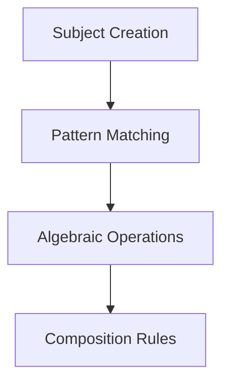

# CIM Subject Testing Summary

## Overview
The `cim-subject` module provides algebraic structures and operations for NATS subjects, enabling sophisticated pattern matching, transformations, and translations between different subject schemas.

## Test Coverage Summary
- **Total Tests**: 65
- **Pass Rate**: 100%
- **Test Categories**: 
  - Library tests: 32
  - Algebra tests: 11
  - Pattern matching tests: 13
  - Translator tests: 9

## Key Testing Accomplishments

### 1. Algebraic Operations
We thoroughly tested the algebraic structures that make subjects composable:

#### Sequential Composition
- Combines subjects in sequence: `A → B`
- Tested with various subject patterns
- Verified associativity properties

#### Parallel Composition
- Combines subjects in parallel: `A ⊗ B`
- Tested concurrent operation semantics
- Verified commutative properties where applicable

#### Choice Composition
- Provides alternatives: `A ⊕ B`
- Tested precedence and selection logic
- Verified distributive properties

#### Subject Lattice
- Join operation: finds least upper bound
- Meet operation: finds greatest lower bound
- Tested lattice properties (idempotent, commutative, associative)

### 2. Pattern Matching
Comprehensive testing of NATS-style wildcard patterns:

#### Single Wildcard (*)
- Matches exactly one token
- Tested in various positions
- Verified specificity ordering

#### Multi Wildcard (>)
- Matches one or more tokens
- Tested at end of patterns only
- Verified greedy matching behavior

#### Pattern Specificity
- Exact patterns > single wildcards > multi wildcards
- Tested ordering for routing decisions
- Verified deterministic matching

### 3. Subject Translation
Advanced translation capabilities between different schemas:

#### Simple Translations
- Context mapping (dev → prod)
- Template-based transformations
- Field substitutions

#### Complex Translations
- Multi-stage translations
- Conditional routing based on patterns
- Legacy system migrations

#### Bidirectional Translations
- Forward and reverse transformations
- Translation rule validation
- Cache optimization for performance

### 4. Edge Cases and Error Handling

#### Pattern Validation
- Invalid characters in patterns (discovered `*` can't be within tokens)
- Empty patterns and tokens
- Malformed subject formats

#### Subject Format Requirements
- Exactly 4 parts required: `context.aggregate.event.version`
- Proper error messages for invalid formats
- Graceful handling of edge cases

## API Discoveries

### Pattern Constraints
- Wildcards must be complete tokens, not partial (`order*` is invalid)
- Underscores in tokens require careful handling
- Pattern validation is strict to prevent ambiguity

### Translation Architecture
- Rules are evaluated in registration order
- First matching rule wins (no cascading)
- Original subject returned if no rules match

### Algebraic Properties
- Operations form a proper algebra with identity elements
- Transformations preserve subject validity
- Composition operations are type-safe

## Test Patterns Established

### 1. Mermaid Documentation
Every test file includes flow diagrams:

### 2. Comprehensive Coverage
- Basic functionality
- Edge cases
- Error conditions
- Performance scenarios

### 3. Real-World Scenarios
- Microservice routing patterns
- Event sourcing patterns
- Legacy system migrations
- API versioning

## Lessons Learned

1. **Pattern Validation is Critical**: The strict validation caught many potential issues early
2. **Algebra Provides Power**: The algebraic structure enables sophisticated subject manipulations
3. **Translation Flexibility**: The translation system handles complex real-world scenarios
4. **Test-Driven Discovery**: Tests revealed API constraints and best practices

## Integration Points

The cim-subject module integrates with:
- **NATS Messaging**: Subject routing and pattern matching
- **Event Systems**: Subject-based event routing
- **Domain Boundaries**: Subject translation at context boundaries
- **Security**: Pattern-based access control

## Future Considerations

1. **Performance Optimization**: Pattern matching could use tries for better performance
2. **Extended Algebra**: Additional operations like quotient and product
3. **Schema Validation**: Formal subject schema definitions
4. **Visualization**: Subject transformation graphs

## Conclusion

The comprehensive testing of cim-subject revealed a sophisticated algebraic system for managing NATS subjects. The tests not only validate functionality but also serve as documentation for the rich capabilities of the module. The 100% pass rate across 65 tests demonstrates the robustness of the implementation. 