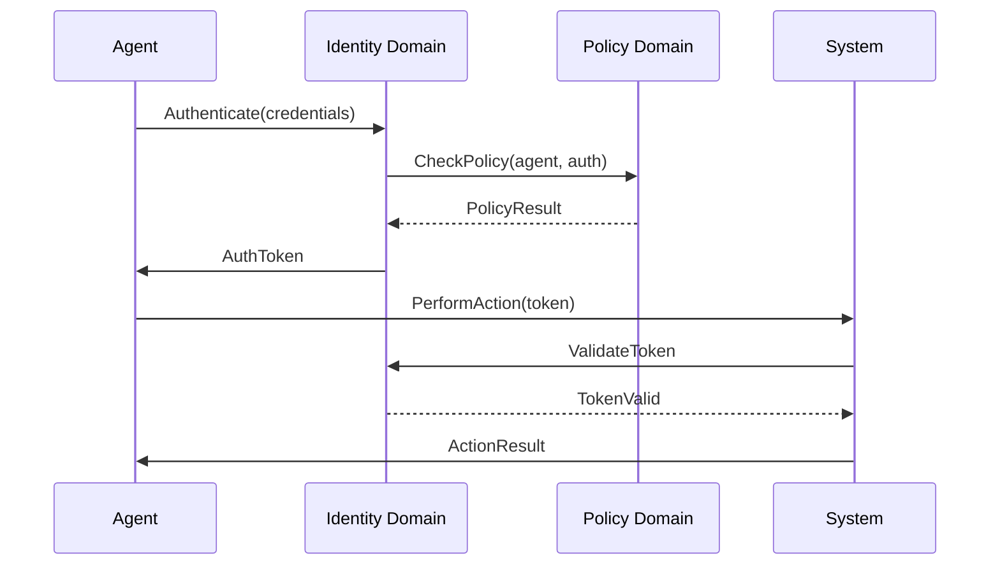
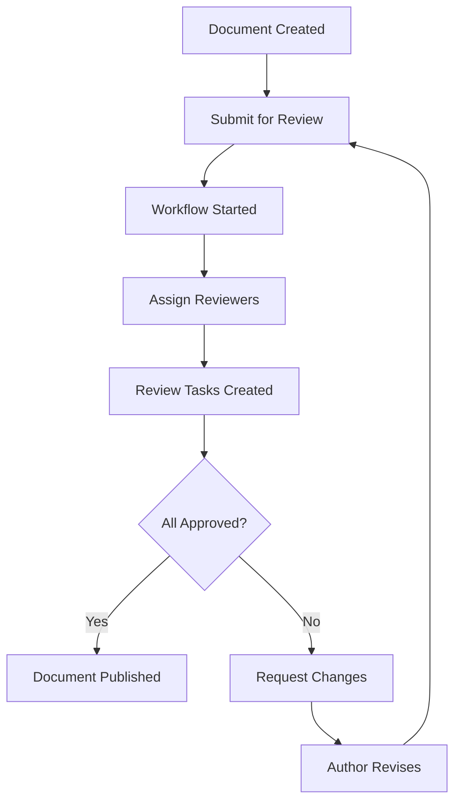
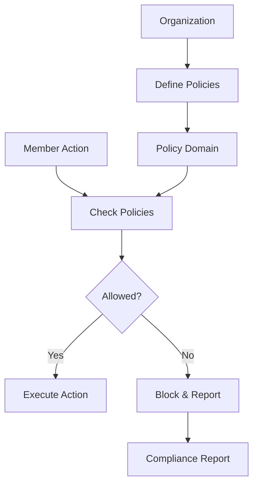
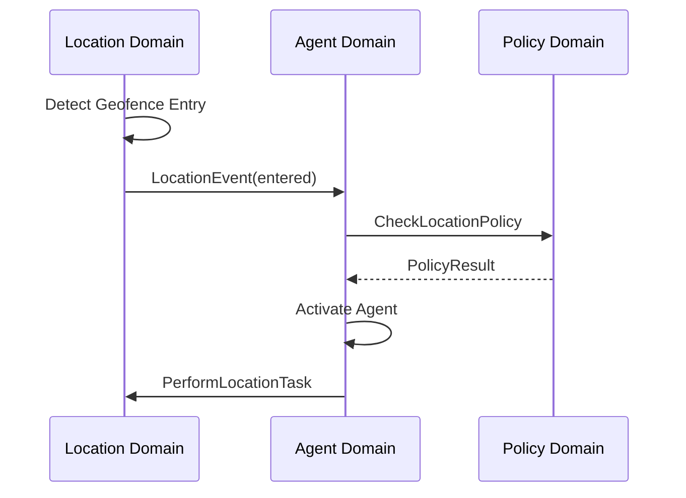
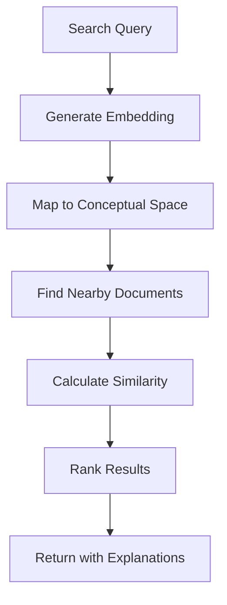
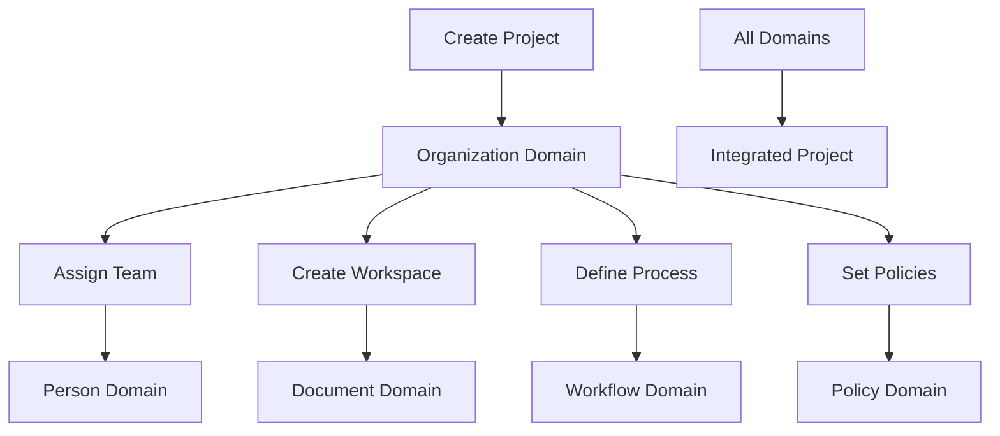
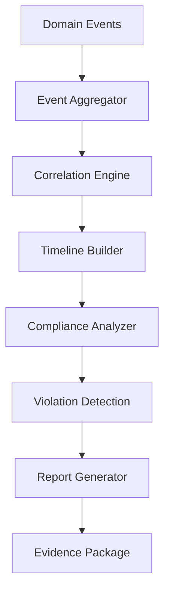

# Cross-Domain Integration User Stories

## Overview

User stories that demonstrate how multiple CIM domains work together to deliver complex, integrated functionality. These stories test the boundaries between domains and ensure proper event-driven communication.

## Identity + Agent Integration

### Story X1: Agent Authentication Flow
**As a** system  
**I want** agents to authenticate using identity services  
**So that** agent actions are properly authorized

**Acceptance Criteria:**
- Agent presents credentials to Identity domain
- Identity validates and issues token
- Agent uses token for subsequent operations
- Token refresh handled automatically
- Audit trail spans both domains

**Mermaid Diagram:**

**Domains:** Agent, Identity, Policy  
**Events:** AgentAuthRequested → IdentityValidated → TokenIssued → AgentAuthenticated  
**Tests:** `test_agent_authentication_flow`, `test_token_validation`

### Story X2: Person Creates Agent
**As a** person  
**I want** to create an agent to act on my behalf  
**So that** tasks can be automated

**Acceptance Criteria:**
- Person authenticated via Identity
- Agent created with Person as owner
- Permissions inherited from Person
- Delegation limits enforced
- Both domains updated atomically

**Domains:** Person, Agent, Identity, Policy  
**Events:** PersonAuthenticated → AgentCreationRequested → PolicyChecked → AgentCreated → OwnershipEstablished  
**Tests:** `test_person_creates_agent`, `test_ownership_delegation`

## Document + Workflow Integration

### Story X3: Document Approval Workflow
**As a** document author  
**I want** to submit documents through approval workflows  
**So that** content is properly reviewed

**Acceptance Criteria:**
- Document submitted triggers workflow
- Workflow assigns reviewers
- Reviews update document status
- Notifications sent at each step
- Version control maintained

**Mermaid Diagram:**

**Domains:** Document, Workflow, Person, Organization  
**Events:** DocumentSubmitted → WorkflowStarted → TasksAssigned → ReviewCompleted → DocumentApproved  
**Tests:** `test_document_approval_workflow`, `test_review_cycle`

### Story X4: Workflow Generates Documents
**As a** workflow  
**I want** to generate documents from templates  
**So that** standardized outputs are created

**Acceptance Criteria:**
- Workflow triggers document generation
- Template variables populated from workflow data
- Document created with proper metadata
- Workflow tracks document creation
- Error handling for template issues

**Domains:** Workflow, Document, Organization  
**Events:** WorkflowStepExecuted → DocumentGenerationRequested → TemplateProcessed → DocumentCreated  
**Tests:** `test_workflow_document_generation`, `test_template_processing`

## Organization + Policy Integration

### Story X5: Organization Policy Enforcement
**As an** organization  
**I want** to enforce policies on all members  
**So that** compliance is maintained

**Acceptance Criteria:**
- Organization defines policies
- Policies apply to all members
- Member actions checked against policies
- Violations tracked and reported
- Exceptions handled per role

**Mermaid Diagram:**

**Domains:** Organization, Policy, Person, Agent  
**Events:** PolicyDefined → PolicyActivated → ActionRequested → PolicyEvaluated → ActionAllowed/Denied  
**Tests:** `test_org_policy_enforcement`, `test_policy_inheritance`

### Story X6: Team Resource Allocation
**As a** team leader  
**I want** to allocate resources following organizational policies  
**So that** budgets are respected

**Acceptance Criteria:**
- Team requests resources
- Organization checks availability
- Policy validates allocation
- Resources assigned to team
- Usage tracked against limits

**Domains:** Organization, Policy, Workflow  
**Events:** ResourceRequested → AvailabilityChecked → PolicyValidated → ResourceAllocated  
**Tests:** `test_team_resource_allocation`, `test_budget_enforcement`

## Location + Agent Integration

### Story X7: Location-Based Agent Activation
**As a** system  
**I want** agents to activate based on location  
**So that** location-aware automation works

**Acceptance Criteria:**
- Agent monitors location events
- Geofence entry triggers activation
- Agent performs location-specific tasks
- Location privacy respected
- Audit trail maintained

**Mermaid Diagram:**

**Domains:** Location, Agent, Policy  
**Events:** GeofenceEntered → AgentTriggered → PolicyChecked → AgentActivated → TaskExecuted  
**Tests:** `test_location_agent_trigger`, `test_geofence_automation`

### Story X8: Person Location Privacy
**As a** person  
**I want** my location shared only per my preferences  
**So that** privacy is maintained

**Acceptance Criteria:**
- Person sets location sharing preferences
- Policy enforces preferences
- Location access logged
- Granular control (who, when, precision)
- Emergency override capability

**Domains:** Person, Location, Policy, Identity  
**Events:** PreferencesSet → PolicyUpdated → LocationRequested → AccessEvaluated → LocationShared/Denied  
**Tests:** `test_location_privacy`, `test_emergency_override`

## Conceptual Spaces + Document Integration

### Story X9: Document Semantic Search
**As a** user  
**I want** to search documents by meaning  
**So that** relevant content is found

**Acceptance Criteria:**
- Documents embedded in conceptual space
- Query mapped to conceptual point
- Similar documents found by distance
- Results ranked by relevance
- Explanation provided

**Mermaid Diagram:**

**Domains:** Document, ConceptualSpaces, Agent  
**Events:** SearchRequested → QueryEmbedded → SimilarityCalculated → ResultsRanked  
**Tests:** `test_semantic_document_search`, `test_relevance_ranking`

### Story X10: Workflow Concept Learning
**As a** system  
**I want** to learn workflow patterns in conceptual space  
**So that** similar workflows are suggested

**Acceptance Criteria:**
- Completed workflows analyzed
- Patterns extracted to conceptual space
- Similar workflows identified
- Suggestions provided to designers
- Learning improves over time

**Domains:** Workflow, ConceptualSpaces, Agent  
**Events:** WorkflowCompleted → PatternExtracted → ConceptLearned → SimilarityFound  
**Tests:** `test_workflow_learning`, `test_pattern_suggestion`

## Complex Multi-Domain Scenarios

### Story X11: Project Collaboration Platform
**As a** project manager  
**I want** to coordinate team activities across domains  
**So that** projects run smoothly

**Acceptance Criteria:**
- Organization creates project
- Team members assigned (Person)
- Documents shared (Document)
- Workflows defined (Workflow)
- Locations set for meetings (Location)
- Policies enforced (Policy)
- Agents assist (Agent)

**Mermaid Diagram:**

**Domains:** Organization, Person, Document, Workflow, Location, Policy, Agent  
**Events:** ProjectCreated → TeamAssigned → WorkspaceSetup → WorkflowsDefined → PoliciesApplied  
**Tests:** `test_project_setup`, `test_cross_domain_coordination`

### Story X12: Intelligent Document Processing Pipeline
**As a** system  
**I want** to process documents intelligently  
**So that** information is extracted and routed

**Acceptance Criteria:**
- Document uploaded (Document)
- Agent analyzes content (Agent)
- Concepts extracted (ConceptualSpaces)
- Workflow triggered based on type (Workflow)
- Routed to appropriate person (Person)
- Policies applied (Policy)
- Location tagged if relevant (Location)

**Domains:** Document, Agent, ConceptualSpaces, Workflow, Person, Policy, Location  
**Events:** DocumentUploaded → AnalysisStarted → ConceptsExtracted → WorkflowTriggered → RoutingDecided  
**Tests:** `test_intelligent_processing`, `test_content_routing`

### Story X13: Compliance Audit Trail
**As a** compliance officer  
**I want** to track all actions across domains  
**So that** compliance is demonstrable

**Acceptance Criteria:**
- All domain events captured
- Events correlated by transaction
- Timeline reconstruction possible
- Policy violations highlighted
- Reports generated across domains
- Evidence package exportable

**Mermaid Diagram:**

**Domains:** All domains  
**Events:** All domain events → AuditEventCaptured → CorrelationComplete → ComplianceReportGenerated  
**Tests:** `test_audit_trail`, `test_cross_domain_correlation`

### Story X14: Adaptive Security Response
**As a** security system  
**I want** to respond to threats across domains  
**So that** security is maintained

**Acceptance Criteria:**
- Suspicious activity detected (any domain)
- Pattern analyzed (ConceptualSpaces)
- Policy evaluated (Policy)
- Response workflow triggered (Workflow)
- Affected users notified (Person)
- Locations secured (Location)
- Agents mobilized (Agent)

**Domains:** All domains  
**Events:** ThreatDetected → PatternAnalyzed → ResponsePlanned → ActionsExecuted → ThreatMitigated  
**Tests:** `test_security_response`, `test_threat_mitigation`

### Story X15: Knowledge Graph Construction
**As a** knowledge engineer  
**I want** to build a knowledge graph from all domains  
**So that** relationships are discoverable

**Acceptance Criteria:**
- Entities extracted from all domains
- Relationships identified
- Graph constructed (Graph)
- Concepts positioned (ConceptualSpaces)
- Policies applied to access (Policy)
- Visualization generated
- Query interface provided

**Domains:** All domains  
**Events:** EntitiesExtracted → RelationshipsFound → GraphConstructed → ConceptsMapped  
**Tests:** `test_knowledge_graph_build`, `test_relationship_discovery`

## Integration Testing Patterns

### Story X16: Event Storm Testing
**As a** developer  
**I want** to test event propagation  
**So that** integration is reliable

**Acceptance Criteria:**
- Generate high-volume events
- Track propagation across domains
- Measure latency and throughput
- Detect lost or duplicate events
- Verify ordering guarantees
- Test failure scenarios

**Tests:** `test_event_storm`, `test_propagation_reliability`

### Story X17: Transaction Boundary Testing
**As a** developer  
**I want** to test cross-domain transactions  
**So that** consistency is maintained

**Acceptance Criteria:**
- Multi-domain operations atomic
- Rollback on partial failure
- Compensation for completed steps
- Eventual consistency verified
- Saga patterns implemented

**Tests:** `test_transaction_boundaries`, `test_saga_compensation`

### Story X18: Performance Under Load
**As a** system architect  
**I want** to test integrated performance  
**So that** scalability is ensured

**Acceptance Criteria:**
- Realistic load scenarios
- Multiple domains stressed
- Resource contention handled
- Graceful degradation
- Recovery tested

**Tests:** `test_integrated_load`, `test_performance_degradation`

## Data Consistency Patterns

### Story X19: Cross-Domain Data Sync
**As a** system  
**I want** data synchronized across domains  
**So that** consistency is maintained

**Acceptance Criteria:**
- Changes propagated via events
- Eventual consistency achieved
- Conflict resolution implemented
- Sync status trackable
- Recovery from desync

**Tests:** `test_data_synchronization`, `test_conflict_resolution`

### Story X20: Reference Data Management
**As a** data steward  
**I want** to manage reference data centrally  
**So that** all domains use consistent values

**Acceptance Criteria:**
- Central reference data repository
- Domains subscribe to updates
- Versioning supported
- Cache invalidation works
- Fallback for unavailability

**Tests:** `test_reference_data`, `test_cache_invalidation`

## Legend

- 🔄 Integration flows
- 📊 Multi-domain coordination
- 🔐 Security and compliance
- 📈 Performance and scalability

## Test Coverage Requirements

- Integration tests for all cross-domain flows
- End-to-end tests for complex scenarios
- Performance tests under load
- Failure scenario testing
- Event propagation verification
- Transaction boundary testing
- Data consistency validation 