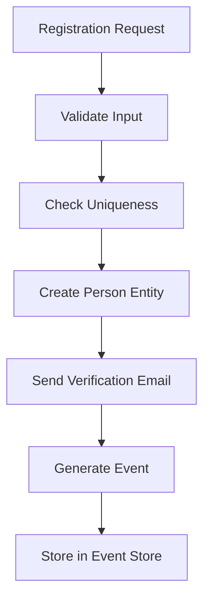
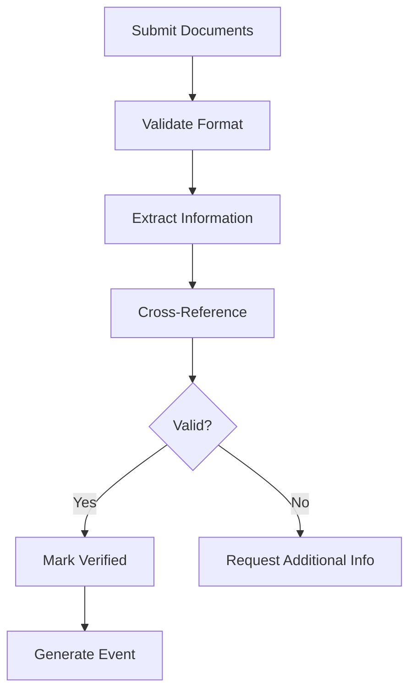
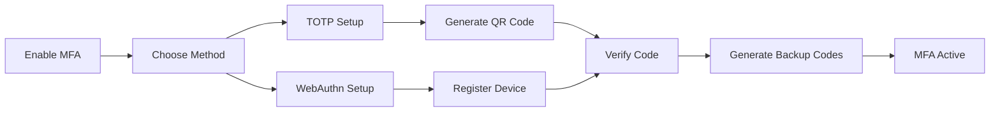
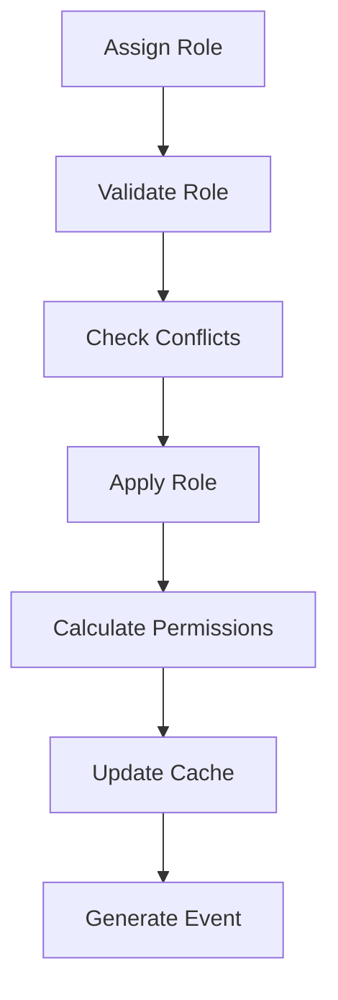
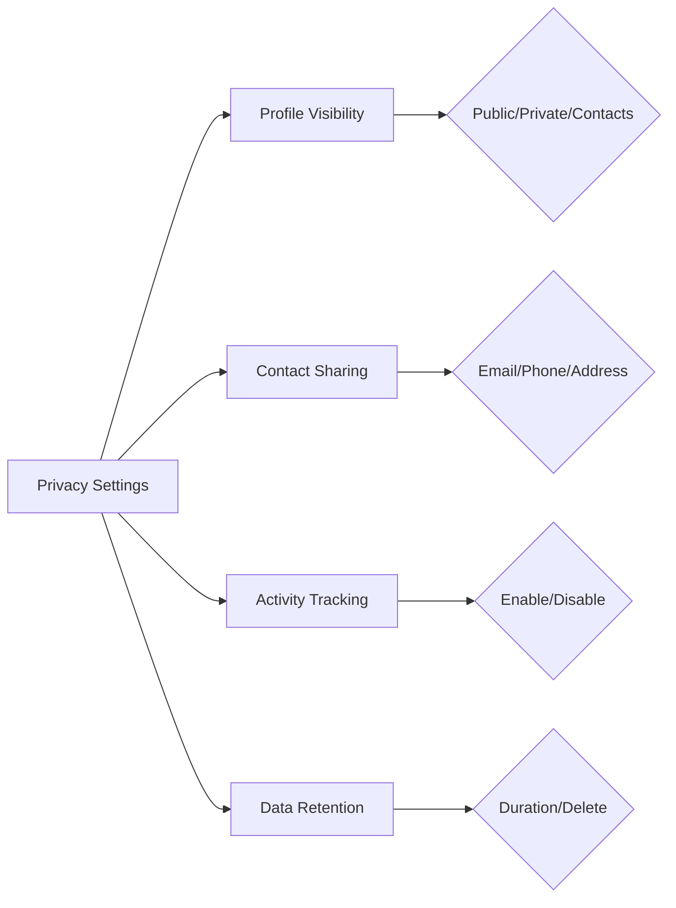
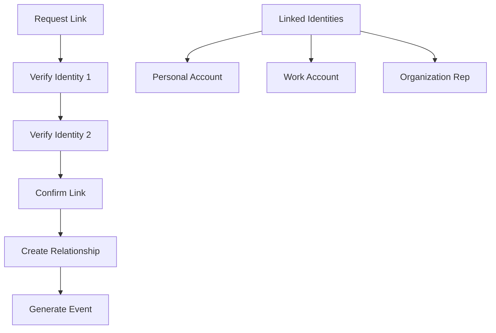
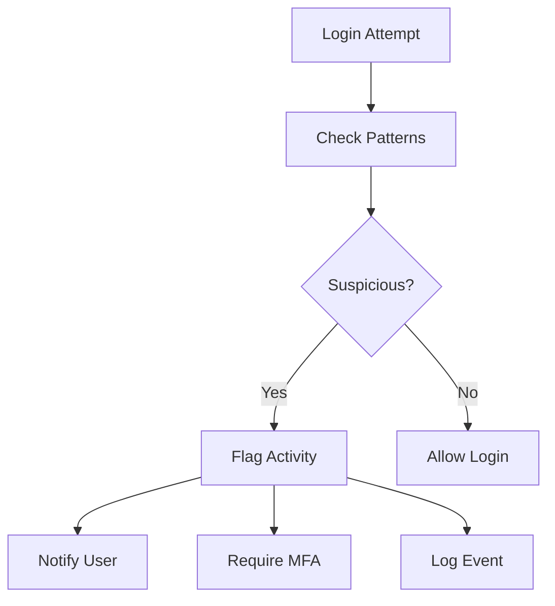

# User Stories for Identity Domain

## Overview

User stories for the Identity domain module, which manages authentication, authorization, and identity verification for people and organizations in the CIM system.

## Identity Creation and Management

### Story I1: Create Person Identity
**As a** new user  
**I want** to create my identity in the system  
**So that** I can access CIM features and own resources

**Acceptance Criteria:**
- Unique person ID generated (UUID v7)
- Basic identity info captured (legal name, preferred name)
- Email verification initiated
- PersonIdentityCreated event generated
- Privacy settings initialized to defaults

**Mermaid Diagram:**

**Tests:** `test_create_person_identity`, `test_email_verification_flow`

### Story I2: Create Organization Identity
**As an** organization administrator  
**I want** to register my organization  
**So that** it can have agents and manage resources

**Acceptance Criteria:**
- Organization entity created with unique ID
- Legal entity information captured
- Primary contact person linked
- OrganizationIdentityCreated event generated
- Verification process initiated

**Tests:** `test_create_organization_identity`, `test_organization_verification`

### Story I3: Verify Identity Claims
**As a** compliance officer  
**I want** to verify identity claims  
**So that** we maintain trust in the system

**Acceptance Criteria:**
- Government ID verification supported
- Document upload and validation
- Verification status tracked
- IdentityVerified event generated
- Audit trail maintained

**Mermaid Diagram:**

**Tests:** `test_identity_verification`, `test_document_validation`

## Authentication Management

### Story I4: Authenticate with Credentials
**As a** user  
**I want** to authenticate with my credentials  
**So that** I can access the system securely

**Acceptance Criteria:**
- Multiple auth methods supported (password, passkey, OAuth)
- Failed attempts tracked and limited
- Session tokens generated
- AuthenticationSucceeded/Failed events generated
- MFA support when enabled

**Tests:** `test_credential_authentication`, `test_failed_attempt_limiting`

### Story I5: Enable Multi-Factor Authentication
**As a** security-conscious user  
**I want** to enable MFA on my account  
**So that** my identity is better protected

**Acceptance Criteria:**
- TOTP/WebAuthn methods supported
- Backup codes generated
- MFAEnabled event generated
- Recovery process documented
- Grace period for setup

**Mermaid Diagram:**

**Tests:** `test_mfa_enablement`, `test_backup_code_generation`

### Story I6: Manage Sessions
**As a** user  
**I want** to manage my active sessions  
**So that** I can control where I'm logged in

**Acceptance Criteria:**
- View all active sessions with details
- Revoke individual sessions
- Revoke all sessions except current
- SessionRevoked events generated
- Real-time session updates

**Tests:** `test_session_management`, `test_session_revocation`

## Authorization and Permissions

### Story I7: Assign Roles to Identity
**As an** administrator  
**I want** to assign roles to users  
**So that** they have appropriate permissions

**Acceptance Criteria:**
- Predefined roles available (Admin, User, Viewer, etc.)
- Custom roles supported
- RoleAssigned event generated
- Effective permissions calculated
- Role inheritance supported

**Mermaid Diagram:**

**Tests:** `test_role_assignment`, `test_permission_calculation`

### Story I8: Define Custom Permissions
**As a** system administrator  
**I want** to create custom permissions  
**So that** we can implement fine-grained access control

**Acceptance Criteria:**
- Permission syntax validated (resource:action)
- Permission groups supported
- PermissionDefined event generated
- Backward compatibility maintained
- Documentation auto-generated

**Tests:** `test_custom_permission_definition`, `test_permission_syntax`

### Story I9: Delegate Authority
**As an** organization owner  
**I want** to delegate authority to team members  
**So that** they can act on behalf of the organization

**Acceptance Criteria:**
- Delegation scopes defined
- Time-limited delegations supported
- AuthorityDelegated event generated
- Delegation chains tracked
- Revocation immediate

**Tests:** `test_authority_delegation`, `test_delegation_revocation`

## Privacy and Data Protection

### Story I10: Manage Privacy Settings
**As a** user  
**I want** to control my privacy settings  
**So that** my data is shared only as I choose

**Acceptance Criteria:**
- Granular privacy controls
- Default to most private
- PrivacySettingsUpdated event generated
- Changes apply immediately
- Export settings capability

**Mermaid Diagram:**

**Tests:** `test_privacy_settings`, `test_privacy_enforcement`

### Story I11: Request Data Export
**As a** user  
**I want** to export all my data  
**So that** I can review what's stored about me

**Acceptance Criteria:**
- GDPR-compliant export format
- All associated data included
- DataExportRequested event generated
- Secure download process
- Automatic expiry of download links

**Tests:** `test_data_export`, `test_export_completeness`

### Story I12: Request Account Deletion
**As a** user  
**I want** to delete my account  
**So that** my data is removed from the system

**Acceptance Criteria:**
- Soft delete with grace period
- Associated data anonymized
- AccountDeletionRequested event generated
- Ownership transferred where needed
- Compliance with regulations

**Tests:** `test_account_deletion`, `test_data_anonymization`

## Identity Relationships

### Story I13: Link Identities
**As a** user with multiple accounts  
**I want** to link my identities  
**So that** I can manage them together

**Acceptance Criteria:**
- Bidirectional verification required
- Different identity types linkable
- IdentitiesLinked event generated
- Permissions not automatically shared
- Unlinking supported

**Mermaid Diagram:**

**Tests:** `test_identity_linking`, `test_link_verification`

### Story I14: Manage Organization Membership
**As an** organization administrator  
**I want** to manage member identities  
**So that** we can collaborate effectively

**Acceptance Criteria:**
- Invite/add/remove members
- Role assignment within org
- MembershipUpdated events generated
- Immediate access changes
- Audit trail maintained

**Tests:** `test_organization_membership`, `test_member_role_management`

## Identity Queries

### Story I15: Search Identities
**As a** user  
**I want** to search for other identities  
**So that** I can connect and collaborate

**Acceptance Criteria:**
- Search by name, email, organization
- Privacy settings respected
- Fuzzy matching supported
- Results ranked by relevance
- Pagination implemented

**Tests:** `test_identity_search`, `test_privacy_filtering`

### Story I16: View Identity Profile
**As a** user  
**I want** to view identity profiles  
**So that** I can verify who I'm interacting with

**Acceptance Criteria:**
- Public information displayed
- Verification badges shown
- Organization affiliations listed
- Activity history (if permitted)
- Contact options based on privacy

**Tests:** `test_profile_viewing`, `test_verification_display`

## Security Features

### Story I17: Detect Suspicious Activity
**As a** security system  
**I want** to detect suspicious identity behavior  
**So that** we can prevent unauthorized access

**Acceptance Criteria:**
- Unusual login patterns detected
- Geographic anomalies flagged
- SuspiciousActivityDetected event generated
- Automatic protective actions
- User notifications sent

**Mermaid Diagram:**

**Tests:** `test_suspicious_activity_detection`, `test_protective_actions`

### Story I18: Manage API Keys
**As a** developer  
**I want** to create and manage API keys  
**So that** my applications can authenticate

**Acceptance Criteria:**
- Scoped API keys supported
- Expiration dates settable
- APIKeyCreated/Revoked events generated
- Usage tracking implemented
- Rate limiting per key

**Tests:** `test_api_key_management`, `test_key_scoping`

## Integration Scenarios

### Story I19: SSO Integration
**As an** enterprise user  
**I want** to use my company SSO  
**So that** I don't need separate credentials

**Acceptance Criteria:**
- SAML/OIDC protocols supported
- Attribute mapping configurable
- SSOLoginCompleted event generated
- JIT provisioning supported
- Session management integrated

**Tests:** `test_sso_integration`, `test_jit_provisioning`

### Story I20: Identity Federation
**As a** platform administrator  
**I want** to federate with other identity providers  
**So that** users can access partner services

**Acceptance Criteria:**
- Trust relationships established
- Claims transformation supported
- FederationEstablished event generated
- Bi-directional authentication
- Audit trail across systems

**Tests:** `test_identity_federation`, `test_claims_transformation`

## Legend

- 🔐 Security-critical functionality
- 🌐 Integration capabilities
- 📊 Analytics and monitoring
- ⚖️ Compliance requirements

## Test Coverage Requirements

- Unit tests for all identity operations
- Integration tests for auth flows
- Security tests for vulnerabilities
- Performance tests for auth operations
- Compliance tests for regulations 