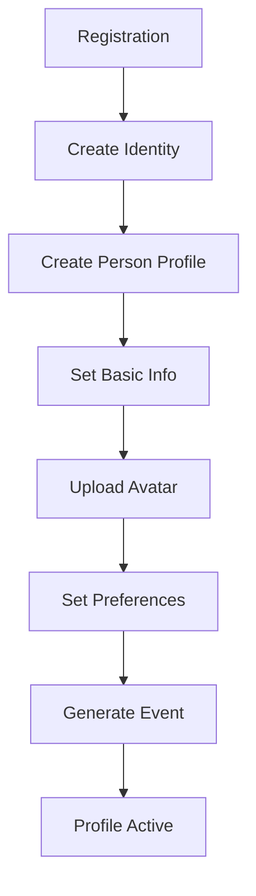
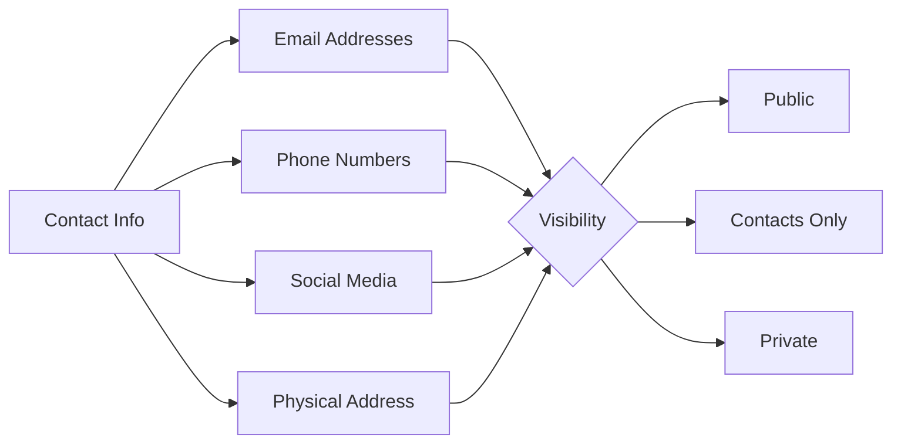
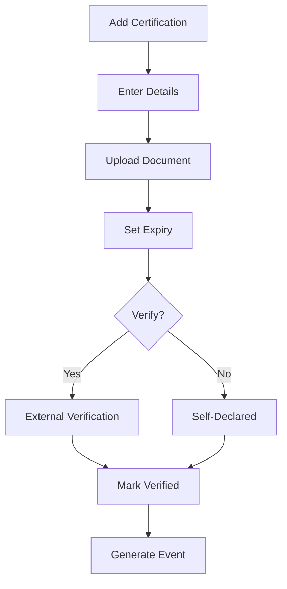
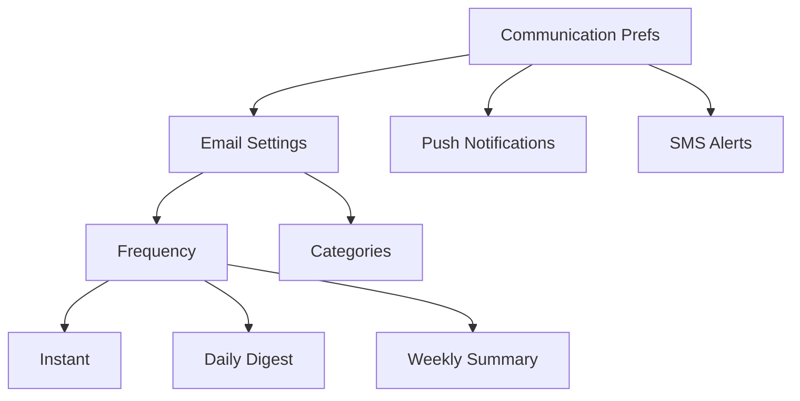
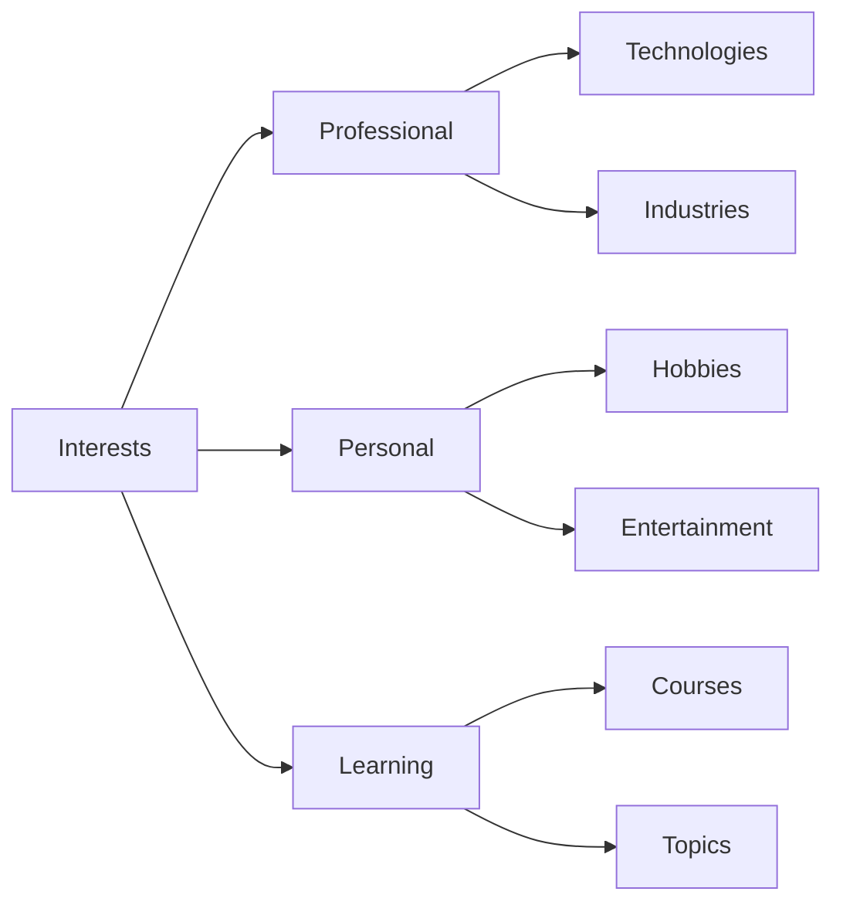

# User Stories for Person Domain

## Overview

User stories for the Person domain module, which manages individual profiles, personal information, relationships, and preferences in the CIM system.

## Person Profile Management

### Story P1: Create Person Profile
**As a** new user  
**I want** to create my personal profile  
**So that** I can establish my presence in the system

**Acceptance Criteria:**
- Person entity created with unique ID
- Basic profile information captured (name, bio, avatar)
- PersonCreated event generated
- Profile visibility settings initialized
- Welcome workflow triggered

**Mermaid Diagram:**

**Tests:** `test_create_person_profile`, `test_profile_initialization`

### Story P2: Update Personal Information
**As a** person  
**I want** to update my personal information  
**So that** my profile stays current

**Acceptance Criteria:**
- Profile fields updatable (bio, interests, skills)
- PersonUpdated event generated
- Change history maintained
- Privacy settings respected
- Validation rules enforced

**Tests:** `test_update_person_info`, `test_profile_validation`

### Story P3: Manage Contact Information
**As a** person  
**I want** to manage my contact details  
**So that** others can reach me appropriately

**Acceptance Criteria:**
- Multiple contact methods supported
- Visibility controls per contact method
- ContactInfoUpdated event generated
- Verification for email/phone
- Primary contact designation

**Mermaid Diagram:**

**Tests:** `test_manage_contacts`, `test_contact_visibility`

## Skills and Expertise

### Story P4: Add Professional Skills
**As a** professional  
**I want** to list my skills and expertise  
**So that** others can find me for collaboration

**Acceptance Criteria:**
- Skill taxonomy available
- Proficiency levels supported
- SkillsAdded event generated
- Endorsements trackable
- Search indexing updated

**Tests:** `test_add_skills`, `test_skill_proficiency`

### Story P5: Receive Skill Endorsements
**As a** person  
**I want** to receive endorsements for my skills  
**So that** my expertise is validated

**Acceptance Criteria:**
- Endorsements from verified connections
- SkillEndorsed event generated
- Endorsement count tracked
- Notification sent
- Public display optional

**Tests:** `test_skill_endorsements`, `test_endorsement_notifications`

### Story P6: Track Certifications
**As a** professional  
**I want** to record my certifications  
**So that** my qualifications are documented

**Acceptance Criteria:**
- Certification details stored
- Expiry dates tracked
- CertificationAdded event generated
- Verification links supported
- Renewal reminders

**Mermaid Diagram:**

**Tests:** `test_add_certification`, `test_certification_expiry`

## Relationships and Connections

### Story P7: Connect with Other People
**As a** person  
**I want** to connect with other people  
**So that** I can build my network

**Acceptance Criteria:**
- Connection requests sent/received
- ConnectionRequested event generated
- Mutual acceptance required
- Connection types (colleague, friend, etc.)
- Block/unblock functionality

**Tests:** `test_send_connection_request`, `test_accept_connection`

### Story P8: Manage Relationship Types
**As a** person  
**I want** to categorize my relationships  
**So that** I can organize my network

**Acceptance Criteria:**
- Predefined relationship types
- Custom types allowed
- RelationshipCategorized event generated
- Privacy per relationship type
- Bulk categorization

**Tests:** `test_relationship_types`, `test_bulk_categorization`

### Story P9: Join Groups
**As a** person  
**I want** to join interest groups  
**So that** I can engage with communities

**Acceptance Criteria:**
- Browse available groups
- Request to join
- GroupJoined event generated
- Group notifications
- Leave group option

**Tests:** `test_join_group`, `test_group_membership`

## Preferences and Settings

### Story P10: Set Communication Preferences
**As a** person  
**I want** to control how I'm contacted  
**So that** I manage interruptions

**Acceptance Criteria:**
- Notification channels configurable
- Frequency settings
- PreferencesUpdated event generated
- Do not disturb modes
- Per-sender preferences

**Mermaid Diagram:**

**Tests:** `test_communication_preferences`, `test_notification_settings`

### Story P11: Configure Privacy Settings
**As a** person  
**I want** to control my privacy  
**So that** I share information selectively

**Acceptance Criteria:**
- Granular privacy controls
- Default privacy levels
- PrivacyConfigured event generated
- Override per item
- Privacy policy compliance

**Tests:** `test_privacy_configuration`, `test_privacy_enforcement`

### Story P12: Set Availability Status
**As a** person  
**I want** to indicate my availability  
**So that** others know when to contact me

**Acceptance Criteria:**
- Status options (available, busy, away)
- Custom status messages
- AvailabilitySet event generated
- Calendar integration
- Auto-status rules

**Tests:** `test_availability_status`, `test_auto_status`

## Activity and Engagement

### Story P13: Track Activity History
**As a** person  
**I want** to see my activity history  
**So that** I can review my engagement

**Acceptance Criteria:**
- Chronological activity feed
- Filter by activity type
- ActivityRecorded events
- Export capability
- Privacy controls

**Tests:** `test_activity_tracking`, `test_activity_export`

### Story P14: Manage Interests
**As a** person  
**I want** to specify my interests  
**So that** I receive relevant content

**Acceptance Criteria:**
- Interest categories available
- Interest level ratings
- InterestsUpdated event generated
- Content recommendations
- Interest evolution tracking

**Mermaid Diagram:**

**Tests:** `test_manage_interests`, `test_interest_recommendations`

### Story P15: Share Achievements
**As a** person  
**I want** to share my achievements  
**So that** others can see my progress

**Acceptance Criteria:**
- Achievement types defined
- Evidence attachable
- AchievementShared event generated
- Visibility controls
- Celebration reactions

**Tests:** `test_share_achievements`, `test_achievement_visibility`

## Professional Features

### Story P16: Create Professional Portfolio
**As a** professional  
**I want** to showcase my work  
**So that** others can evaluate my capabilities

**Acceptance Criteria:**
- Portfolio items with rich media
- Categories and tags
- PortfolioUpdated event generated
- View analytics
- Shareable links

**Tests:** `test_create_portfolio`, `test_portfolio_analytics`

### Story P17: Set Career Goals
**As a** person  
**I want** to set career goals  
**So that** I can track my progress

**Acceptance Criteria:**
- SMART goal framework
- Milestone tracking
- GoalSet event generated
- Progress visualization
- Goal sharing options

**Tests:** `test_set_career_goals`, `test_goal_progress`

## Integration Features

### Story P18: Link External Profiles
**As a** person  
**I want** to link my external profiles  
**So that** I maintain a unified presence

**Acceptance Criteria:**
- OAuth integration for major platforms
- Profile data import
- ExternalProfileLinked event generated
- Sync preferences
- Unlink capability

**Tests:** `test_link_external_profiles`, `test_profile_sync`

### Story P19: Export Personal Data
**As a** person  
**I want** to export my data  
**So that** I own my information

**Acceptance Criteria:**
- GDPR-compliant export
- Multiple formats (JSON, CSV)
- DataExportRequested event generated
- Include all associations
- Secure download

**Tests:** `test_personal_data_export`, `test_export_completeness`

### Story P20: Delegate Profile Management
**As a** person  
**I want** to delegate profile management  
**So that** assistants can help maintain it

**Acceptance Criteria:**
- Delegation scopes defined
- Time-limited delegations
- DelegationGranted event generated
- Audit trail of changes
- Revocation immediate

**Tests:** `test_profile_delegation`, `test_delegation_audit`

## Legend

- 👤 Core profile functionality
- 🤝 Relationship management
- 🎯 Professional features
- 🔐 Privacy and security

## Test Coverage Requirements

- Unit tests for all profile operations
- Integration tests for relationship flows
- Privacy tests for access control
- Performance tests for search operations
- UI tests for profile interactions 