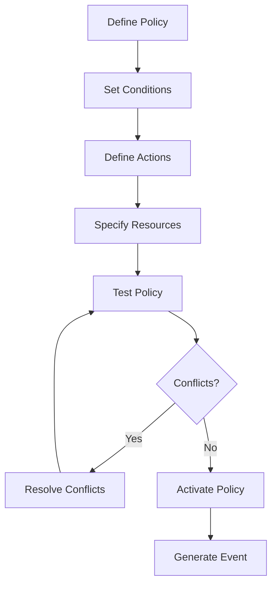
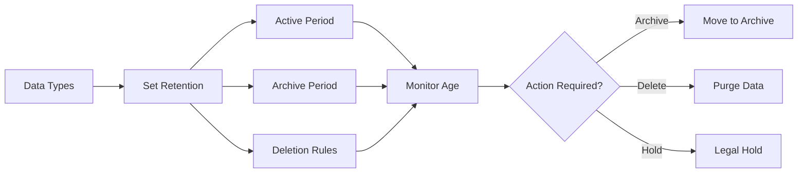
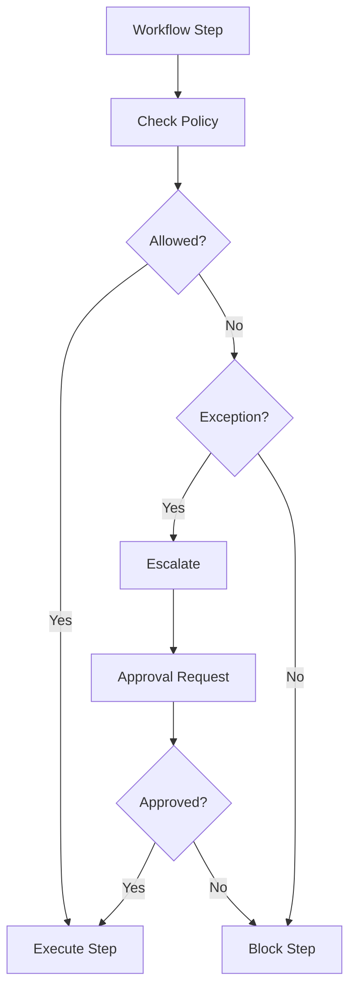
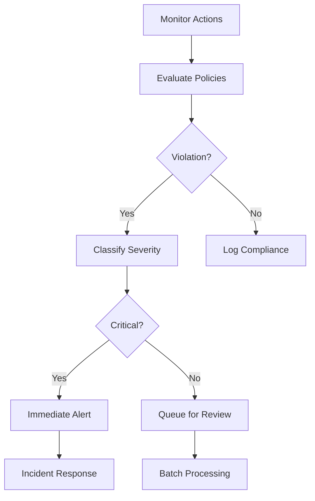
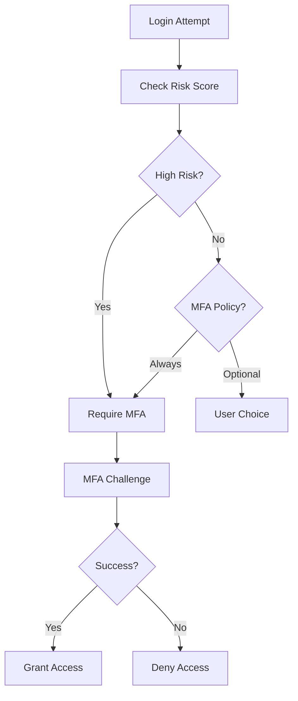

# User Stories for Policy Domain

## Overview

User stories for the Policy domain module, which manages rules, permissions, compliance requirements, and automated enforcement in the CIM system.

## Policy Definition and Management

### Story PO1: Define Access Policy
**As a** security administrator  
**I want** to define access control policies  
**So that** resources are protected appropriately

**Acceptance Criteria:**
- Policy rules using attribute-based access control (ABAC)
- PolicyDefined event generated
- Policy versioning supported
- Dry-run testing capability
- Conflict detection with existing policies

**Mermaid Diagram:**

**Tests:** `test_define_access_policy`, `test_policy_conflict_detection`

### Story PO2: Create Compliance Policy
**As a** compliance officer  
**I want** to create compliance policies  
**So that** regulatory requirements are met

**Acceptance Criteria:**
- Compliance framework templates (GDPR, HIPAA, SOC2)
- CompliancePolicyCreated event generated
- Automated compliance checks
- Evidence collection rules
- Audit trail requirements

**Tests:** `test_create_compliance_policy`, `test_compliance_templates`

### Story PO3: Define Data Retention Policy
**As a** data governance officer  
**I want** to set data retention policies  
**So that** data lifecycle is managed properly

**Acceptance Criteria:**
- Retention periods by data type
- RetentionPolicySet event generated
- Automatic deletion scheduling
- Legal hold capabilities
- Archival rules

**Mermaid Diagram:**

**Tests:** `test_retention_policy`, `test_automatic_deletion`

## Policy Enforcement

### Story PO4: Enforce Access Policies
**As a** system  
**I want** to enforce access policies automatically  
**So that** unauthorized access is prevented

**Acceptance Criteria:**
- Real-time policy evaluation
- AccessDenied/Granted events generated
- Performance < 10ms per check
- Caching for efficiency
- Detailed denial reasons

**Tests:** `test_access_enforcement`, `test_enforcement_performance`

### Story PO5: Apply Rate Limiting
**As a** system administrator  
**I want** to apply rate limiting policies  
**So that** resource abuse is prevented

**Acceptance Criteria:**
- Configurable rate limits
- RateLimitExceeded events generated
- Per-user/API key/IP limits
- Sliding window implementation
- Graceful degradation

**Tests:** `test_rate_limiting`, `test_sliding_window`

### Story PO6: Enforce Workflow Policies
**As a** process owner  
**I want** to enforce workflow policies  
**So that** processes follow approved paths

**Acceptance Criteria:**
- Workflow step validation
- WorkflowPolicyViolation events
- Approval requirements
- Escalation rules
- Exception handling

**Mermaid Diagram:**

**Tests:** `test_workflow_enforcement`, `test_escalation_flow`

## Permission Management

### Story PO7: Define Role-Based Permissions
**As a** system administrator  
**I want** to define role-based permissions  
**So that** access is managed efficiently

**Acceptance Criteria:**
- Hierarchical role definitions
- RolePermissionsDefined event generated
- Permission inheritance
- Role composition
- Effective permissions calculation

**Tests:** `test_role_permissions`, `test_permission_inheritance`

### Story PO8: Grant Temporary Permissions
**As a** security administrator  
**I want** to grant temporary permissions  
**So that** time-bound access is possible

**Acceptance Criteria:**
- Time-limited permission grants
- TemporaryAccessGranted event generated
- Automatic expiration
- Extension capabilities
- Audit of temporary access

**Tests:** `test_temporary_permissions`, `test_permission_expiry`

### Story PO9: Delegate Permission Management
**As a** department head  
**I want** to delegate permission management  
**So that** teams can self-manage

**Acceptance Criteria:**
- Scoped delegation rules
- DelegationGranted event generated
- Delegation constraints
- Revocation capabilities
- Delegation audit trail

**Tests:** `test_permission_delegation`, `test_delegation_constraints`

## Compliance Monitoring

### Story PO10: Monitor Policy Violations
**As a** compliance officer  
**I want** to monitor policy violations  
**So that** issues are addressed quickly

**Acceptance Criteria:**
- Real-time violation detection
- PolicyViolation events generated
- Severity classification
- Alert routing
- Violation trends

**Mermaid Diagram:**

**Tests:** `test_violation_monitoring`, `test_alert_routing`

### Story PO11: Generate Compliance Reports
**As a** compliance officer  
**I want** to generate compliance reports  
**So that** audit requirements are met

**Acceptance Criteria:**
- Scheduled report generation
- ComplianceReportGenerated events
- Multiple report formats
- Evidence attachment
- Trend analysis

**Tests:** `test_compliance_reporting`, `test_evidence_collection`

### Story PO12: Track Policy Effectiveness
**As a** policy manager  
**I want** to track policy effectiveness  
**So that** policies can be improved

**Acceptance Criteria:**
- Effectiveness metrics defined
- PolicyMetricsCalculated events
- A/B testing support
- Impact analysis
- Recommendation engine

**Tests:** `test_effectiveness_tracking`, `test_policy_optimization`

## Security Policies

### Story PO13: Define Password Policies
**As a** security administrator  
**I want** to define password policies  
**So that** account security is maintained

**Acceptance Criteria:**
- Complexity requirements
- PasswordPolicySet event generated
- Expiration rules
- History enforcement
- Breach detection integration

**Tests:** `test_password_policy`, `test_breach_detection`

### Story PO14: Set Session Policies
**As a** security administrator  
**I want** to set session policies  
**So that** sessions are managed securely

**Acceptance Criteria:**
- Session timeout rules
- SessionPolicyDefined event generated
- Concurrent session limits
- Geographic restrictions
- Device trust requirements

**Tests:** `test_session_policies`, `test_geographic_restrictions`

### Story PO15: Configure MFA Policies
**As a** security administrator  
**I want** to configure MFA policies  
**So that** authentication is strengthened

**Acceptance Criteria:**
- MFA requirement rules
- MFAPolicySet event generated
- Risk-based authentication
- Bypass conditions
- Recovery procedures

**Mermaid Diagram:**

**Tests:** `test_mfa_policies`, `test_risk_based_auth`

## Data Governance

### Story PO16: Define Data Classification
**As a** data governance officer  
**I want** to define data classification policies  
**So that** data is handled appropriately

**Acceptance Criteria:**
- Classification levels (public, internal, confidential, restricted)
- DataClassified event generated
- Automatic classification rules
- Manual override capability
- Handling requirements per level

**Tests:** `test_data_classification`, `test_classification_rules`

### Story PO17: Set Data Access Policies
**As a** data owner  
**I want** to set data access policies  
**So that** data is accessed appropriately

**Acceptance Criteria:**
- Purpose-based access control
- DataAccessPolicySet event generated
- Consent management
- Cross-border restrictions
- Anonymization rules

**Tests:** `test_data_access_policies`, `test_consent_management`

## Integration Policies

### Story PO18: Define API Usage Policies
**As an** API manager  
**I want** to define API usage policies  
**So that** APIs are used responsibly

**Acceptance Criteria:**
- Rate limits per endpoint
- APIUsagePolicySet event generated
- Authentication requirements
- Response filtering
- Usage analytics

**Tests:** `test_api_policies`, `test_usage_analytics`

### Story PO19: Set Integration Security Policies
**As a** security architect  
**I want** to set integration security policies  
**So that** external connections are secure

**Acceptance Criteria:**
- Allowed integration patterns
- IntegrationPolicyDefined event generated
- Certificate requirements
- Encryption standards
- Audit requirements

**Tests:** `test_integration_security`, `test_encryption_enforcement`

### Story PO20: Manage Third-Party Policies
**As a** vendor manager  
**I want** to manage third-party policies  
**So that** vendor risks are controlled

**Acceptance Criteria:**
- Vendor assessment requirements
- ThirdPartyPolicySet event generated
- Compliance verification
- Access restrictions
- Monitoring requirements

**Tests:** `test_third_party_policies`, `test_vendor_compliance`

## Legend

- 🔒 Security policies
- 📋 Compliance requirements
- ⚡ Enforcement mechanisms
- 📊 Monitoring and reporting

## Test Coverage Requirements

- Unit tests for all policy operations
- Integration tests for enforcement flows
- Performance tests for real-time checks
- Security tests for bypass attempts
- Compliance tests for regulations 