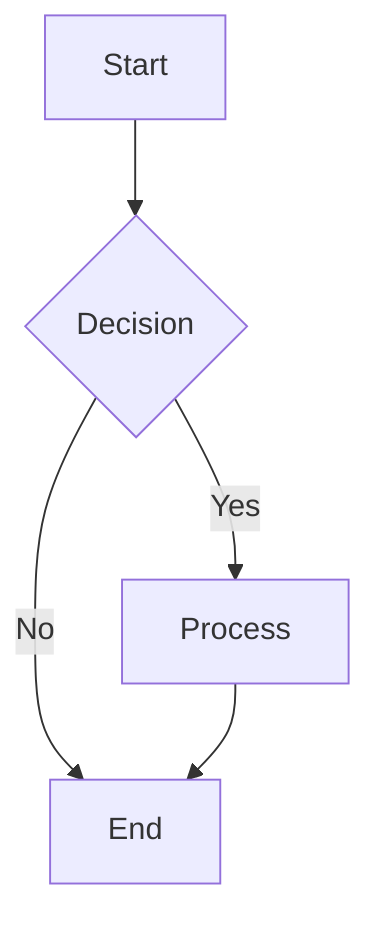
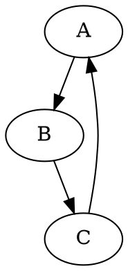

# Importing Graphs into CIM

The Composable Information Machine (CIM) supports importing graphs from various formats, making it easy to bring existing diagrams and workflows into the system.

## Supported Formats

CIM can import graphs from the following formats:

1. **Arrows.app JSON** - Graph data exported from arrows.app
2. **Cypher** - Neo4j's graph query language
3. **Mermaid** - Text-based diagramming language
4. **DOT/Graphviz** - Graph description language
5. **Progress JSON** - CIM's native progress tracking format
6. **Vocabulary JSON** - Structured vocabulary/taxonomy format
7. **RSS/Atom** - Event feeds (for EventStore integration)

## Import Methods

### Method 1: Using the GUI (Keyboard Shortcuts)

When running the main CIM application, you can use these keyboard shortcuts:

- **Ctrl+I** - Import from file (default: sample_graph.json)
- **Ctrl+M** - Import Mermaid diagram
- **Ctrl+D** - Import DOT graph
- **Ctrl+Shift+I** - Import from clipboard

### Method 2: Using the CLI Tool

CIM includes a command-line tool for importing graphs:

```bash
# Basic usage
./target/debug/import_graph <file_path> [format]

# Examples
./target/debug/import_graph examples/data/sample_graph.json
./target/debug/import_graph examples/data/workflow.mermaid mermaid
./target/debug/import_graph examples/data/network.dot dot

# With logging
RUST_LOG=info ./target/debug/import_graph examples/data/sample_graph.json
```

If you don't specify a format, the tool will try to detect it from the file extension.

### Method 3: Programmatic Import

You can import graphs programmatically using the GraphImportService:

```rust
use ia::domain::services::{GraphImportService, ImportFormat};

let import_service = GraphImportService::new();
let content = std::fs::read_to_string("graph.json")?;
let imported_graph = import_service.import_from_content(
    &content,
    ImportFormat::ArrowsApp,
    None
)?;
```

## File Format Examples

### Arrows.app JSON

```json
{
  "nodes": [
    {
      "id": "n1",
      "position": {"x": 0, "y": 0, "z": 0},
      "caption": "User",
      "labels": ["Person"],
      "properties": {
        "name": "Alice"
      }
    }
  ],
  "relationships": [
    {
      "id": "r1",
      "fromId": "n1",
      "toId": "n2",
      "type": "KNOWS",
      "properties": {}
    }
  ]
}
```

### Mermaid Diagram



### DOT Graph



## Import Options

When importing, you can specify various options:

- **Merge Behavior**: How to handle existing nodes/edges
  - `Skip` - Skip existing items
  - `Replace` - Replace existing items
  - `MergePreferExisting` - Merge, keeping existing properties
  - `MergePreferImported` - Merge, preferring imported properties
  - `AlwaysCreate` - Always create new items

- **ID Prefix**: Add a prefix to all imported node/edge IDs
- **Position Offset**: Offset all node positions by a vector
- **Validation**: Whether to validate imported data
- **Max Nodes**: Limit the number of nodes to import

## Layout Algorithms

After import, graphs are automatically laid out using one of these algorithms:

- **Force-Directed**: Physics-based layout (default)
- **Circular**: Nodes arranged in a circle
- **Hierarchical**: Tree-like layout
- **Grid**: Regular grid arrangement
- **Random**: Random positions
- **Property-Based**: Layout based on node properties

## Troubleshooting

### Common Issues

1. **Missing Z coordinate**: Ensure all positions have x, y, and z values
2. **Invalid JSON**: Check that your JSON is properly formatted
3. **Large graphs**: Use the `max_nodes` option to limit import size
4. **Duplicate nodes**: Some formats may create duplicate nodes during parsing

### Error Messages

- `"File not found"` - Check the file path
- `"Invalid format"` - Ensure the file matches the expected format
- `"Validation failed"` - Check that required fields are present

## Best Practices

1. **Test with small graphs first** to understand the import behavior
2. **Use appropriate formats** - Mermaid for workflows, DOT for networks
3. **Apply layouts** after import for better visualization
4. **Set ID prefixes** when importing multiple graphs to avoid conflicts
5. **Validate imports** to catch errors early

## Next Steps

After importing a graph:

1. Use the graph editor to refine the layout
2. Add conceptual mappings to enable semantic features
3. Connect to workflows for process automation
4. Export to other formats as needed
