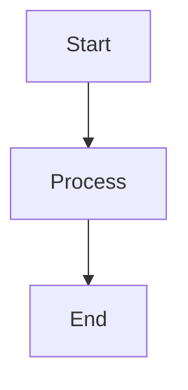

# Markdown Import with NATS Replay

This guide demonstrates how to import markdown files containing Mermaid diagrams into the graph visualization system and replay the events through NATS.

## Overview

The Information Alchemist supports importing markdown files that contain Mermaid diagrams. These diagrams are parsed and converted into interactive 3D graph visualizations. All import operations generate domain events that are stored in NATS JetStream, enabling replay and event sourcing capabilities.

## Features

- **Markdown Import**: Parse markdown files and extract Mermaid diagrams
- **Mermaid Support**: Convert Mermaid graph syntax into 3D visualizations
- **Event Recording**: All import operations generate domain events
- **NATS Storage**: Events are persisted in NATS JetStream
- **Event Replay**: Reconstruct graphs by replaying events from NATS
- **Multiple Formats**: Support for various Mermaid diagram types

## Available Markdown Files

The system includes several Domain-Driven Design (DDD) example files:

1. **KECO_DDD_Core_Model.md** - Core domain overview with bounded contexts
2. **KECO_DDD_LoanOriginationContext.md** - Loan origination workflow
3. **KECO_DDD_UnderwritingContext.md** - Underwriting process details
4. **KECO_DDD_DocumentContext.md** - Document management workflows
5. **KECO_DDD_ClosingContext.md** - Loan closing procedures

## Running the Demo

### Prerequisites

1. Ensure NATS server is installed:
   ```bash
   # In NixOS environment
   nix-shell -p nats-server
   ```

2. Start NATS with JetStream:
   ```bash
   nats-server -js
   ```

### Simple Import Demo

Run the basic markdown import example:

```bash
cargo run --example markdown_import_simple
```

**Controls:**
- `M` - Import markdown file
- `Ctrl+D` - Cycle through DDD markdown files
- `V` - Debug: Show node visibility
- `ESC` - Exit

### NATS Replay Demo

Run the full demo with NATS event replay:

```bash
cargo run --example markdown_import_nats_demo
```

**Controls:**
- `M` - Import markdown file with Mermaid diagrams
- `R` - Replay events from NATS
- `C` - Clear current graph
- `ESC` - Exit

### Using the Demo Script

For convenience, use the provided demo script:

```bash
./scripts/demo_markdown_import.sh
```

This script will:
1. Check if NATS is running and start it if needed
2. Build the demo in release mode
3. Run the interactive demo
4. Clean up when finished

## How It Works

### 1. Markdown Parsing

The system parses markdown files looking for Mermaid code blocks:

```markdown

```

### 2. Mermaid Conversion

Mermaid diagrams are converted to graph structures:
- Nodes become 3D spheres with labels
- Edges become lines connecting nodes
- Subgraphs create visual groupings
- Styling is preserved where possible

### 3. Event Generation

Each import operation generates events:
- `GraphImportRequested` - Import initiated
- `NodeAdded` - For each node in the diagram
- `EdgeAdded` - For each connection
- `GraphImportCompleted` - Import finished

### 4. NATS Storage

Events are stored in NATS JetStream:
- Stream: `EVENTS`
- Subject pattern: `events.graph.>`
- Retention: File-based, 365 days
- Deduplication window: 120 seconds

### 5. Event Replay

Replaying events reconstructs the graph:
1. Fetch all events for a graph ID from NATS
2. Clear the current visualization
3. Replay each event in order
4. Reconstruct the visual representation

## Supported Mermaid Features

### Graph Types
- `graph TD` - Top-down flow
- `graph LR` - Left-right flow
- `graph TB` - Top-bottom flow
- `flowchart` - Enhanced flowcharts

### Node Types
- `[Rectangle]` - Standard nodes
- `(Rounded)` - Rounded rectangles
- `{Diamond}` - Decision nodes
- `[[Subroutine]]` - Special nodes

### Relationships
- `-->` - Directed edge
- `---` - Undirected edge
- `-.->` - Dotted edge
- `==>` - Thick edge

### Subgraphs
```mermaid
subgraph Name["Display Name"]
    A --> B
end
```

## Example Workflow

1. **Start the application**:
   ```bash
   cargo run --example markdown_import_nats_demo
   ```

2. **Import a markdown file** (Press `M`):
   - The system reads `KECO_DDD_Core_Model.md`
   - Parses Mermaid diagrams
   - Creates nodes and edges
   - Stores events in NATS

3. **View the graph**:
   - Use mouse to rotate camera
   - Scroll to zoom
   - See nodes and connections in 3D

4. **Clear the graph** (Press `C`):
   - Removes all visual elements
   - Events remain in NATS

5. **Replay from NATS** (Press `R`):
   - Fetches events from NATS
   - Reconstructs the graph
   - Shows the same visualization

## Integration with Event Sourcing

The markdown import system is fully integrated with the event sourcing architecture:

1. **Commands**: Import requests are commands
2. **Events**: All changes generate domain events
3. **Projections**: Visual graph is a projection
4. **Replay**: Full reconstruction from events

## Troubleshooting

### NATS Connection Issues
```bash
# Check if NATS is running
nats server check connection

# Start NATS manually
nats-server -js
```

### Import Not Working
- Check file path exists
- Verify markdown contains Mermaid blocks
- Look for error messages in console

### Replay Issues
- Ensure NATS has JetStream enabled
- Check event store connection
- Verify graph ID matches

## Advanced Usage

### Custom Import Options

```rust
ImportOptions {
    merge_behavior: MergeBehavior::MergePreferImported,
    id_prefix: Some("custom".to_string()),
    position_offset: Some(Position3D { x: 10.0, y: 0.0, z: 0.0 }),
    mapping: None,
    validate: true,
    max_nodes: Some(1000),
}
```

### Programmatic Import

```rust
// Import from file
let command = Command::Graph(GraphCommand::ImportGraph {
    graph_id,
    source: ImportSource::File {
        path: "path/to/file.md".to_string(),
    },
    format: "mermaid".to_string(),
    options: ImportOptions::default(),
});

// Import from string
let command = Command::Graph(GraphCommand::ImportGraph {
    graph_id,
    source: ImportSource::InlineContent {
        content: markdown_content,
    },
    format: "mermaid".to_string(),
    options: ImportOptions::default(),
});
```

## Next Steps

- Try importing your own markdown files with Mermaid diagrams
- Experiment with different graph layouts
- Build workflows using the imported graphs
- Integrate with AI agents for automated processing
