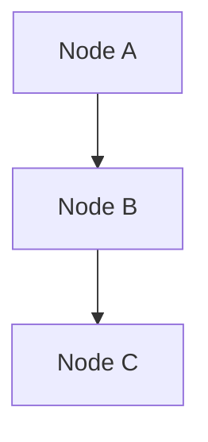
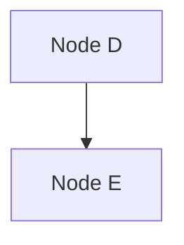

# CIM Graph Editor - Quick Reference Guide

## Keyboard Shortcuts

### Import Operations
| Key | Action | Description |
|-----|--------|-------------|
| I | Import JSON | Import graph from JSON file |
| Ctrl+D | Import DDD Markdown | Import from markdown with mermaid diagrams |

### Camera Controls
| Input | Action | Description |
|-------|--------|-------------|
| Left Mouse Drag | Orbit | Rotate camera around focus point |
| Right Mouse Drag | Pan | Move camera laterally |
| Mouse Wheel | Zoom | Adjust distance from focus |
| R | Reset | Reset camera to default position |
| F | Focus | Focus on selected nodes |

### Subgraph Operations
| Key | Action | Description |
|-----|--------|-------------|
| Ctrl+G | Create Subgraph | Create subgraph from selected nodes |
| B | Toggle Boundary | Cycle through boundary types |
| V | Toggle Voronoi | Show/hide Voronoi tessellation |

### Selection
| Input | Action | Description |
|-------|--------|-------------|
| Left Click | Select Node | Select single node |
| Ctrl+Click | Multi-select | Add/remove from selection |
| Shift+Drag | Box Select | Select nodes in rectangle |

## Visual Indicators

### Node States
- **Default**: Blue sphere
- **Selected**: Yellow highlight
- **Subgraph Member**: Colored by subgraph

### Edge Types
- **Default**: White line
- **Animated**: Growing from source to target
- **Subgraph Internal**: Matches subgraph color

### Boundary Types
1. **ConvexHull**: Minimal enclosing polygon
2. **BoundingBox**: Axis-aligned rectangle
3. **Circle**: Minimum enclosing circle
4. **Voronoi**: Tessellation cells

## Import File Formats

### JSON Graph Format
```json
{
  "nodes": [
    {
      "id": "node1",
      "label": "Node 1",
      "position": [0, 0, 0],
      "metadata": {}
    }
  ],
  "edges": [
    {
      "source": "node1",
      "target": "node2",
      "relationship": "connects_to"
    }
  ]
}
```

### Markdown with Mermaid
```markdown
# Context Name

## Subgraph 1



## Subgraph 2


```

## Event System Patterns

### Subject Patterns
- `event.graph.>` - All graph events
- `event.graph.*.node.>` - All node events
- `event.graph.123.>` - Events for specific graph
- `event.*.created` - All creation events

### Consumer Setup
```rust
// Subscribe to specific patterns
let patterns = vec![
    "event.graph.*.node.added",
    "event.graph.*.edge.connected",
];
let consumer = SubjectConsumer::new(&router, patterns)?;
```

## Conceptual Space Features

### Quality Dimensions
- Each subgraph represents a quality dimension
- Prototype is the centroid of member nodes
- Distance metrics determine similarity

### Voronoi Cells
- Natural categories in conceptual space
- Each cell contains semantically similar nodes
- Lloyd's relaxation smooths cell boundaries

## Performance Tips

1. **Import Large Graphs**: Use `LayoutAlgorithm::None` to preserve positions
2. **Many Subgraphs**: Toggle Voronoi off (V) for better performance
3. **Event Processing**: Use specific subject patterns to reduce overhead
4. **Camera Movement**: Adjust sensitivity in OrbitCamera settings

## Troubleshooting

### Import Not Visible
- Check camera position (press R to reset)
- Verify file format matches examples
- Look for errors in console output

### Events Not Received
- Check subject pattern matches event type
- Verify consumer is polling in Update system
- Monitor sequence gaps in statistics

### Voronoi Not Showing
- Press V to toggle visualization
- Ensure subgraphs exist (Ctrl+G)
- Check VoronoiSettings resource

## Configuration

### Camera Settings
```rust
OrbitCamera {
    focus: Vec3::new(100.0, 0.0, 0.0),
    distance: 150.0,
    sensitivity: 0.005,
    zoom_speed: 2.0,
}
```

### Event System Settings
```rust
RouterConfig {
    channel_capacity: 10_000,
    track_sequences: true,
    enable_dlq: true,
    max_retries: 3,
}
```

### Voronoi Settings
```rust
VoronoiSettings {
    update_frequency: 0.5,
    smoothing_factor: 0.3,
    min_cell_size: 10.0,
    boundary_padding: 20.0,
}
```
