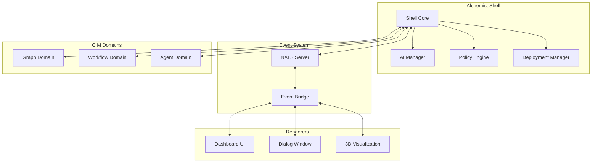

# Alchemist Documentation

Welcome to the Alchemist documentation! Alchemist is a revolutionary shell-based control system for the Composable Information Machine (CIM), providing a command-line interface, AI integration, policy management, deployment automation, and advanced visualization capabilities.

## 📚 Documentation Index

### Getting Started
- [Installation Guide](INSTALLATION.md) - Setting up Alchemist on your system
- [Quick Start Tutorial](QUICK_START.md) - Get up and running in 5 minutes
- [Configuration Guide](CONFIGURATION.md) - Customizing Alchemist for your needs

### Core Documentation
- **[Shell Commands Reference](SHELL_COMMANDS.md)** - Complete guide to all shell commands
- **[Renderer API Reference](RENDERER_API.md)** - Building custom visualization components
- [Architecture Overview](ARCHITECTURE.md) - System design and components
- [Event System Guide](EVENTS.md) - Understanding the event-driven architecture

### Feature Guides
- [AI Integration](AI_INTEGRATION.md) - Working with AI providers and models
- [Dialog Management](DIALOGS.md) - Creating and managing AI conversations
- [Policy Engine](POLICIES.md) - Security and access control
- [Deployment Automation](DEPLOYMENTS.md) - CI/CD and deployment pipelines
- [Workflow System](WORKFLOWS.md) - Building and executing workflows
- [Rendering Features](RENDERING_FEATURES.md) - Markdown, charts, and visualizations

### Development
- [Contributing Guide](CONTRIBUTING.md) - How to contribute to Alchemist
- [Plugin Development](PLUGINS.md) - Creating Alchemist plugins
- [Testing Guide](../TEST_COVERAGE_SUMMARY.md) - Running and writing tests
- [API Reference](API.md) - Rust API documentation
- [Performance Optimization](PERFORMANCE_OPTIMIZATION.md) - Benchmarking and optimization guide

### Domain Guides
- [Graph Domain](domains/GRAPH.md) - Graph operations and visualization
- [Workflow Domain](domains/WORKFLOW.md) - Workflow execution engine
- [Agent Domain](domains/AGENT.md) - AI agent management
- [Document Domain](domains/DOCUMENT.md) - Document lifecycle management

## 🚀 Quick Links

### Essential Commands
```bash
# Check system status
alchemist version

# Start a new AI dialog
alchemist dialog new "My Discussion"

# List all domains
alchemist domain list

# Launch the dashboard
alchemist render dashboard
```

### Key Features

#### 🤖 AI Integration
- Multiple AI providers (OpenAI, Anthropic, Ollama)
- Streaming responses
- Model management
- Dialog persistence

#### 🔐 Policy Management
- Role-based access control
- Claims-based authorization
- Policy evaluation engine
- Audit logging

#### 🚀 Deployment Automation
- Multi-environment pipelines
- Canary deployments
- Approval workflows
- GitOps integration

#### 📊 Visualization
- Real-time dashboards
- Event flow visualization
- Performance monitoring
- 3D graph rendering

## 📖 Document Summaries

### [Shell Commands Reference](SHELL_COMMANDS.md)
Comprehensive guide covering all available shell commands including:
- AI management (`ai` commands)
- Dialog operations (`dialog` commands)
- Policy configuration (`policy` commands)
- Deployment automation (`deploy` commands)
- Domain management (`domain` commands)
- Workflow execution (`workflow` commands)
- Progress tracking (`progress` command)
- Renderer launching (`render` commands)

**Key sections:**
- Command structure and syntax
- Global options and environment variables
- Complete examples for each command
- Troubleshooting common issues

### [Renderer API Reference](RENDERER_API.md)
Complete guide for building visualization components:
- Event-driven architecture
- Shell-to-renderer communication
- Renderer-to-shell communication
- Data structures and event types
- Implementation examples (Iced, Bevy, custom)
- Performance optimization techniques
- Testing strategies

**Key sections:**
- Event type definitions
- Communication patterns
- Integration examples
- Best practices
- Troubleshooting guide

## 🏗️ Architecture Overview



## 🔧 Configuration

Default configuration location: `~/.alchemist/alchemist.toml`

### Minimal Configuration
```toml
[general]
default_ai_model = "gpt-4"

[ai.providers.openai]
api_key_env = "OPENAI_API_KEY"
```

### Environment Variables
- `ALCHEMIST_HOME` - Override home directory
- `ALCHEMIST_CONFIG` - Custom config file path
- `NATS_URL` - NATS server URL
- `OPENAI_API_KEY` - OpenAI API key
- `ANTHROPIC_API_KEY` - Anthropic API key

## 🧪 Testing

Run the comprehensive test suite:
```bash
# Run all tests
./run_all_tests.sh

# With NATS integration
./run_all_tests.sh --with-nats

# With coverage report
./run_all_tests.sh --coverage
```

See [Test Coverage Summary](../TEST_COVERAGE_SUMMARY.md) for details.

## 🤝 Contributing

We welcome contributions! Please see our [Contributing Guide](CONTRIBUTING.md) for:
- Code style guidelines
- Testing requirements
- Pull request process
- Development setup

## 📝 License

Alchemist is licensed under the [MIT License](../LICENSE).

## 🆘 Getting Help

- **Documentation**: You're here!
- **Examples**: See `/examples` directory
- **Issues**: [GitHub Issues](https://github.com/thecowboyai/alchemist/issues)
- **Discussions**: [GitHub Discussions](https://github.com/thecowboyai/alchemist/discussions)

## 🎯 Next Steps

1. **New Users**: Start with the [Quick Start Tutorial](QUICK_START.md)
2. **Developers**: Check out the [Renderer API](RENDERER_API.md) and [Plugin Development](PLUGINS.md)
3. **Operators**: Review [Deployment Automation](DEPLOYMENTS.md) and [Configuration Guide](CONFIGURATION.md)
4. **Contributors**: Read the [Contributing Guide](CONTRIBUTING.md) and [Architecture Overview](ARCHITECTURE.md)

---

*This documentation is continuously updated. For the latest version, check the repository.*